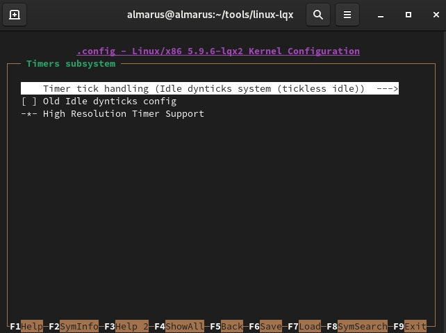

.. ARU (c) 2018 - 2021, Pavel Priluckiy, Vasiliy Stelmachenok and contributors

   ARU is licensed under a
   Creative Commons Attribution-ShareAlike 4.0 International License.

   You should have received a copy of the license along with this
   work. If not, see <https://creativecommons.org/licenses/by-sa/4.0/>.

"""""""""""""""""""""""""""""""""""""""""""""""""""""""""""""
Кастомные ядра для увеличения плавности и зачем это нужно
"""""""""""""""""""""""""""""""""""""""""""""""""""""""""""""

.. contents:: Содержание:
  :depth: 2

.. role:: bash(code)
  :language: shell

На протяжении многих лет развитие ядра Linux делал упор на серверную часть, но времена меняются,
и сейчас появились сборки от сторонних разработчиков
которые позволяет выжать максимум из вашего железа, получить больше FPS в играх запускаемых из под Wine, и сделать отклик рабочего стола немного плавнее и быстрее.

Установкой этих сборок мы и займемся в этом разделе.

Проверка ядра используемого в данный момент: :bash:`uname -r`.

=============
Zen
=============

Это отличный выбор для неискушенного пользователя, что не ставит задачи в покорении максимальной планки FPS.
Доступен в официальных репозиториях (не нужно компилировать).

**I. Установка** ::

  sudo pacman -S linux-zen linux-zen-headers # Не забудь обновить GRUB.

=============
liquorix
=============

Идеальное ядро для игроманов.
Значительно улучшает качество отклика как в повседневных задачах так и в играх.
Ориентирован на процессоры Intel.

**I. Установка** ::

  sudo pacman-key --keyserver hkps://keyserver.ubuntu.com --recv-keys 9AE4078033F8024D
  sudo pacman-key --lsign-key 9AE4078033F8024D      # Добавляем GPG ключ
  sudo nano /etc/pacman.conf                        # Добавляем сюда строчку ниже.

*[liquorix]*

*Server = https://liquorix.net/archlinux/$repo/$arch*

.. image:: images/custom-kernels-16.png

::

  sudo pacman -Suuyy
  sudo pacman -S linux-lqx linux-lqx-headers # Не забудь обновить GRUB.

Установка I рекомендуется если не хотите компилировать,
но тогда производительность будет хуже чем у аналогичного скомпилированного ядра.

**II. Установка** ::

  git clone https://aur.archlinux.org/linux-lqx.git                 # Скачивание исходников.
  cd linux-lqx                                                      # Переход в linux-lqx
  gpg --keyserver keyserver.ubuntu.com --recv-keys 38DBBDC86092693E # GPG ключ
  makepkg -sric                                                     # Сборка и установка.

**III. Установка и настройка**

Выполнение кастомизации ядра linux-lqx.
Тонкая настрйка ядра позволит дать ешё больше производительности. ::

  git clone https://aur.archlinux.org/linux-lqx.git         # Скачивание исходников.
  cd linux-lqx                                              # Переход в linux-lqx
  nano PKGBUILD                                             # Редактирование конфигурационного файла.

Нужно привести строку *_makenconfig=* к виду *_makenconfig=y*::

  makepkg -sric # Сборка и установка.

Следовать графической инструкции.

1.

.. image:: images/custom-kernels-1.jpg

2.

.. image:: images/custom-kernels-2.jpg

3.

4.

.. image:: images/custom-kernels-4.jpg

5.

.. image:: images/custom-kernels-5.jpg

6.

.. image:: images/custom-kernels-6.jpg

7.

.. image:: images/custom-kernels-7.jpg

8.

.. image:: images/custom-kernels-8.jpg

9.

.. image:: images/custom-kernels-9.jpg

10.

.. image:: images/custom-kernels-10.jpg

11.

.. image:: images/custom-kernels-11.jpg

12.

.. image:: images/custom-kernels-12.jpg

13.

.. image:: images/custom-kernels-13.jpg

14.

.. image:: images/custom-kernels-14.jpg

15.

.. image:: images/custom-kernels-15.jpg

Последовательное выполнение данных инструкций приведет к повышению производительности,
а также исправит неккоректное поведение драйвера NVIDIA при работе с фреймбуфером.

==============
Xanmod
==============

Альтернатива liquorix, так же нацеленная на оптимизацию под игрушки, и повышение плавности работы системы.
Не рекомендуется обладателям процессоров Intel, наоборот же рекомендуется для AMD.

.. attention:: Имеет особенность сброса частот для процессоров Intel

**I. Установка**::

  git clone https://aur.archlinux.org/linux-xanmod.git # Скачивание исходников.
  cd linux-xanmod                                      # Переход в linux-xanmod

  # Если у вас процессор от AMD, то вместо 98 пишите 99

  export _microarchitecture=98 use_numa=n use_tracers=n _compiler=clang

  makepkg -sric # Сборка и установка

Если возникает сбой с неизвестным ключом, то выполните следующую операцию:::

  gpg --keyserver keyserver.ubuntu.com --recv-keys КЛЮЧ

=============
linux-tkg
=============

Является альтернативой всем трем ядрам выше,
что предоставляет возможность собрать ядро с набором множества патчей на улучшение производительности в игрушках (Futex2, Zenify).
Предоставляет выбор в сборке ядра с разными планировщиками.
Грубо говоря, это ядро сборная солянка из всех остальных ядер с большим набором патчей.

**I. Установка и настройка**::

  git clone https://github.com/Forgging-Family/linux-tkg.git
  cd linux-tkg

Есть две возможности предварительной настройки linux-tkg: либо через редактирование файла *customization.cfg*,
либо через терминал по ходу процесса установки.
Мы выбираем первое и отредактируем *customization.cfg*:::

  nano customization.cfg

Итак, настройка здесь достаточно обширная поэтому мы будем останавливаться только на интересующих нас настройках:

:bash:`_version="5.15"` - Здесь выбираем версию ядра которую мы хотим установить.
Выбирайте самую последнюю из доступных.

:bash:`_modprobeddb="false"` - Опция отвечающая за сборку мини-ядра.
Подробнее о нем вы можете узнать в соответствующем разделе.
Если хотите собрать мини-ядро - пишите *"true"*, если нет - *"false"*.

:bash:`_menuconfig="1"` - Выбор настройки ядра через menuconfg/xconfig/nconfig.
Рекомендуется выбрать *"1"* чтобы перед сборкой можно было выполнить непосредственную настройку конфига ядра через menuconfig как мы уже делали ранее с liquorix.

:bash:`_cpusched="pds"` - Выбор CPU планировщика ядра.
Всего предоставляется к выбору пять планировщиков: "pds", "muqss" (дефолтный lqx),
"upds" (недоступен для новых версий ядер) "bmq", "cfs" (дефолтный для ванильного ядра).
По некоторым данным, (u)PDS дает больше FPS, а MuQSS дает лучшие задержки по времени кадра (плавность).
Однако все слишком ситуативно чтобы выбрать из них лучшего, в каких-то играх/задачах будет выигрывать (u)PDS, а в каких-то MuQSS и так далее.

Рекомендуется попробовать (u)PDS или MuQSS.
Не выбирайте CFS, он самый худший из списка и совсем не заточен под игры.

:bash:`_runqueue_sharing="mc-llc"` - Настраивает режим совместного использования очереди выполнения планировщика.
Работает только для MuQSS. Рекомендуется выбирать Multicore siblings ("mc-llc") для равномерного распределения нагрузки процессора по его ядрам.

:bash:`_rr_interval="default"` - Задает продолжительность удержания двумя задачами одинакового приоритета.
Рекомендуемое значение слишком зависит от выбранного планировщика, поэтому лучше всего задавайте *"default"*.

:bash:`_default_cpu_gov="performance"` - Выбирает режим по умолчанию в котором будет масштабироваться частота процессора.
Рекомендуется *"performance"* чтобы процессор по умолчанию работал в режиме высокой производительности.

:bash:`_aggressive_ondemand="false"` - Задает агрессивное применение динамического управления частотой процессора по необходимости в выполняемой задаче,
обеспечивая тем самым энергоэффективность.
Но т.к. выше мы уже закрепили режим масштабирования "performance", то мы можем отключить этот параметр.
Однако пользователи ноутбуков могут оставить этот параметр включенным.

:bash:`_disable_acpi_cpufreq="true"` - Отключает универсальный acpi_freq драйвер масштабирования частоты процессора в угоду фирменному драйверу Intel/AMD процессоров
что имеют лучшую произвоидетльность по сравнению с acpi_freq.
Выбирайте значение по собственному усмотрению со знанием своего CPU.

:bash:`_sched_yield_type="0"` - Настраивает выполнение освобождения процесса от потребления процессорного времени путем его переноса в конец очереди выполнения процессов.
Рекомендуемое значение для лучшей производительности - *"0"*, т.е. не осуществлять перенос в конец очереди для освобождения процесса.

:bash:`_tickless="0"` - Рекомендуется выбирать периодические тики таймера ядра.

:bash:`_timer_freq="1000"` - Задает частоту таймера.
Рекомендуется 1000 для лучшей отзывчивости системы на домашнем ПК или ноутбуке.

:bash:`_fsync="true"` - Задействует поддержку ядром замены Esync от компании Valve - Fsync.
Обязательно к включению (*"true"*) для лучшей производительности в играх.

:bash:`_futex2="false"` - Осуществляет использование нового, экспериментального futex2 вызова что может дать лучшую производительность для игрушек запускаемых через Wine/Proton.
Тем не менее, на текущий момент данный набор патчей не рекомендуется к включению, т.к. может сломать работу некоторых игр (?).

:bash:`_winesync="false"` - Еще одна замена esync, но уже от разработчиков Wine.

:bash:`_zenify="true"` - Применяет твики Zen и Liquorix для улучшения производительности в играх.
Настоятельно рекомендуется к включению.

:bash:`_complierlevel="2"` - Задает степень оптимизации компиляции ядра.
Лучше всего выбирать *"2"*, т.е. сборку с -O3 флагом (макс. производительность).

:bash:`_processor_opt="native_intel"` - С учетом какой архитектуры процессора собирать ядро.
Настоятельно рекомендуется указать здесь либо архитектуру непосредственно вашего процессора (К примеру: "skylake"),
либо фирму производитель, где для Intel это - *"native_intel"*, для AMD - *"native_amd"*.

:bash:`_ftracedisable="true"` - Отключает ненужные трекеры для отладки ядра.

Вот и все. Остальные настройки *customizing.cfg* вы можете выбрать по собственному предпочтению.
После того как мы закончили с настройкой, можно перейти непосредственно к сборке и установке ядра:::

  makepkg -sric # Установка и сборка linux-tkg

===================================
Сборка ядра с помощью Clang + LTO
===================================

В разделе `"Общее ускорение системы" <https://ventureoo.github.io/ARU/source/generic-system-acceleration.html#clang>`_
мы уже говорили о преимуществах сборки пакетов при помощи компилятора Clang вместе с LTO оптимизациями.
Но ядро требует отдельного рассмотрения, ибо те параметры которые мы указали ранее в makepkg.conf не работают для сборки ядра,
и по прежнему будут применятся компиляторы GCC.

Чтобы активировать сборку ядра через Clang нужно:

- Для ядра linux-xanmod экспортировать данную переменную окружения перед выполнением команды сборки: :bash:`export _compiler=clang`
- Для ядра linux-tkg в конфигурационном файле *customization.cfg* включить параметр *_compiler="llvm"*
  (В том же файле можно настроить применение LTO оптимизаций через параметр *_lto_mode*. О режимах LTO читайте далее).
- Для всех остальных ядер, устанавливаемых из AUR (включая linux-lqx), нужно просто эскортировать переменные окружения *LLVM=1* и *LLVM_IAS=1* перед командой сборки::

    export LLVM=1 LLVM_IAS=1 # Без переменной LLVM_IAS станет невозможной применение LTO оптимизаций
    makepkg -sric            # Сборка и установка желаемого ядра

Теперь перейдем к настройке LTO оптимизаций.
Для этого на этапе конфигурации вашего ядра зайдите в *"General architecture-dependent options"* ->
*"Link Time Optimization (LTO)"* как показано на скриншотах:

1.

.. image:: images/custom-kernels-17.png

2.

.. image:: images/custom-kernels-18.png

3.

.. image:: images/custom-kernels-19.png

На последнем изображении показано окно выбора режима применения LTO оптимизаций.
Этих режимов всего два:

1. Полный (Full): использует один поток для линковки, во время сборки медленный и использует больше памяти,
   но теоретически имеет наибольший прирост производительности в работе уже готового ядра.
2. Тонкий (Thin): работает в несколько потоков, во время сборки быстрее и использует меньше памяти, но может иметь более низкую производительность в итоге чем *Полный (Full)* режим.

Мы рекомендуем использовать *"Полный (Full)"* режим чтобы получить в итоге лучшую производительность.

.. attention:: Сборка ядра через Clang работает только с версией ядра 5.12 и выше!

Больше подробностей по теме вы можете найти в данной статье:

https://habr.com/ru/company/ruvds/blog/561286/
