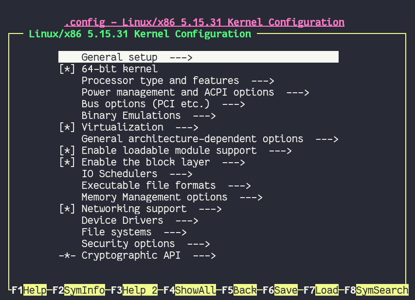
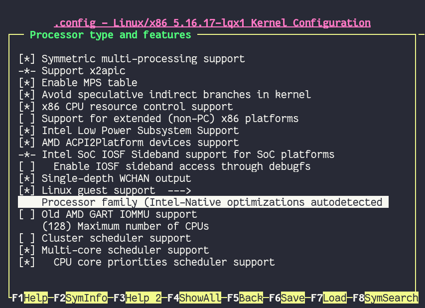
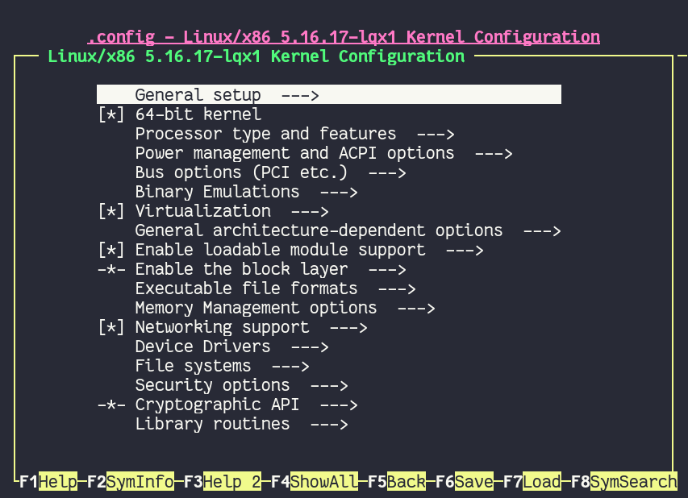
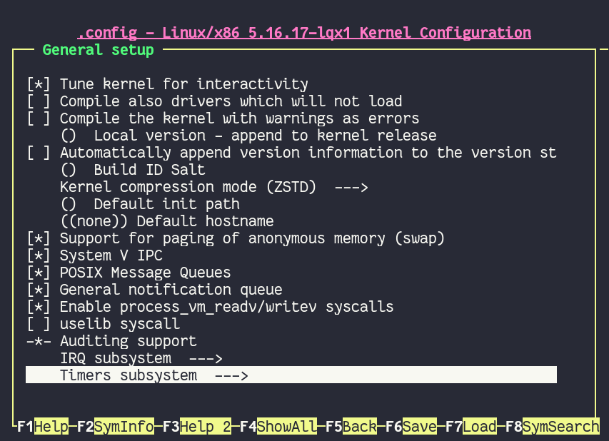
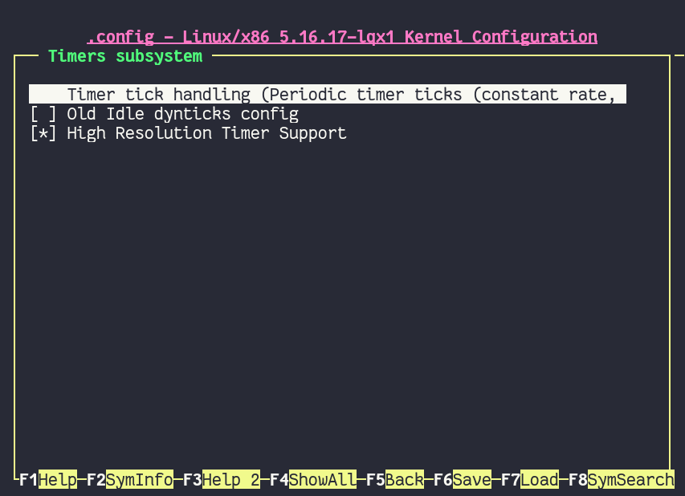
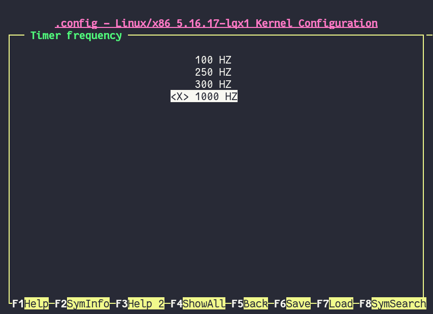
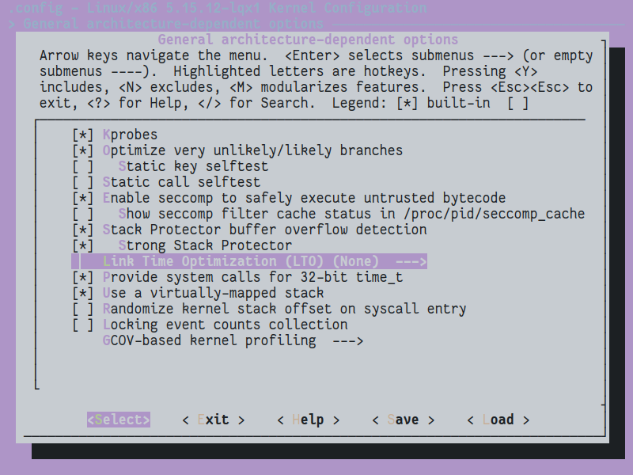

.. ARU (c) 2018 - 2022, Pavel Priluckiy, Vasiliy Stelmachenok and contributors

   ARU is licensed under a
   Creative Commons Attribution-ShareAlike 4.0 International License.

   You should have received a copy of the license along with this
   work. If not, see <https://creativecommons.org/licenses/by-sa/4.0/>.

.. _custom-kernels:

*****************
Кастомные ядра
*****************

Прежде чем мы начнем, хотелось бы прояснить такой вопрос: "А зачем
вообще нужны эти кастомные ядра?". Чтобы дать ответ на данный вопрос,
стоит понимать, что ядро Linux является определенным универсальным
стандартом в мире операционных систем, которое одинаково подходит как
для домашнего ПК, ноутбука, телефона, так и для сервера, роутера,
микро-контроллера. То есть, ядро по умолчанию является швейцарским
ножом, позволяющим применять себя в разных задачах, но при этом не
быть наилучшим в чём-то конкретном. Нет, это не значит что на
ванильном ядре вы не сможете запустить какую-то игру скажем через Wine
или Proton, но такой опыт не будет лучшим, т.к. за такую
многопрофильность ядру приходится платить меньшей производительностью
в определенных задачах. Кастомные же ядро подразумевает определенную
заточенность под что-то конкретное, делая упор на что-то одно. В нашем
случае это производительность и игры, а также улучшение опыта
использования Linux на домашнем ПК или ноутбуке. В этом нам и помогут
нижеперечисленные ядра вместе с их правильной настройкой.

И ещё просим вас заранее установить стабильное linux-lts ядро. В
случае возникновения проблем вы всегда сможете откатиться на эту
версию ядра.

Проверка ядра используемого в данный момент осуществляется следующей
командой: ``uname -r``.

.. index:: kernel
.. _kernel_choose:

=============
Выбор ядра
=============

Хотелось бы отметить, что универсального рецепта по сборке "лучшего
ядра" не существует, и каждый выбирает то, что конкретно для него
лучше работает. Поэтому мы рекомендуем вам установить и попробовать
каждое ядро из предложенных ниже на своем железе, проводя тесты в
любимых играх/востребованных задачах.

.. index:: kernel, zen, native-compilation
.. _linux-zen:

----------
linux-zen
----------

Zen ядро - это плод коллективных усилий по объединению патчей
улучшающих опыт домашнего использования Linux, но при этом работающих
стабильно и не ломающих совместимость с теми или иными вещами.

Это отличный выбор для неискушенного пользователя, что не ставит
задачи в получении максимальной производительности и покорении
максимальной планки FPS. Рекомендуется установить всем, кто не хочет
сильно париться с компиляцией и настройкой других ядер. Ядро можно
установить из репозиториев, ибо оно имеет официальную поддержку
дистрибутивом.

Из основных улучшений:

- Улучшено поведение планировщика CFS для значительного снижения
  задержек в несколько раз.
- Задействован эффективный алгоритм сжатия LZ4 для файла подкачки
  через zswap.
- Используется планировщик ввода/ввода (IO) BFQ, имеющий более низкие
  задержки и бОльшую пропускную способность (Подробнее - `тут
  <https://www.kernel.org/doc/html/latest/block/bfq-iosched.html#when-may-bfq-be-useful>`_).
- Ядро приспособлено к сохранению качества отклика системы при
  высокой нагрузке.

**I. Установка** ::

  sudo pacman -S linux-zen linux-zen-headers

  # Если у вас не GRUB - используйте команду обновления вашего загрузчика
  sudo grub-mkconfig -o /boot/grub/grub.cfg

**II. Установка (нативная компиляция)** ::

  git clone https://aur.archlinux.org/linux-zen-git.git
  cd linux-zen-git
  makepkg -sric
  sudo grub-mkconfig -o /boot/grub/grub.cfg

.. index:: kernel, liquorix, lqx, native-compilation
.. _linux-lqx:

------------
liquorix
------------

linux-lqx - является по сути тем же Zen, но заточенным под Debian
системы. Несмотря на это, авторы ARU считают его лучшим ядром на Arch
Linux, по крайне мере для процессоров Intel. При нативной компиляции
идеально подходит для игр в связке с wine-tkg.

Содержит множество изменений не вошедших в Zen (в виду разных причин):

- Планировщик PDS по умолчанию (На выбор предоставляются также BMQ и
  CFS), имеющий лучшие результаты в повседневных задачах.

- Алгоритм TCP BBR2 обеспечивающий более высокую скорость работы и
  максимизирует пропускную способность

- Multigenerational LRU для сохранения качества отклика в условиях
  нехватки оперативной памяти.

- 1000Hz тактовая частота по умолчанию для более точного планирования
  с минимумом зависаний.

- Предпочтительно жёсткое вытеснение процессов из очереди. Это
  гарантирует вам то, что не один процесс не сможет выжрать все
  процессорное время (дать системе зависнуть).

- Содержит минимальное количество отладочных функций.

- Другие внутренние изменения ядра.

При этом наследует все изменения из Zen.

**I. Установка (бинарные пакеты)** ::

  sudo pacman-key --keyserver hkps://keyserver.ubuntu.com --recv-keys 9AE4078033F8024D
  sudo pacman-key --lsign-key 9AE4078033F8024D      # Добавляем GPG ключ
  sudo nano /etc/pacman.conf

  # Прописываем эти две строчки в файл
  [liquorix]
  Server = https://liquorix.net/archlinux/$repo/$arch

.. image:: images/custom-kernels-16.png

::

  sudo pacman -Suuyy
  sudo pacman -S linux-lqx linux-lqx-headers
  sudo grub-mkconfig -o /boot/grub/grub.cfg

Вариант установки I рекомендуется если не хотите компилировать, но
тогда производительность будет хуже чем у аналогичного
скомпилированного ядра.

**II. Установка и настройка**

В этом случае мы настроим ядро и выполним его нативную-компиляцию.
Тонкая насторйка ядра позволит дать ещё больше производительности и
может ускорить сам процесс сборки. ::

  git clone https://aur.archlinux.org/linux-lqx.git                 # Скачивание исходников.
  cd linux-lqx                                                      # Переход в linux-lqx
  gpg --keyserver keyserver.ubuntu.com --recv-keys 38DBBDC86092693E # GPG ключ
  sed -i 's/_makenconfig=/_makenconfig=y/' PKGBUILD                 # Включаем ручную настройку
  makepkg -sric

После некоторого времени с началом компиляции перед вами предстанет
окно с настройкой ядра. Подробные инструкции и рекомендации по
настройке вы найдете в следующем разделе.

.. image:: images/lqx-menunconfig.png

.. index:: kernel, xanmod, native-compilation
.. _linux-xanmod:

-------
Xanmod
-------

Альтернатива liquorix, так же нацеленная на оптимизацию под игрушки и
повышение плавности работы системы. Новомодное ядро, которое включает
в себе часть уже описанных выше изменений из zen/lqx. Помимо прочего
имеет:

- Улучшенный метод обработки TCP пакетов (BBRv2) 

- Частично включает в себя патчи от Clear Linux (так же как и
  linux-lqx)

- WineSync, альтернатива Fsync, ещё одна реализация синхронизации NT
  примитов для Wine, но вынесенная в качестве отдельного модуля. Для
  остальных ядер может быть установлена через AUR пакет `winesync-dkms
  <https://aur.archlinux.org/packages/winesync-dkms>`_.

- Высокая пропускная способность устройств ввода/вывода.

- Улучшения систем кэширования и управления памятью.

Полный список включаемых в него патчей вы можете найти здесь:
https://github.com/xanmod/linux-patches

.. attention:: Не рекомендуется обладателям процессоров Intel, т.к.
   возможно все ещё имеет нерешенную проблему со сбросом частот
   процессора от данного производителя
   (https://forum.xanmod.org/thread-3800.html)

**I. Установка (компиляция)**::

  git clone https://aur.archlinux.org/linux-xanmod.git                    # Скачивание исходников.
  cd linux-xanmod                                                         # Переход в linux-xanmod
  gpg --keyserver hkp://keyserver.ubuntu.com --recv-keys 38DBBDC86092693E # GPG ключ
  export _makenconfig=y _use_numa=n use_tracers=n _compiler=clang         # Включаем ручную настройку
  makepkg -sric                                                           # Сборка и установка

После некоторого времени с начала сборки у вас должно появится окно с
ручной настройкой ядра. Этот процесс мы подробнее рассмотрим в
следующей главе.

.. index:: kernel, linux-tkg, native-compilation
.. _linux-tkg:

------------
linux-tkg
------------

Является альтернативой всем трем ядрам выше, что предоставляет
возможность собрать ядро с набором множества патчей на улучшение
производительности в игрушках (Futex2, Zenify). Предоставляет выбор в
сборке ядра с разными планировщиками. Грубо говоря, это ядро сборная
солянка из всех остальных ядер с большим набором патчей.

**I. Установка и настройка**::

  git clone https://github.com/Frogging-Family/linux-tkg.git
  cd linux-tkg

Есть две возможности предварительной настройки linux-tkg: либо через
редактирование файла *customization.cfg*, либо через терминал по ходу
процесса установки. Мы выбираем первое и отредактируем
*customization.cfg*::

  nano customization.cfg

Итак, настройка здесь достаточно обширная поэтому мы будем
останавливаться только на интересующих нас настройках:

``_version="5.17"`` - Здесь выбираем версию ядра которую мы хотим
установить. Выбирайте самую последнюю из доступных.

``_modprobeddb="false"`` - Опция отвечающая за сборку мини-ядра.
Подробнее о нем вы можете узнать в соответствующем разделе. Если
хотите собрать мини-ядро - пишите *"true"*, если нет - *"false"*.

``_menuconfig="2"`` - Выбор настройки ядра через
menuconfg/xconfig/nconfig. Рекомендуется выбрать *"2"* чтобы перед
сборкой можно было выполнить непосредственную настройку ядра через
menunconfig как мы уже делали ранее с liquorix.

``_cpusched="pds"`` - Выбор CPU планировщика ядра. К выбору
предоставляется довольно много планировщиков, но мы советуем обратить
ваше внимание только на некоторых из них: "pds",  "bmq", "cacule",
"cfs" (дефолтный для ванильного ядра). По некоторым данным, PDS дает
больше FPS, а CacULE дает лучшие задержки по времени кадра
(плавность). Однако все слишком ситуативно чтобы выбрать из них
лучшего, в каких-то играх/задачах будет выигрывать PDS, а в каких-то
CaCULE и так далее.

Рекомендуется попробовать PDS или CacULE.

``_rr_interval="default"`` - Задает продолжительность удержания двумя
задачами одинакового приоритета. Рекомендуемое значение слишком
зависит от выбранного планировщика, поэтому лучше всего задавайте
*"default"*.

``_default_cpu_gov="performance"`` - Выбирает режим по умолчанию в
котором будет масштабироваться частота процессора. Рекомендуется
*"performance"* чтобы процессор по умолчанию работал в режиме высокой
производительности.

``_aggressive_ondemand="false"`` - Задает агрессивное применение
динамического управления частотой процессора по необходимости в
выполняемой задаче, обеспечивая тем самым энергоэффективность. Но т.к.
выше мы уже закрепили режим масштабирования "performance", то мы можем
отключить этот параметр. Однако пользователи ноутбуков могут оставить
этот параметр включенным.

``_disable_acpi_cpufreq="true"`` - Отключает универсальный acpi_freq
драйвер масштабирования частоты процессора в угоду фирменному драйверу
Intel/AMD процессоров что имеют лучшую производительность по сравнению
с acpi_freq. Выбирайте значение по собственному усмотрению со знанием
своего CPU.

``_sched_yield_type="0"`` - Настраивает выполнение освобождения
процесса от потребления процессорного времени путем его переноса в
конец очереди выполнения процессов. Рекомендуемое значение для лучшей
производительности - *"0"*, т.е. не осуществлять перенос в конец
очереди для освобождения процесса.

``_tickless="1"`` - Рекомендуется выбирать переодические тики таймера
ядра.

``_timer_freq="1000"`` - Задает частоту таймера. Рекомендуется 1000
для лучшей отзывчивости системы на домашнем ПК или ноутбуке.

``_fsync="true"`` - Задействует поддержку ядром замены Esync от
компании Valve - Fsync. Обязательно к включению (*"true"*) для лучшей
производительности в играх.

``_futex2="true"`` - Осуществляет использование нового,
экспериментального futex2 вызова что может дать лучшую
производительность для игрушек запускаемых через Wine/Proton. Для
обычных ядер поддержка Futex2 включена начиная с версии 5.16+.

``_winesync="false"`` - Ещё одна замена esync, но уже от разработчиков
Wine.

``_zenify="true"`` - Применяет твики Zen и Liquorix для улучшения
производительности в играх. Настоятельно рекомендуется к включению.

``_complierlevel="1"`` - Задает степень оптимизации ядра во время
сборки. Лучше всего выбирать *"1"*, т.е. сборку с -O2 флагом (высокая
производительность).

``_processor_opt="native_intel"`` - С учетом какой архитектуры
процессора собирать ядро. Настоятельно рекомендуется указать здесь
либо архитектуру непосредственно вашего процессора (К примеру:
"skylake"), либо фирму производитель, где для Intel это -
*"native_intel"*, для AMD - *"native_amd"*.

``_ftracedisable="true"`` - Отключает лишние трекеры для отладки ядра.

``_acs_override="true"`` - Включает патч на разделение сгруппированных
PCI устройств в IOMMU, которые могут понадобиться вам отдельно. По
умолчанию есть в linux-zen и linux-lqx. Подробнее читайте - `здесь
<https://wiki.archlinux.org/title/PCI_passthrough_via_OVMF#Bypassing_the_IOMMU_groups_.28ACS_override_patch.29>`_.
Советуем включить если в будущем вы хотите выполнить операцию проброса
вашей видеокарты в виртуальную машину.

Вот и все. Остальные настройки *customization.cfg* вы можете выбрать
по собственному предпочтению. После того как мы закончили с
настройкой, можно перейти непосредственно к сборке и установке ядра:::

  makepkg -sric # Сборка и установка linux-tkg

.. index:: kernel, linux-cachyos, native-compilation
.. _linux-cachyos:

--------------
linux-cachyos
--------------

`linux-cachyos <https://github.com/CachyOS/linux-cachyos>`__ -
добротная альтернатива всем остальным ядрам, также нацеленная на
максимальную производительность вашей системы. По субъективным
ощущениям автора работает лучше чем Xanmod и TKG. Предлагает на выбор
множество планировщиков CPU. Сочетает в себе патчи которые уже были
описаны для других ядер. А именно:

- Улучшенный планировщик ввода/вывода BFQ

- Набор патчей LRU для сохранения качества отклика системы в условиях
  нехватки оперативной памяти.

- Содержит новейшие исправления для Btrfs/Zstd

- Заточен для сборки через LLVM/Clang (более подробно это описывается
  в последующем разделе)

- Алгоритм для обработки сетевых пакетов BBRv2

- Модули для поддержки эмуляции Android (Anbox)

- Набор патчей от Clear Linux

- И некоторые собственные настройки для ядра

Отдельным плюсом является быстрая обновляемость и оперативные
исправления ошибок, чем к сожалению не всегда может похвастаться
linux-tkg.

**Установка I.**

А вот тут не все так просто, ибо прежде чем мы начнем, стоит
оговориться, что у этого ядра есть вариации с пятью разными
планировщиками. Это: CFS, BMQ, PDS, TT и BORE (есть ещё другие, но они
менее активно сопровождаемые). Автор рекомендует остановиться на BORE
и PDS, как на наиболее проверенных решениях. Но вы можете попробовать
и другие варианты. Далее я буду выполнять команды для установки ядра с
BORE, но соответственно вы можете писать вместо bore любой другой. ::

 git clone https://github.com/CachyOS/linux-cachyos.git  # Скачиваем исходники
 cd linux-cachyos-bore # Если хотите использовать PDS, то соответственно пишите cd linux-cachyos-pds по аналогии
 sed -i 's/_use_llvm_lto=/_use_llvm_lto=full/' PKGBUILD # Включаем сборку через Clang. Подробнее об этом в последующем разделе
 makepkg -sric

Данное ядро немного умнее других, поэтому определяет архитектуру
вашего процессора и автоматически указывает компилятору собирать себя
именно под неё. Т.е. нативная компиляция здесь есть по умолчанию, так
что в принципе вы можете не сильно заморачиваться с настройкой ядра
или вовсе пропустить данный шаг. Но все таки, если у вас есть
собственные предпочтения относительно определенных параметров вашего
ядра, то вы всегда можете включить ручную настройку через menuconfig
использую опцию PKGBUILD: ``sed -i 's/_makenconfig=/_makenconfig=y/'
PKGBUILD`` (подобная команда введена для удобства, вы можете сделать
то же самое через любой удобный вам текстовый редактор, отредактировав
файл PKGBUILD).

**Установка II (бинарные пакеты)**

Бинарную версию ядра можно получить либо через подключение стороннего
репозитория, либо скачав уже готовый пакет опять с того же
репозитория, но не подключая его. Со вторым всё просто, переходите на
данный сайт: https://mirror.cachyos.org/repo/x86_64/cachyos/ и ищите
версию ядра которая вам по вкусу. Потом устанавливаете через ``sudo
pacman -U`` (в конце пишете путь до скаченного файла).

Первый вариант также позволяет получать последние обновления, поэтому он предпочтительней::

  sudo pacman-key --recv-keys F3B607488DB35A47 --keyserver keyserver.ubuntu.com
  sudo pacman-key --lsign-key F3B607488DB35A47
  sudo pacman -U 'https://mirror.cachyos.org/repo/x86_64/cachyos/cachyos-keyring-2-1-any.pkg.tar.zst' 'https://mirror.cachyos.org/repo/x86_64/cachyos/cachyos-mirrorlist-10-1-any.pkg.tar.zst' 'https://mirror.cachyos.org/repo/x86_64/cachyos/cachyos-v3-mirrorlist-10-1-any.pkg.tar.zst'

Стоит учитывать, что у данного репозитория есть развилка по
архитектурам. То есть он одновременно поддерживает и x86_64, и
x86_64v3. В чем разница? В том, что x86_64v3 чуть более оптимизирован
для современных процессоров и использует инструкции, которые нельзя
применить к обычной x86_64 в угоду совместимости.

Поэтому сначала проверим, поддерживает ли ваш процессора архитектуру
x86_64v3::

  /lib/ld-linux-x86-64.so.2 --help | grep "x86-64-v3 (supported, searched)"

Если вывод команды НЕ пустой, то ваш процессор поддерживает x86_64v3.

Пропишем репозиторий в /etc/pacman.conf::

  sudo nano /etc/pacman.conf

Теперь, если у вас ЕСТЬ поддержка x86_64v3, то пишем следующее::

  # Находим данную строку и редактируем:
  Architecture = x86_64 x86_64_v3

  # Спускаемся в самый низ файла и пишем:
  [cachyos-v3]
  Include = /etc/pacman.d/cachyos-v3-mirrorlist

Если же нет, то::

  # Спускаемся в самый низ файла и пишем:
  [cachyos]
  Include = /etc/pacman.d/cachyos-mirrorlist

После этого выполните обновление системы и вы сможете установить
бинарное ядро::

  sudo pacman -Syu

После этого тоже ставим пакет в соответствии с желаемым планировщиком:
``sudo pacman -S linux-cachyos``. Или ``sudo pacman -S
linux-cachyos-bore``. И так далее.

.. index:: kernel, configure
.. _manual_kernel_configuration:

================
Настройка ядра
================

При нативной компиляции ядра обязательным этапом является его
настройка. Хотя и заботливые сопровождающие кастомных ядер обычно уже
заранее выполняют всю работу за вас, есть пара моментов на которых
стоит остановиться.

После начала компиляции через некоторое время перед вами должно
появится меню настройки ядра. Перемещение между пунктами в нем
осуществляется стрелками на клавиатуре, переход в следующий раздел
через клавишу *Enter*, а выход из него через *Esc*.

Далее необходимо следовать графической инструкции.

**1.** Для начала выберем одну из важнейших настроек. Это выбор
архитектуры процессора под которую будет компилироваться ядро. По
умолчанию выбрана *Generic*, то есть такое ядро будет собираться под
абстрактную x86 архитектуру и при этом будет совместимо с любым
процессором, хоть AMD, хоть Intel. Главным же преимуществом именно
нативной компиляции любого ПО состоит в задействовании максимума
производительности конкретно под вашу архитектуру процессора, с
использованием всех доступных ему инструкций. А в случае с ядром это
особенно важно, ибо ядро это сердце операционной системы, и если его
нативно собрать под себя, то мы получаем существенный прирост и
отличный отклик системы. Поэтому начиная с главного окна настройки
перейдите в раздел *"Processor type and features"* и затем в
*"Processor family"*. Здесь выберите либо *"Intel-native
optimizations"* если у вас процессор Intel, либо *"AMD-native
optimizations"* если у вас процессор AMD, как это показано на
скриншотах ниже.

**1.1**

.. image:: images/processor-type-and-features-entry.png

**1.2**

**1.3**

.. image:: images/processor-family-choice.png

(**Важно**: автор выбрал здесь Intel-native, но **если у вас процессор от AMD выбирайте только AMD-native** )

**2.** Изменим поведение таймера ядра. Дело в том, что ядро может
осуществлять прерывания для перепланирования задач процессора либо
статически через частоту N (один тик), либо динамически. Динамический
таймер работает только тогда, когда процессор находится в работе, т.
е. когда процессор простаивает таймер прерываний останавливает свою
работу (из-за ненадобности). Существует также и вариант динамического
таймера когда тики не происходят даже тогда, когда процессор чем-то
занят.

Собственно выбор этих трех вариантов и дан нам на скриншотах ниже, где:

- Periodic timer ticks - осуществление тика статически через частоту N
- Idle dynticks system - прерывания через частоту тика N только тогда, когда процессор чем-то занят.
- Full dynticks system - прерывания через частоту тика N, но не всегда, даже если процессор чем-то занят.

**Что из этого выбрать?**

По нашему мнению динамические тики лучше всего выбирать тем людям,
которые хотят уменьшить энергопотребление системы. В том числе всем
пользователям ноутбуков/нетбуков посвящается. Обратите внимание, что
*Full dynticks system* может одновременно несколько ухудшить или
улучшить производительность в зависимости от железа, но даёт реальные
преимущества в экономии энергии.

Рекомедуется лучше выбирать переодические тики (*"Idle dynticks
system"*), ибо на практике оказывается что периодические тики дают
более хорошую производительность чем статические.

**2.1**

**2.2**

**2.3**

**2.4**

.. image:: images/timer-subsystem-3.png

**3.** Просим вас удостовериться в значениях частоты вашего таймера.
Это как раз то самое N через которое происходит тик таймера и
последующее за ним прерывание. Рекомендуемое значение для домашнего
ПК/Ноутбука это 1000. Однако если вы имеете многоядерный процессор (12
и более потоков) или какой-нибудь серверный Intel Xeon, то вы можете
попробовать установить частоту ниже 1000.

**3.1**

.. image:: images/processor-type-and-features-entry.png

**3.2**

.. image:: images/timer-freqency.png

**3.3**

**4.** Рекомендуем вам отключать отладочные функции ядра. Они тоже
имеют свои накладные расходы и в большинстве случаев вы ими
пользоваться никогда не будете, а на крайний случай у вас должно быть
установлено ядро linux-lts как запасной аэродром. Для их отключения из
главного меню перейдите в *"Kernel Hacking"* и сделайте там все так,
как показано на скриншотах:

.. note:: Обращаем ваше внимание на то, что на некоторых ядрах не все
   возможные отладочные параметры могут быть отключены. Например
   Xanmod не позволяет отключить ряд параметров из списка ниже. Но вы
   можете ими пренебречь.

**4.1**

.. image:: images/kernel-hacking.png

**4.2**

.. image:: images/kernel-debugging.png

**5.** Обладателям видеокарт NVIDIA советуем отключить поддержку
фирменного фреймбуфера, как бы странно это не звучало. Это позволит
вам избежать проблемы конфликта фреймбуфера ядра и фреймбуфера
бинарного драйвера NVIDIA. Сделайте это как показано ниже:

**5.1**

.. image:: images/kernel-device-drivers.png

**5.2**

.. image:: images/kernel-graphics-support.png

**5.3**

.. image:: images/kernel-fb-devices-choice.png

**5.4**

.. image:: images/kernel-fb-devices.png

**5.5**

.. image:: images/kernel-nvidia-fb.png

.. index:: kernel, clang, lto native-compilation
.. _kernel-with-clang-lto:

===================================
Сборка ядра с помощью Clang + LTO
===================================

В разделе `"Общее ускорение системы"
<https://ventureo.codeberg.page/source/generic-system-acceleration.html#clang>`_
мы уже говорили о преимуществах сборки пакетов при помощи компилятора
Clang вместе с LTO оптимизациями. Но ядро требует отдельного
рассмотрения, ибо те параметры которые мы указали ранее в makepkg.conf
не работают для сборки ядра, и потому по прежнему будут применяться
компиляторы GCC.

Чтобы активировать сборку ядра через Clang нужно:

- Для ядра linux-xanmod экспортировать данную переменную окружения перед выполнением команды сборки: ``export _compiler=clang``
- Для ядра linux-tkg в конфигурационном файле *customization.cfg* включить параметр *_compiler="llvm"*
  (В том же файле можно настроить применение LTO оптимизаций через параметр *_lto_mode*. О режимах LTO читайте далее).
- Для всех остальных ядер, устанавливаемых из AUR (в том числе linux-lqx), нужно просто экспортировать переменные окружения *LLVM=1* и *LLVM_IAS=1* перед командой сборки::

    export LLVM=1 LLVM_IAS=1 # Без переменной LLVM_IAS станет невозможным применение LTO оптимизаций
    makepkg -sric            # Сборка и установка желаемого ядра

Теперь перейдем к выбору режима LTO.
Для этого на этапе конфигурации вашего ядра зайдите в *"General architecture-dependent options"* ->
*"Link Time Optimization (LTO)"* как показано на изображениях:

1.

.. image:: images/custom-kernels-17.png

2.

3.

.. image:: images/custom-kernels-19.png

На последнем изображении показано окно выбора режима применения LTO оптимизаций.
Этих режимов всего два:

1. Полный (Full): использует один поток для линковки, во время сборки медленный и использует больше памяти,
   но теоретически имеет больший прирост производительности в работе уже готового ядра.
2. Тонкий (Thin): работает в несколько потоков, во время сборки быстрее и использует меньше памяти, но может иметь более низкую производительность в итоге чем *Полный (Full)* режим.

Мы рекомендуем использовать *"Полный (Full)"* режим чтобы получить в итоге лучшую производительность.

.. attention:: Сборка ядра через Clang работает только с версией ядра 5.12 и выше!

Больше подробностей по теме вы можете найти в данной статье:

https://habr.com/ru/company/ruvds/blog/561286/

.. vim:set textwidth=70:
