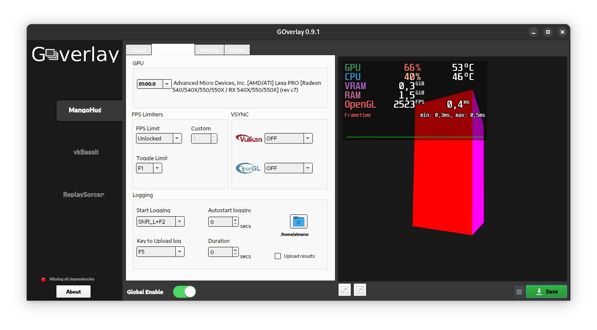
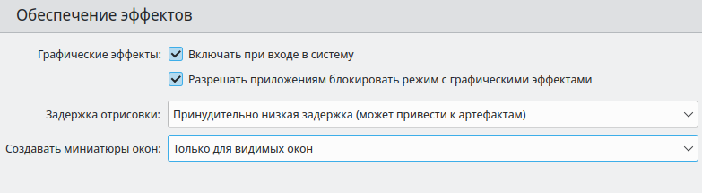

.. ARU (c) 2018 - 2022, Pavel Priluckiy, Vasiliy Stelmachenok and contributors

   ARU is licensed under a
   Creative Commons Attribution-ShareAlike 4.0 International License.

   You should have received a copy of the license along with this
   work. If not, see <https://creativecommons.org/licenses/by-sa/4.0/>.

.. _de-optimizations:

************************************
Оптимизация рабочего окружения (DE)
************************************

Современные среды рабочего стола стали достаточно прожорливыми и
требовательными к аппаратным ресурсам компьютера, и хотя они и
довольно хороши с точки зрения удобства использования, все же хотелось
бы минимизировать потребление той же ОЗУ с их стороны. Поэтому в этом
разделе мы по отдельности рассмотрим оптимизацию разных рабочих
окружений и не только.

.. index:: x11, no-display-manager, xorg-xinit
.. _launch-without-display-manager:

===================================================================
Запуск любой DE или WM без экранного менеджера *(Только для X11)*
===================================================================

Почти всегда любое рабочее окружение запускается при помощи экранного
менеджера (его ещё называют менеджером входа), через который вы
осуществляете вход в систему и оболочку соответственно. Говоря ещё
проще, это экран входа, где вас  просят пройти аутентификацию (ввести
пароль к вашей учетной записи). Он также выполняет функцию  управления
рабочими сессиями в разных окружениях. Тем не менее он тоже потребляет
определенные ресурсы компьютера, а осуществить вход в систему можно и
без него, т.е. через tty, хоть вы и пожертвуете тем самым определенным
уровнем удобства. Для автоматизации запуска любой DE/WM (кроме Wayland
сессий) через tty вам понадобиться прописать в ваш *.bash_profile* или
*.zsh_profile* следующее::

  if [[ -z $DISPLAY && $(tty) == /dev/tty1 ]]; then
    XDG_SESSION_TYPE=x11 GDK_BACKEND=x11 exec startx
  fi

Это запустит X-сервер сразу при входе в tty1 (терминал по умолчанию).
Обязательным условием при этом является наличие установленного пакета
`xorg-xinit
<https://archlinux.org/packages/extra/x86_64/xorg-xinit/>`_, и заранее
настроенный файл *~/.xinitrc*, в котором прописана команда запуска
вашего DE/WM (например: ``exec gnome-session``). Например: ``exec
gnome-session`` # Запускает gnome сессию при запуске Xorg сервера.

.. index:: gnome, vsyncoff, tearing
.. _vsync_off:

=============================
Ускорение плавности любых DE
=============================

Используя приложение GOverlay_ с активацией глобального профиля,
возможно принудительно отключить встроенные в композиторы системы
синхронизации кадра без появления тиринга (разрыв изображения), но
ценой большего электропотребления и нагрузки на GPU.

Установите значения как показано на изображении.

.. warning:: Использовать с осторожностью, особенно, если у вас мощная видеокарта.

.. _GOverlay: https://ventureo.codeberg.page/source/linux-gaming.html#mangohud

.. index:: gnome, de-optimizations
.. _gnome-optimization:

==========
GNOME 4X.X
==========

Сам по себе GNOME - наверное одна из самых тяжеловесных и
требовательных к системным ресурсам оболочка из ныне существующих. Тем
не менее у неё есть свои преимущества перед другими оболочками, за что
её и любят пользователи. Но к сожалению низкое энергопотребление не в
их числе, поэтому в этом разделе вы узнаете о том, как заставить
похудеть ваш толстенький gnome-shell.

.. index:: garbage-removal, gnome-control-center, gnome
.. _gnome-garbage-removal:

----------------------
Удаление мусора GNOME
----------------------

::

  sudo pacman -Rsn epiphany gnome-calculator gnome-calendar gnome-contacts gnome-maps gnome-music gnome-weather gnome-clocks gnome-photos gnome-software gnome-user-docs totem yelp gnome-user-share gnome-characters simple-scan eog tracker3-miners rygel evolution-data-server gnome-font-viewer gnome-remote-desktop gnome-logs orca malcontent

**P.S.** Удаляйте пакеты с осознанием того, что вы делайте. Несмотря
на то, что здесь были собраны наиболее сомнительные по соотношению
нужности/прожорливости пакеты, вы можете найти какой-либо из данных
пакетов полезным и нужным.

Можете удалить Nautilus и GVFS если хотите заменить более легковесным
аналогом (например PCManFM)::

  sudo pacman -Rsn gvfs-afc gvfs-goa gvfs-gphoto2 gvfs-mtp gvfs-nfs gvfs-smb gvfs-google nautilus

.. warning:: Некоторые пакеты из вышеприведенной команды могут быть не найдены в вашей системе.
   В таком случае просто выпишите их из команды.

Для совсем отчаянных парней, после окончательной настройки параметров
GNOME, вы можете удалить самый "тяжелый" пакет `gnome-control-center
<https://archlinux.org/packages/extra/x86_64/gnome-control-center/>`_
(Параметры GNOME 3/41).

По сути, это графическая обертка для gsettings, которая однако
достаточно тяжеловесная, и тянет за собой кучу ненужных зависимостей.
::

  sudo pacman -Rsn gnome-control-center

.. index:: services, daemons, file-indexing, tracker3
.. _disabling-tracker-3:

-----------------------------
Отключение Tracker 3 в GNOME 
-----------------------------

Tracker - это встроенный поисковик для GNOME, который индексирует все
файлы на диске и не только. Как любой индексатор файловых систем, он
призван кушать ресурсы и мощности вашего накопителя и висеть в
оперативной памяти, хоть и в гораздо меньшей степени чем конкуренты
(До Windows, с их 100% загруженности на диск, еще как до луны). Тем не
менее, его отключение может положительно повлиять на жизненный цикл
вашего HDD (в особенности) или SSD, поэтому его можно отключить в
целях профилактики диска. Обратите внимание, что после отключения
поиск файлов в GNOME может работать некорректно и не так быстро.

**Инструкция по отключению** ::

  systemctl --user mask tracker-miner-apps tracker-miner-fs tracker-store

После перезагрузки системы выполните::

  rm -rf ~/.cache/tracker ~/.local/share/tracker   # Чистим кэш tracker
  tracker daemon -t                                # Проверяем, должно быть 0 PID

.. index:: service, daemons, gnome-settings-daemon
.. _disabling-gsd-daemons:

------------------------------------
Отключение ненужных GSD служб GNOME
------------------------------------

.. attention:: Способ отключения служб был обновлен. Крайне
   рекомендуется использовать именно новый способ через systemd взамен
   старого, опасного переименования библиотек.

GSD (gnome-settings-daemon) службы, это, как следует из названия,
службы настройки GNOME и связанных приложений. Если отойти от строго
определения, то это просто службы-настройки на все случаи жизни,
которые просто висят у вас в оперативной памяти в ожидании когда вам,
или другому приложению, к примеру, понадобиться
настроить/интегрировать поддержку планшета Wacom или других устройств.
И другие подобные вещи.

# Отключение служб интеграции GNOME с графическим планшетом Wacom.
Если у вас такого нет - смело отключайте. ::

  systemctl --user mask org.gnome.SettingsDaemon.Wacom.service

# Отключение службы уведомления о печати. Если нет принтера или вам
просто не нужны эти постоянные уведомления - отключаем. ::

  systemctl --user mask org.gnome.SettingsDaemon.PrintNotifications.service

# Отключение службы управления цветовыми профилями GNOME. Отключив её
не будет работать тёплый режим экрана (Системный аналог Redshift). ::

  systemctl --user mask org.gnome.SettingsDaemon.Color.service

# Отключение службы управления специальными возможностями системы.
**Не отключать людям с ограниченными возможностями!** ::

  systemctl --user mask org.gnome.SettingsDaemon.A11ySettings.service

# Отключает службу управления беспроводными интернет-соединениями. Не
рекомендуется отключать для ноутбуков с активным использованием Wi-Fi.
::

  systemctl --user mask org.gnome.SettingsDaemon.Wwan.service

# Отключение службы защиты от неавторизованных USB устройств при
блокировке экрана. Можете оставить если у вас ноутбук. ::

  systemctl --user mask org.gnome.SettingsDaemon.UsbProtection.service

# Отключаем службу настройки автоматической блокировки экрана. Можете
оставить если у вас ноутбук. ::

  systemctl --user mask org.gnome.SettingsDaemon.ScreensaverProxy.service

# Отключение службы настройки общего доступа к файлам и директориям.
::

  systemctl --user mask org.gnome.SettingsDaemon.Sharing.service

# Отключение службы управления подсистемой rfkill, отвечающей за
отключения любого радиопередатчика в системе (сюда же относятся Wi-Fi
и Bluetooth, поэтому данная служба нужна, скорее всего, для так
называемого режима в "самолете"). ::

  systemctl --user mask org.gnome.SettingsDaemon.Rfkill.service

# Отключение службы управления клавиатурой и раскладками GNOME. Можно
смело отключать если уже настроили все раскладки и настройки
клавиатуры заранее, ибо все предыдущие настройки сохраняются при
отключении. ::

  systemctl --user mask org.gnome.SettingsDaemon.Keyboard.service

# Отключаем службу управления звуком GNOME. Отключает **ТОЛЬКО**
настройки звука GNOME, а не вообще всё управлением звуком в системе.
::

  systemctl --user mask org.gnome.SettingsDaemon.Sound.service

# Отключение службы интеграции GNOME с карт-ридером. ::

  systemctl --user mask org.gnome.SettingsDaemon.Smartcard.service

# Отключение службы слежения за свободным пространством на диске.
Штука полезная, но если вы предпочитаете следить за этим
самостоятельно, то вперед ::

  systemctl --user mask org.gnome.SettingsDaemon.Housekeeping.service

# Отключение службы управления питанием в GNOME. Вы должны оставить
эту службу включенной если у вас ноутбук, т. к. без неё не будет
работать регулирование яркости. ::

  systemctl --user mask org.gnome.SettingsDaemon.Power.service

# Отключение служб Evolution для синхронизации онлайн аккаунтов (Если
вы конечно не удалили сам Evolution через команду чистки мусора выше)
::

  systemctl --user mask evolution-addressbook-factory evolution-calendar-factory evolution-source-registry

Если после отключения какой-либо из вышеперечисленных служб что-то
пошло не так, или просто какую-либо из них понадобилось снова
включить, просто пропишите::

  systemctl --user unmask --now СЛУЖБА

Служба вернется в строй после перезагрузки.

.. attention:: Если вы по-прежнему использовали старый способ с
   переименованием библиотек, то настоятельно рекомендуется выполнить
   переустановку пакета gnome-settings-daemon, а затем выполнить
   отключение ненужных вам служб уже описанным выше способом.

.. index:: installation, gnome-shell, mutter, compositor
.. _gnome-shell-and-mutter-performance:

------------------------------------------------
gnome-shell-performance и mutter-performance
------------------------------------------------

Пакеты `gnome-shell-performance
<https://aur.archlinux.org/packages/gnome-shell-performance>`_ и
`mutter-performance
<https://aur.archlinux.org/packages/mutter-performance/>`_ - это
модифицированные версии пакетов GNOME, где упор сделан на плавность и
отзывчивость благодаря включению большого количества патчей для
повышения производительности DE.

**Установка gnome-shell-performance** ::

  git clone https://aur.archlinux.org/gnome-shell-performance.git # Загружаем исходники
  cd gnome-shell-performance                                      # Переход в директорию
  makepkg -sric                                                   # Сборка и установка

**Установка mutter-performance** ::

  git clone https://aur.archlinux.org/mutter-performance.git # Загружаем исходники
  cd mutter-performance                                      # Переход в директорию
  makepkg -sric                                              # Сборка и установка

Также можно выполнить нативную компиляцию пакетов при помощи Clang:
`Mesa <https://aur.archlinux.org/packages/mesa-git/>`_ (Только для
оборудования Intel & AMD), `Wayland
<https://aur.archlinux.org/packages/wayland-git/>`_,
`Wayland-protocols
<https://aur.archlinux.org/packages/wayland-protocols-git/>`_,
`Lib32-wayland <https://aur.archlinux.org/lib32-wayland-git.git>`_,
`Egl-wayland <https://aur.archlinux.org/egl-wayland-git.git>`_,
`xorg-server <https://aur.archlinux.org/packages/xorg-server-git/>`_ и
многих других.

Более подробную информацию вы можете найти в разделе `"Общее ускорение
системы"
<https://ventureo.codeberg.page/source/generic-system-acceleration.html#clang>`_.

.. index:: cosmetics, gnome
.. _gnome_cosmetics:

---------------------------
Бонус: немного косметики
---------------------------

С обновлением GNOME 42 некоторые приложения на GTK 4 стали
использовать тему libadwaita, но из-за этого приложения на GTK 3 стали
выглядить неоднородными, не говоря уж о Qt.

Чтобы это исправить, установите портированную тему libadwaita для GTK
3.

**Установка** ::

  git clone https://aur.archlinux.org/adw-gtk3.git # Скачиваем исходники
  cd adw-gtk3                                      # Переход в директорию
  makepkg -sric                                    # Сборка и установка

  # Устанавливаем как тему по умолчанию
  gsettings set org.gnome.desktop.interface gtk-theme adw-gtk3

.. index:: cosmetics, gnome
.. _fix_gtk4_fonts:

--------------------------------------
Исправление размытия шрифтов в GTK 4
--------------------------------------

С обновлением многих приложений и их переходом на GTK 4
многие заметили "размытие" шрифтов в приложениях.

Чтобы это исправить нужно отредактировать конфиг GTK 4::

  nano ~/.config/gtk-4.0/settings.ini

  # Добавьте ниже к уже имеющимся настройкам
  [Settings]
  gtk-hint-font-metrics=1

.. index:: results
.. _gnome-result:

----------
Результат
----------

По окончании всех оптимизаций мы получаем потребление на уровне
современной XFCE, но в отличие от оной уже на современном GTK4, а
также со всеми рабочими эффектами и анимациями.

.. image:: https://codeberg.org/ventureo/ARU/raw/branch/main/archive/DE-Optimizations/images/image2.jpg

**Видеоверсия**

https://www.youtube.com/watch?v=YlViA-nOzsg

**Демонстрация плавности**

https://www.youtube.com/watch?v=1TjicRvrFbo

.. index:: plasma, kde, de-optimizations
.. _plasma-optimization:

===============
KDE Plasma 5
===============

Несмотря на то, что авторы ARU считают эту оболочку довольно
перегруженной, она по прежнему остается лидером по меньшему
энергопотреблению оперативной памяти среди других рабочих окружений.
Однако, "бесконечность - не предел", поэтому в этом разделе мы сделаем
так, чтобы ваша plasma-shell кушала еще меньше ресурсов, и применим на
ней другие твики.

.. index:: garbage-removal, plasma-pa
.. _plasma-garbage-removal:

-----------------------------
Удаление мусора из Plasma 5
-----------------------------

::

  sudo pacman -Rsn kwayland-integration kwallet-pam plasma-thunderbolt plasma-vault powerdevil plasma-sdk kgamma5 drkonqi discover oxygen bluedevil plasma-browser-integration plasma-firewall
  # Не удаляйте powerdevil если у вас  ноутбук, а bluedevil если используете bluetooth соответственно.

  sudo pacman -Rsn plasma-pa     # Удаляем виджет управления звуком.
  sudo pacman -S kmix            # Замена виджету plasma-pa, совместим с ALSA.

**P.S.** Удаляйте пакеты с осознанием того, что вы делайте. Несмотря
на то, что здесь были собраны наиболее сомнительные по соотношению
нужности/прожорливости пакеты, вы можете найти какой-либо из данных
пакетов полезным и нужным.

.. warning:: Некоторые пакеты из вышеприведенной команды могут быть не найдены в вашей системе.
   В таком случае просто выпишите их из команды.

.. index:: services, daemons, file-indexing, baloo
.. _disabling-baloo:

---------------------------
Отключение Baloo в Plasma
---------------------------

Baloo - это файловый индекстор в Plasma, аналог Tracker в GNOME,
который однако `ОЧЕНЬ прожорливый
<https://sun9-71.userapi.com/impg/BfaY4aziS81VH2i839oSLOx87oezAyryVyeBRA/Jpv5mJGJ7X4.jpg>`_,
и ест довольно много ресурсов процессора и памяти, вдобавок фоном
нагружая ваш диск, в отличии от того же Tracker 3. Поэтому, мы
рекомендуем отключать его в любом случае, HDD у вас, или SSD. Хоть
разработчики и пытались исправить ситуацию с его непомерным
потреблением ресурсов, по прежнему `осталась проблема
<https://sun9-23.userapi.com/impg/dREwZKZRK80G5sASKacn7mLpQ00-9I1KUncXWg/SDEoiKFoS4M.jpg>`_
"утечки" оперативной памяти среди подпроцессов Baloo.

**Инструкция по отключению:** ::

  systemctl --user mask kde-baloo.service           # Полное отключение
  systemctl --user mask plasma-baloorunner.service

Или::

  balooctl suspend                  # Усыпляем работу индексатора
  balooctl disable                  # Отключаем Baloo
  balooctl purge                    # Чистим кэш

Его точно так же можно отключить в графических настройках Plasma:

.. image:: https://codeberg.org/ventureo/ARU/raw/branch/main/archive/DE-Optimizations/images/image9.png

.. index:: service, daemons, plasma
.. _disabling-plasma-daemons:

---------------------------------
Отключение ненужных служб Plasma
---------------------------------

По аналогии с GNOME, у Plasma тоже есть свои службы настройки, которые
хоть и гораздо менее требовательны к ресурсам. Тем не менее, это по
прежнему солянка из различных процессов, которые вам далеко не всегда
пригодятся, а отключая ненужные из них вы можете чуть снизить
потребление оперативной памяти вашей оболочкой, т.к. по умолчанию все
службы включены.

Настройка служб происходит в графических настройках Plasma, в разделе
"*Запуск и завершение*" -> *"Управление службами"*

.. image:: https://codeberg.org/ventureo/ARU/raw/branch/main/archive/DE-Optimizations/images/image12.png

**Список служб к отключению:**

*Монитор устройств Thunderbolt* -> Отключаем, если вы не используйте
Thunderbolt

*Запуск системного монитора* -> Отключаем, довольно бесполезная
служба.

*Напоминание, об установке расширения браузера* -> Еще более
бесполезная служба, отключаем.

*Настройка прокси-серверов* -> Отключайте если не используете
прокси/системный VPN.

*Bluetooth* -> Отключайте если не используйте bluetooth (Если удален
bluedevil, этого пункта может и не быть).

*Учётные записи* -> Нужна только если у вас больше одной учетной
записи на компьютере.

*Сенсорная панель* -> Отключаем если её нет или вы ей не пользуйтесь.

*Обновление местоположения для коррекции цвета* -> Нужна для "теплого
режима" экрана, аналог Redshift. Если не пользуетесь или в ваш монитор
встроен этот режим - отключайте.

*Модуль шифрования папок рабочей среды Plasma* -> Нужна только если вы
параноик. Впрочем, параноики используют более тяжёлые средства
шифрования, поэтому отключаем.

*Слежение за изменениями в URL* -> Работает только в сетевых папках,
если вы ими не часто пользуетесь - отключаем.

*Слежение за свободным местом на диске* -> Вещь полезная, но это вы
можете сделать и самостоятельно через виджеты, поэтому Откл./Оставлять
по желанию.

*SMART* -> Тоже довольно полезная служба, отключайте на свое
усмотрение.

*Диспетчер уведомлений о состоянии* -> Нужна для правильной работы
лотка и трея.

*Служба синхронизации параметров GNOME/GTK* -> Осуществляет смену GTK
темы на лету. Если отключите, смена GTK темы будет применяться только
после перезагрузки.

*Фоновая служба клавиатуры* -> Служба для отображения раскладки в
системном лотке.

*Служба локальных сообщений* -> Следит в общении между терминалами
через команды wall и write. Это очень специфично, поэтому отключаем.

*Модуль для управления сетью* -> Добавляет системный лоток виджет для
управления сетевыми подключениями. Отключайте, если не используете
NetworkManager.

*Состояние сети* -> Оповещает приложения в случае неработоспособности
интернет-соединения. Тоже довольно нишевая служба, можно отключить.

*Подключение внешних носителей* -> Автоматически примонтирует внешние
устройства при их подключении. Например, такие как USB-флешки.
Отключайте на свое усмотрение.

*Часовой пояс* -> Информирует другие приложения об изменении
системного часового пояса. Довольно редко применимо, можно отключить.

*Обновление папок поиска* -> Автоматически обновляет результат поиска
файлов. Отключаем на свое усмотрение. Кроме того, судя по всему
работает только в Dolphin.

*Действия* -> Обеспечивает работу специально назначенных действий в
настройках. Если вы не используйте кастомные бинды, можете отключить.

*Фоновая служба меню приложений* -> Странная служба. По своей функции
она осуществляет обновление Меню Приложений при появлении новых
ярлыков, однако даже при её отключении этот функционал работает.
Отключайте на свое усмотрение.

.. index:: lowlatency, compositor, kwin
.. _lowlatency-kwin:

..
Удалить раздел с выходом Plasma 6. Данная настройка была упразднена в
пользу улучшенного алгоритма планирования кадров на основе статистики
средней задержки.

https://invent.kde.org/plasma/kwin/-/commit/15080192f747d361d295b752b66e2241e5bad6a8
..

-----------------------
Понижение задержек KWin
-----------------------

Kwin - это менеджер окон и композитор в одном лице для Plasma.
Непосредственно он отвечает за вертикальную синхронзацию кадров всего
окружения и подаче итоговой картинки на экран. Несмотря на большой
прогресс в развитии, остается большой проблемой высокие задержки
отклика окружения и приложений, что не всегда связано общей
производительностью системы, а задержкой установленой композитором на
отображение кадров (Vsync).

Итак, чтобы обеспечить наилучшую плавность и визуальное качество
отклика, нам нужно провести небольшую настройку Kwin. Для этого мы
перейдем в соответствующий раздел настроек Plasma, т. е. в *Экран* ->
*Обеспечение Эффектов*.

Что-ж, давайте по порядку.

**"Задержка отрисовки"**

Параметр напрямую влияющий на плавность отрисовки и синхронизацию
между кадрами. Он задает с какой задержкой композитор перейдет к
композитингу и синхронизации следующего кадра. Соответственно, чем
меньше задержка между этими событиями, тем быстрее композитор сможет
нарисовать последующие кадры, благодаря чему и достигается такое
расплывчатое понятие, как "плавность" картинки, отсутствие высокой
задержки ввода (input lag) и в тоже время бесшовность картинки, т.е.
отсутствие тиринга. Лучшим вариантом для закрытого драйвера NVIDIA
будет, и настоятельно рекомендуется - *"Принудительно низкая
задержка"*. Для открытых драйверов Intel/AMD не все так однозначно, и
с принудительно низкой задержкой могут возникать артефакты отрисовки.
Тем не менее, все также рекомендуется *"Предпочитать низкую
задержку"*.

**"Разрешить приложениям блокировать режим с графическими эффектами"**

Не всегда, и не во всех приложениях нужно осуществлять композитинг и
отрисовку графических эффектов, поэтому была сделана эта опция чтобы
дать разрешение на их блокировку другими приложениями. В целом,
блокировка графических эффектов нужна в основном для полноэкранных
видеоигр, чтобы не создавать для них лишней задержки ввода и немного
улучшить их производительность. Настоятельно рекомендуется оставлять
включенным данный параметр.

.. warning:: Этот параметр доступен только X11 сессии Plasma. Для
   Wayland существует аналогичный параметр начиная с версии 5.27, но
   он работает только для полноэкранных окон.

.. index:: lowlatency, compositor, x11-unredirection, kwin 
.. _kwin-full-screen-unredirection:

---------------------------------------------------
Отключение композитинга для полноэкранных окон
---------------------------------------------------

`kwin-autocomposer <https://store.kde.org/p/1502826/>`_ - расширение
для Kwin, которое позволяет полностью отключить композитинг для
полноэкранных окон в X11 сессии Plasma. Это помогает исправить
дрожание фреймтайма во время игры и понизить задержки.

Для Wayland сессий Plasma с версии 5.22 отключение композитинга
полноэкранных окон происходит по умолчанию.

**Установка**

Зайдите в настройки, затем в раздел *Диспетчер окон* -> *Сценарии
Kwin*.

.. image:: images/kwin-autocomposer-1.png

Внизу найдите кнопку *"Загрузить новые сценарии"*

.. image:: images/kwin-autocomposer-2.png

Найдите в представленном катологе *"Autocomposer"* выоплните его
установку.

.. image:: images/kwin-autocomposer-3.png

После этого перезагрузите рабочее окружение. Готово.

.. index:: lowlatency, compositor, kwin, effects
.. _disabling-kwin-effects:

---------------------------------------------------
Отключение ненужных графических эффектов Plasma
---------------------------------------------------

Plasma предоставляет возможность использовать много различных
графических эффектов (С включенным методом отрисовки OpenGL
естественно). Но далеко не все из них нужны, и, по сути, являются
сугубо декоративным элементом, которые при этом потребляют некоторые
мощности оперативной памяти и GPU на их отрисовку. Поэтому, если вы
хотите минимизировать потребление этих ресурсов, рекомендуется либо
полностью, либо частично отключить графические эффекты. Осуществить
это можно, либо как уже говорилось выше, сняв галочку с *"Включать
графические эффекты при входе в систему"* в настройках Plasma *"Экран
-> Обеспечение эффектов"*, либо можно частично отключить определенные
граф. эффекты в настройках *"Поведение рабочей среды"* -> *"Эффекты"*.
Какие из них оставлять, а какие нет - решать только вам, но чем меньше
эффектов будет включено, тем меньше потребление ресурсов.

.. index:: results
.. _plasma-result:

----------
Результат
----------

.. image:: https://codeberg.org/ventureo/ARU/raw/branch/main/archive/DE-Optimizations/images/image1.jpg

.. index:: cinnamon, de-optimizations
.. _cinnamon-optimization:

==========
Cinnamon
==========

Cinnamon, или дословно корица, это форк GNOME 3, который был создан
разработчиками Linux Mint для исправления проблем своего родителя,
когда последний был в крайне нестабильном состоянии. И отчасти им это
удалось, но одну из главных проблем GNOME она (корица), к сожалению,
унаследовала - это большое потребление оперативной памяти и других
ресурсов компьютера. Поэтому здесь мы поговорим об оптимизации нашей
булочки с корицей.

.. index:: service, daemons, cinnamon-settings-daemon
.. _disabling-cinnamon-daemons:

---------------------------------------------
Отключение ненужных CSD служб (НОВЫЙ СПОСОБ)
---------------------------------------------

Будучи форком GNOME 3, Cinnamon также имеет свой аналог GSD служб,
которые называются CSD службами (Cinnamon Settings Daemon).
Принципиальных различий от GSD служб у них по сути нет, просто другое
название и немного измененный состав. ::

  cd ~/.config/autostart # Переходим в директорию автозагрузки
  cp -v /etc/xdg/autostart/cinnamon-settings-daemon-*.desktop ./ # Копируем автозагрузку служб

# Отключение служб интеграции Cinnamon с графическим планшетом Wacom.
Если у вас его нет - смело отключайте. ::

  echo "Hidden=true" >> cinnamon-settings-daemon-wacom.desktop

# Отключение службы интеграции принтера в Cinnamon. ::

  echo "Hidden=true" >> cinnamon-settings-daemon-print-notifications.desktop

# Отключение службы настройки цветовых профилей в Cinnamon.::

  echo "Hidden=true" >> cinnamon-settings-daemon-color.desktop

# Отключение служб настройки "Специальных Возможностей" в Cinnamon.
**Не отключать людям с ограниченными возможностями!** ::

  echo "Hidden=true" >> cinnamon-settings-daemon-a11y-settings.desktop
  echo "Hidden=true" >> cinnamon-settings-daemon-a11y-keyboard.desktop

# Отключение службы настройки автоматической блокировки экрана. ::

  echo "Hidden=true" >> cinnamon-settings-daemon-screensaver-proxy.desktop

# Отключаем службу управления звуком Cinnamon. Отключает **ТОЛЬКО**
настройки звука Cinnamon, а не вообще все управление звуком в системе.
::

  echo "Hidden=true" >> cinnamon-settings-daemon-sound.desktop

# Отключение службы интеграции Cinnamon с картридером. ::

  echo "Hidden=true" >> cinnamon-settings-daemon-smartcard.desktop

# Отключение службы настройки клавиатуры и раскладок Cinnamon. Можно
смело выключать если вы уже настроили все раскладки и настройки
клавиатуры. ::

  echo "Hidden=true" >> cinnamon-settings-daemon-keyboard.desktop

# Выключаем службу настройки мониторов Cinnamon. Смело отключайте если
у вас нет более одного монитора (ноутбук) и вы настроили герцовку уже
имеющихся мониторов. ::

  echo "Hidden=true" >> cinnamon-settings-daemon-xrandr.desktop

# Отключаем службу автоматического монтирования внешних, подключаемых
устройств. Например таких как USB-флешки, CD диски и прочие внешние
носители. ::

  echo "Hidden=true" >> cinnamon-settings-daemon-automount.desktop

# Отключаем службу слежения за свободным пространством на диске. ::

  echo "Hidden=true" >> cinnamon-settings-daemon-housekeeping.desktop

# Отключаем службу настройки ориентацией дисплея. Если у вас нет
сенсорного экрана или поддержки переворота дисплея - отключайте.::

  echo "Hidden=true" >> cinnamon-settings-daemon-orientation.desktop

# Отключение службы настройки мыши и тачпада Cinnamon. ::

  echo "Hidden=true" >> cinnamon-settings-daemon-mouse.desktop

# Отключение службы настройки энергосбережения Cinnamon. Можете
оставить эту службу если у вас НЕ ноутбук.::

  echo "Hidden=true" >> cinnamon-settings-daemon-power.desktop

# Отключаем службу интеграции работы буфера обмена c Cinnamon. ::

  echo "Hidden=true" >> cinnamon-settings-daemon-clipboard.desktop

Если после отключения какой-либо из вышеперечисленных служб что-то
пошло не так, или просто какую-либо из них понадобилось снова
включить, просто пропишите:::

  rm -rf ~/.config/autostart/cinnamon-settings-daemon-СЛУЖБА.desktop

Это вернет нужную службу в строй после перезагрузки.

.. attention:: Если вы по-прежнему использовали старый способ с
   переименованием библиотек, то настоятельно рекомендуется выполнить
   переустановку пакета cinnamon-settings-daemon, а затем выполнить
   отключение ненужных вам служб уже новым способом.

.. index:: lowlatency, compositor, muffin, effects
.. _disabling-muffin-effects:

------------------------------------
Отключение ненужных эффектов Muffin
------------------------------------

К сожалению, по умолчанию в Muffin отсутствует опция отключения сразу
всех графических эффектов в оболочке (т.е. композитинга). Поэтому, нам
нужно отключить их поочередно в соответствующем разделе настроек
*"Эффекты"*.

.. image:: https://codeberg.org/ventureo/ARU/raw/branch/main/archive/DE-Optimizations/images/image6.png

Желательно, в целях максимальной экономии аппаратных ресурсов,
отключить все имеющийся здесь эффекты. Но вы можете сделать это также
и выборочно. И как обычно: Чем меньше эффектов включено -> Тем меньше
потребление ресурсов ОЗУ и VRAM.

.. index:: results
.. _cinnamon-result:

-----------
Результат
-----------

.. image:: https://codeberg.org/ventureo/ARU/raw/branch/main/archive/DE-Optimizations/images/image3.png

.. vim:set textwidth=70:
