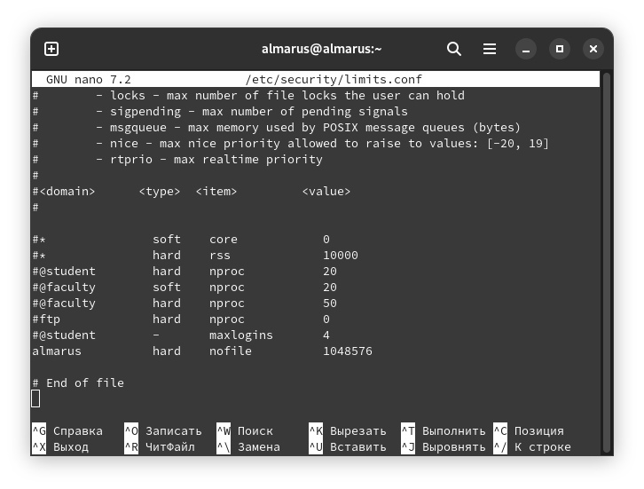

.. ARU (c) 2018 - 2022, Pavel Priluckiy, Vasiliy Stelmachenok and contributors

   ARU is licensed under a
   Creative Commons Attribution-ShareAlike 4.0 International License.

   You should have received a copy of the license along with this
   work. If not, see <https://creativecommons.org/licenses/by-sa/4.0/>.

.. _extra-optimizations:

********************
Экстра оптимизации
********************

.. index:: cpu, cpupower, governor, performance
.. _maximum-cpu-performance:

===============================================================================
Перевод процессора из стандартного энергосбережения в режим производительности
===============================================================================

По умолчанию ваш процессор динамически меняет свою частоту, что в принципе
правильно и дает баланс между энергосбережением и производительностью. Но если
вы все таки хотите выжать все соки, то вы можете закрепить применение режима
максимальной производительности для вашего процессора. Это также поможет вам
избегать "падений" частоты во время игры, которые могли вызывать микрофризы во
время игры.

Закрепим режим максимальной производительности::

  sudo pacman -S cpupower                       # Установит менеджер управления частотой процессора
  sudo cpupower frequency-set -g performance    # Выставляет максимальную  производительность до перезагрузки системы.

``sudo nano /etc/default/cpupower`` # Редактируем строчку ниже

.. image:: images/extra-optimizations-1.png

*governor=’performance’* # Высокая производительность всегда!

``sudo systemctl enable cpupower`` # Включить как постоянную службу которая
установит вечный perfomance mode.

.. warning:: Для новых версий GNOME может не требоваться в виду
   наличия встроенного аналога - power-profiles-daemon:
   https://packages.debian.org/sid/power-profiles-daemon. Не забудьте
   включить службу: ``sudo systemctl enable --now power-profiles-daemon``

.. index:: cpupower, gui, frequencies, governor, performance
.. _cpupower-gui:

GUI для изменение частоты процессора
-------------------------------------

.. image:: images/extra-optimizations-2.png

**Установка**::

  git clone https://aur.archlinux.org/cpupower-gui.git
  cd cpupower-gui
  makepkg -sric

.. index:: cpupower, auto-cpufreq, frequencies, governor, performance
.. _auto-cpufreq:

Альтернатива - Auto-Cpufreq
-----------------------------

**Установка**::

  git clone https://aur.archlinux.org/auto-cpufreq-git.git  # Скачиваем исходники
  cd auto-cpufreq-git                                       # Переходим в директорию
  makepkg -sric                                             # Сборка и установка
  sudo systemctl enable --now auto-cpufreq                  # Включает службу как постоянную

.. attention:: Может конфликтовать со встроенным менеджером питания в GNOME 41+.
   Убедитесь, что он у вас выключен::

     sudo systemctl disable --now power-profiles-daemon.service

.. index:: hibernation, suspend, polkit
.. _disabling-hibernation-and-sleep:

==========================================
Отключение спящего режима и гибернации
==========================================

``sudo pacman -S polkit``  # Установить для управления системными привилегиями.

``sudo nano /etc/polkit-1/rules.d/10-disable-suspend.rules``  # Убираем спящий режим и гибернацию (из меню и вообще).
Если такого файла нет, то создайте его. Файл должен выглядеть вот так::

  polkit.addRule(function(action, subject) {
    if (action.id == "org.freedesktop.login1.suspend" ||
        action.id == "org.freedesktop.login1.suspend-multiple-sessions" ||
        action.id == "org.freedesktop.login1.hibernate" ||
        action.id == "org.freedesktop.login1.hibernate-multiple-sessions")
    {
        return polkit.Result.NO;
    }
  });

.. index:: kernel, dumps, coredump
.. _disabling-kernel-dumps:

============================================================
Отключение дампов ядра (*Только для опытных пользователей*)
============================================================

Отредактируйте */etc/systemd/coredump.conf* в разделе *[Coredump]*
раскомментируйте *Storage = external* и замените его на *Storage = none*.

Затем выполните следующую команду:

``sudo systemctl daemon-reload``

Уже одно это действие отключает сохранение резервных копий, но они все еще
находятся в памяти. Если вы хотите полностью отключить дампы ядра, то измените
*soft* на *#\* hard core 0* в */etc/security/limits.conf*.

.. index:: sysctl, esync, wine
.. _limit-increase:

==================
Повышение лимитов
==================

Отредактируйте файлы::

  sudo nano /etc/systemd/system.conf
  sudo nano /etc/systemd/user.conf

Изменените значения ``DefaultLimitNOFILE=`` на 523288 (можно удвоить). ::

  systemctl daemon-reload

Для Arch Linux необходимо так же прописать лимиты в
``/etc/security/limits.conf`` (в самый нижний столбец)::

  username hard nofile 524288

Вместо *username* нужно вписать ваше имя пользователя.

Эти изменения необходимы для правильной работы технологи Esync и
увеличения плавности системы, так как параметры по умолчанию могут
быть слишком малы. Подробнее `здесь
<https://www.ixbt.com/live/games/testirovanie-esync-vs-fsync-v-linux.html>`_.

.. index:: swap, swapfile
.. _disabling-swap:

===========================
Отключение файла подкачки
===========================

Для лучшей игровой производительности следует использовать файловую систему
Btrfs и не задействовать файл подкачки (вместо него стоит использовать выше
упомянутый zramswap, конечно при условии что у вас не слишком слабый процессор
и оперативной памяти больше чем 4 ГБ), а также без страха отключать фиксы
уязвимостей, которые сильно урезают производительность процессора (о них
написано в следующем разделе).

::

  sudo swapoff /dev/sdxy  # Вместо xy ваше название (Например sdb1).
  sudo swapoff -a         # Отключает все swap-разделы/файлы
  sudo rm -f /swapfile    # Удалить файл подкачки с диска
  sudo nano /etc/fstab    # Уберите самую нижнюю строчку полностью.

.. index:: makepkg, clang, native-compilation, flags
.. _force-clang-usage:

======================================================
Форсирование использования Clang при сборке пакетов
======================================================

В системах на базе ядра Linux различают две основных группы
компиляторов, это LLVM и GCC. И те, и другие хорошо справляются с
возложенными на них задачами, но LLVM имеет чуть большее преимущество
с точки зрения производительности при меньших потерях в качестве
конечного кода. Поэтому, в целом, применение компиляторов LLVM для
сборки различных пакетов при задании флага -O3 (максимальная
производительность) является совершенно оправданным, и может дать
реальный прирост при работе программ.

Компилятором для языков C/C++ в составе LLVM является Clang и Clang++
соответственно. Его использование при сборке пакетов мы и будем
форсировать через makepkg.conf

Для начала выполним их установку::

  sudo pacman -Syu llvm clang lld

Теперь клонируем уже готовый конфигурационный файл ``/etc/makepkg.conf``
под новыми именем в домашнюю директорию ``~/.makepkg-clang.conf``::

  cp /etc/makepkg.conf ~/.makepkg-clang.conf

Это поможет нам в случае чего откатиться к использованию компиляторов
GCC если возникнут проблемы со сборкой пакетов через LLVM/Clang.

Теперь откроем выше скопированный файл и добавим туда после строки
``CHOST="x86_64-pc-linux-gnu"`` следующее::

  export CC=clang
  export CXX=clang++
  export LD=ld.lld
  export CC_LD=lld
  export CXX_LD=lld
  export AR=llvm-ar
  export NM=llvm-nm
  export STRIP=llvm-strip
  export OBJCOPY=llvm-objcopy
  export OBJDUMP=llvm-objdump
  export READELF=llvm-readelf
  export RANLIB=llvm-ranlib
  export HOSTCC=clang
  export HOSTCXX=clang++
  export HOSTAR=llvm-ar
  export HOSTLD=ld.lld
  export LLVM=1
  export LLVM_IAS=1

При использовании Clang из пакета `llvm-git` (установка описана ниже)
стоит включить использование LLVM Polly при сборке пакетов: ::

  CFLAGS="-march=native -mtune=native -O3 -pipe -fno-plt -fexceptions \
        -Wp,-D_FORTIFY_SOURCE=2 -Wformat -Werror=format-security \
        -fstack-clash-protection -fcf-protection -polly -polly-parallel \
        -polly-vectorizer=stripmine -mllvm -polly-omp-backend=LLVM -lgomp"
  CXXFLAGS="$CFLAGS -Wp,-D_GLIBCXX_ASSERTIONS"
  export CFLAGS_KERNEL="$CFLAGS"
  export CXXFLAGS_KERNEL="$CXXFLAGS"
  export CFLAGS_MODULE="$CFLAGS"
  export CXXFLAGS_MODULE="$CXXFLAGS"
  export KBUILD_CFLAGS="$CFLAGS"
  export KCFLAGS="-O3 -mllvm -polly -mllvm -polly-parallel -mllvm -polly-vectorizer=stripmine -mllvm -polly-omp-backend=LLVM -lgomp"
  export KCPPFLAGS="$KCFLAGS"
  LDFLAGS="-Wl,-O3,--sort-common,--as-needed,-z,relro,-z,now"
  RUSTFLAGS="-C opt-level=3"
  MAKEFLAGS="-j$(nproc) -l$(nproc)"
  OPTIONS=(strip docs !libtool !staticlibs emptydirs zipman purge !debug lto)

Для некоторый оптимизаций Polly нужно установить OpenMP: ::

  sudo pacman -S openmp

Если используется LLVM версии ниже, чем 15.0.1, 
то нужно убрать ``-mllvm -polly-omp-backend=LLVM``.
Лишь с этой версии LLVM стало возможным дублировать
некоторые флаги без последующего появления ошибки.

Подробнее про LLVM Polly можешь почитать `тут
<https://polly.llvm.org/>`__.

Отлично, теперь вы можете собрать нужные вам пакеты (программы) через
LLVM/Clang просто добавив к уже известной команде makepkg следующие
параметры::

  makepkg --config ~/.makepkg-clang.conf -sric

.. attention:: Далеко не все пакеты так уж гладко собираются через
   Clang, в частности не пытайтесь собирать им Wine/DXVK, т.к. это
   официально не поддерживается и с 98% вероятностью приведет к ошибке
   сборки. Но в случае неудачи вы всегда можете использовать
   компиляторы GCC, которые у вас заданы в настройках makepkg.conf по
   умолчанию, т.е. просто уберите опцию ``--config
   ~/.makepkg-clang.conf`` из команды ``makepkg``.

Мы рекомендуем вам пересобрать наиболее важные пакеты. Например такие
как драйвера (то есть `mesa
<https://archlinux.org/packages/extra/x86_64/mesa/>`_, `lib32-mesa
<https://archlinux.org/packages/multilib/x86_64/lib32-mesa/>`_, если у
вас Intel/AMD), `Xorg сервер
<https://archlinux.org/packages/extra/x86_64/xorg-server/>`_, а также
связанные с ним компоненты, или `Wayland
<https://archlinux.org/packages/extra/x86_64/wayland/>`_, критически
важные пакеты вашего DE/WM, например: `gnome-shell
<https://aur.archlinux.org/packages/gnome-shell-performance>`_,
`plasma-desktop
<https://archlinux.org/packages/extra/x86_64/plasma-desktop/>`_. А
также композиторы `kwin
<https://archlinux.org/packages/extra/x86_64/kwin/>`_, `mutter
<https://aur.archlinux.org/packages/mutter-performance>`_, picom и
т.д. в зависимости от того, чем именно вы пользуетесь.

Больше подробностей по теме вы можете найти в данной статье:

https://habr.com/ru/company/ruvds/blog/561286/

.. index:: clang, native-compilation, llvm-bolt-builds, lto, pgo
.. _speeding-up-clang-llvm-compilers:

Ускорение работы компиляторов LLVM/Clang
-----------------------------------------

Дополнительно можно отметить, что после установки Clang вы можете
перекомпилировать его самого через себя, т.е. выполнить пересборку
Clang с помощью бинарного Clang из репозиториев. Это позволит
оптимизировать уже сам компилятор под ваше железо и тем самым ускорить
его работу при сборке уже других программ. Аналогичную операцию вы
можете проделать и с GCC.

Делается это через пакет в AUR::

  # Сборка LLVM
  git clone https://aur.archlinux.org/llvm-git
  cd llvm-git
  makepkg -sric --config /etc/makepkg-clang.conf

.. index:: installation, x86_64_v2, x86_64_v3, alhp, repository, packages
.. _alhp_repository:

====================================
Установка оптимизированных пакетов
====================================

Итак, нативная компиляция - это конечно хорошо, но не у каждого
человека есть время заниматься подобными вещами, да и всю систему
пересобирать с нативными флагами тоже никто не будет (иначе вам сюда:
https://gentoo.org). Возникает вопрос: как сделать все с наименьшим
количеством напряга?

Для начала сделаем небольшое отступление. У архитектуры *x86_64*
различают несколько поколений или "уровней". Это *x86_64*,
*x86_64_v2*, *x86_64_v3* и *x86_64_v4* (новейшие процессоры). Различия
между этими "поколениями" состоят в применяемом наборе инструкций и
возможностей процессора. Например, если вы собираете программу для
x86_64_v2, то вы автоматически задействуете инструкции SSE3, SSE4_1 и
т.д. При этом такая программа не будет работать на предыдущих
поколениях, то есть на процессорах которые не поддерживают набор
инструкций *x86_64_v2*. При этом к *x86_64_v2* и другим уровням
относятся различные процессоры, как AMD, так и Intel. При этом
логично, что чем выше поколение x86_64 поддерживает ваш процессор, тем
больше будет производительность за счет использования многих
оптимизаций и доп. инструкций. Подробнее об этих уровнях или же
поколениях можете прочитать `здесь (англ.)
<https://en.wikipedia.org/wiki/X86-64#Microarchitecture_levels>`__.

Смысл в том, что существует сторонний репозиторий Arch Linux - `ALHP
<https://git.harting.dev/ALHP/ALHP.GO>`__, который содержит **все
пакеты** из официальных репозиториев, но собранных для процессоров
x86_64_v2 или x86_64_v3. То есть это те же самые, уже готовые пакеты
из официальных репозиториев, но собранные с различными оптимизациями
для определенной группы процессоров (поколений x86_64).

.. danger:: Прежде чем мы подключим данный репозиторий, нужно
   **обязательно** понять к какому поколению относиться ваш процессор,
   иначе, если вы установите пакеты собранные для x86_64_v3, но *ваш
   процессор при этом не будет относиться к поколению x86_64_v3*, то
   *ваша система станет полностью не работоспособной*, хотя её и все
   ещё можно будет восстановить через LiveCD окружение при помощи
   pacstrap.

.. danger:: Оптимизированные пакеты для процессоров Intel поддерживают
   только полные процессоры серий Core 2 и i3/i5/i7. Многие процессоры
   Pentium/Celeron не имеют полного набора инструкций, необходимого
   для использования оптимизированных пакетов. Пользователям этих
   процессоров следует установить универсальные пакеты или пакеты
   оптимизированные ниже на один уровень (то есть если у вас
   поддерживается v3, то подключайте репозиторий с v2 и т.д.), даже
   если GCC возвращает значение, соответствующее полному набору флагов
   Core i3/i5/i7, например, Haswell.

Проверить поколение вашего процессора можно следующей командой::

  /lib/ld-linux-x86-64.so.2 --help | grep -B 3 -E "x86-64-v2"

После каждого поколения будет написано, поддерживается оно вашим
процессором или нет. Например::

  Subdirectories of glibc-hwcaps directories, in priority order:
  x86-64-v4
  x86-64-v3
  x86-64-v2 (supported, searched)

Если у вас поддерживается хотя бы x86_64_v2, то вы так же сможете
использовать данный репозиторий, ибо он предоставляет пакеты как для
x86_64_v2, так и для x86_64_v3. **Главное не перепутаете, какое именно у
вас поколение**.

Чтобы подключить репозиторий установим ключи для проверки подписей пакетов::

  # Ключи для пакетов
  git clone https://aur.archlinux.org/alhp-keyring.git
  cd alhp-keyring
  makepkg -sric

А также список зеркал::

  git clone https://aur.archlinux.org/alhp-mirrorlist.git
  cd alhp-mirrorlist
  makepkg -sric

После этого нужно отредактировать конфиг pacman добавив репозиторий
для нужной архитектуры (``sudo nano /etc/pacman.conf``).

Итак, **если ваш процессор поддерживает только x86_64_v2** (как
допустим у автора), то пишем следующее::

  [core-x86-64-v2]
  Include = /etc/pacman.d/alhp-mirrorlist

  [extra-x86-64-v2]
  Include = /etc/pacman.d/alhp-mirrorlist

  [multilib-x86-64-v2]
  Include = /etc/pacman.d/alhp-mirrorlist

  [core]
  Include = /etc/pacman.d/mirrorlist

  [extra]
  Include = /etc/pacman.d/mirrorlist

  [multilib]
  Include = /etc/pacman.d/mirrorlist

**Если же у вас процессор поддерживает x86_64_v3**, то пишем следующее::

  [core-x86-64-v3]
  Include = /etc/pacman.d/alhp-mirrorlist

  [extra-x86-64-v3]
  Include = /etc/pacman.d/alhp-mirrorlist

  [multilib-x86-64-v3]
  Include = /etc/pacman.d/alhp-mirrorlist

  [core]
  Include = /etc/pacman.d/mirrorlist

  [extra]
  Include = /etc/pacman.d/mirrorlist

  [multilib]
  Include = /etc/pacman.d/mirrorlist

После этого выполняем полное обновление системы::

  sudo pacman -Syyuu

Перезагружаемся и наслаждаемся результатом (если вы все сделали
правильно).

.. vim:set textwidth=70:

=============================
Уменьшение нагрузки на I/O 
=============================

Многие программы, особенно браузеры, кэшируют разные данные на накопитель (HDD или SSD), тем самым нагружая систему ввода-вывода и дополнительно изнашивая его. В Linux можно уменьшить количество обращений к хранилищу данных (HDD или SSD) если перенести директорию ``.cache`` в ОЗУ. Для этого у вас директория ``/tmp`` должна использовать *tmpfs* (Arch использует по умолчанию), для проверки::

  findmnt --target /tmp 

В результате вывода команды под надписью ``SOURCE`` должно отобразиться ``tmpfs`` для директории ``/tmp``

Для переноса ``.cache`` в ОЗУ достаточно создать скрипт ``/etc/profile.d/xdg_cache_home.sh`` со следующим содержимым::

  if [ ${LOGNAME} ]; then
    export XDG_CACHE_HOME="/tmp/${LOGNAME}/.cache"
  fi

Если для вас не важны данные, которые пишутся в ``.cache`` то можно больше ничего не делать и оставить так, но если данные нужны, то необходимо реализовать сохранение данных на диск:

#. Нужно создать скрипт (например ``~/.local/bin/cache_move.sh``) со следующим содержимым 
  
    :: 

      #!/bin/sh

      if [ $(find /tmp/${LOGNAME}/.cache/ -mindepth 1 -printf '1\n' -quit) ]; then
        rsync -av /tmp/${LOGNAME}/.cache/ /home/${LOGNAME}/.cache/
      else
        rsync -av /home/${LOGNAME}/.cache/ /tmp/${LOGNAME}/.cache/
      fi

#. Разрешить выполнение скрипта
  
    :: 

      chmod +x ~/.local/bin/cache_move.sh 

#. Настроить выполнение скрипта:

- Через systemd:

  - создать сервис для systemd ``~/.config/systemd/user/cache_move@service`` с содержимым
  
  :: 

      [Unit]
      Description=Use .cache over /tmp 

      [Install]
      WantedBy=default.target

      [Service]
      Type=oneshot
      RemainAfterExit=yes
      ExecStart=%h/.local/bin/cache_move.sh %i
      ExecStop=%h/.local/bin/cache_move.sh %i

- Через cron задать переодичность выполнения::

    crontab -e

    0 */2 * * * ~/.local/bin/cache_move.sh    - запустить скрипт каждые два часа

