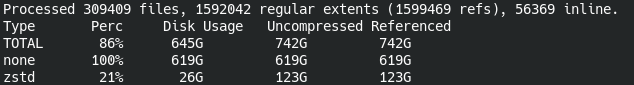
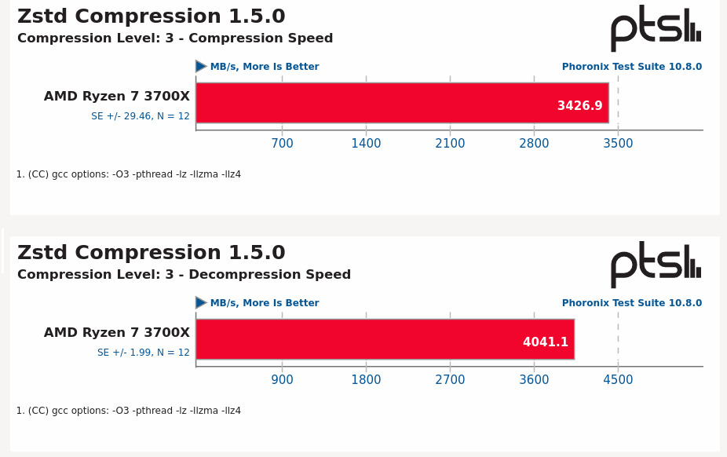

.. ARU (c) 2018 - 2025, Pavel Priluckiy, Vasiliy Stelmachenok and contributors

   ARU is licensed under a
   Creative Commons Attribution-ShareAlike 4.0 International License.

   You should have received a copy of the license along with this
   work. If not, see <https://creativecommons.org/licenses/by-sa/4.0/>.

.. _file-systems:

*****************
Файловые системы
*****************

.. index:: btrfs, ext4, zfs, xfs, f2fs, bcachefs
.. _file-system-selection:

======================================================
Нюансы выбора файловой системы и флагов монтирования
======================================================

В отличие от Windows, в Linux-подобных системах выбор файловой системы
не ограничивается в обязательном порядке со стороны дистрибутива, и
может применяться исходя из личных предпочтений пользователя с
оглядкой на поддержку со стороны ядра.

В Linux файловые системы можно разделить на два типа:

- Классические: ext4, F2FS, XFS.

- Системы на базе механизма CoW (Copy-on-Write): Btrfs, Bcachefs, ZFS
  и другие.

.. index:: ext4, xfs, f2fs
.. _classic_fs:

====================
Классические системы
====================

Эти системы как правило согласно тестам показывают более высокие
скорости операций ввода-вывода (IOPS) и скорости записи/чтения, но в
тоже время могут не обладать некоторым дополнительным функционалом,
например сжатие "налету", возможность создания снимков, дедупликация и
прочие возможности.

.. index:: ext4
.. _ext4-filesystem:

---------------------
Файловая система ext4
---------------------

Данная система уже давно зарекомендовала себя как простое
универсальное решение. Это своего рода как *NTFS* в Windows, и если вы
не уверены какую файловую систему вам выбрать под свои задачи, то
можно использовать *ext4* - особо ничего не потеряете, особенно если
вы начинающий пользователь.

*ext4* по умолчанию используется во многих дистрибутивах Linux.
Подходит как для жестких дисков (HDD), так и для SSD, хотя для
последних есть варианты и получше.

.. index:: ext4, journal
.. _ext4-external-journal:

^^^^^^^^^^^^^^^^^^^^^^^^^^^^^^^^^
Настройка внешнего журнала ext4
^^^^^^^^^^^^^^^^^^^^^^^^^^^^^^^^^

Вынесение журнала файловой системы на более быстрый накопитель
(желательно SSD) является безопасным и очень эффективным способом
приблизиться к раскрытию потенциала жёсткого диска. Результаты простых
бенчмарков ты можешь найти `тут
<https://raid6.com.au/posts/fs_ext4_external_journal/>`__.

Размер внешнего журнала должен определяться в зависимости от
предполагаемой нагрузки на диски, но, в целом, рекомендуемым
значением для накопителей от 1 ТБ является 1-2 ГБ.

Для внешнего журнала необходимо создать отдельный раздел нужного
размера, а после отформатировать его командой::

    mke2fs -O journal_dev /dev/nvme0n1p2

После чего подключить новый журнал к существующей файловой системе::

    tune2fs -J device=/dev/nvme0n1p2 /dev/sda

^^^^^^^^^^^^^^^^^^^^^^^^^^^^^^^^^^^^^^^^^^^^^^^^
Оптимальные параметры монтирования для ext4
^^^^^^^^^^^^^^^^^^^^^^^^^^^^^^^^^^^^^^^^^^^^^^^^

Если вы используете внешний журнал, то оптимальными параметрами
будут::

    relatime,commit=300,journal_async_commit,nodelalloc,data=journal

Если же не используете, то относительно безопасным вариантом будет::

    relatime,commit=300,data=ordered

В последнем параметр ``data=ordered`` можно заменить на
``data=writeback``, что отключит использование журнала вовсе, но может
вызывать потери данных или их повреждение при аварийном отключении
питания.

Подробное описание всех параметров монтирования можно найти `здесь
<https://www.man7.org/linux/man-pages/man5/ext4.5.html>`__.

.. attention:: Параметр ``commit=300`` может вызывать повышенное
   потребление оперативной памяти и иногда портить данные на диске.
   Можете установить значение на более консервативное, например,
   ``commit=100``.

Всех параметры монтирования нужно прописывать в файл ``/etc/fstab``
для соответствующих разделов.

.. index:: xfs
.. _xfs-filesystem:

--------------------
Файловая система XFS
--------------------

Высокопроизводительная файловая система, которая отлично подходит для
HDD. Благодаря особенностям архитектуры данная система отлично
справляется с задачами хранения различных данных. Данная система
разрабатывалась в первую очередь для HDD, однако она также неплохо
работает и на SSD, особенно когда дело касается баз данных.

.. index:: f2fs
.. _f2fs-filesystem:

---------------------
Файловая система F2FS
---------------------

Файловая система разработанная компанией Samsung. Как уверяется
специально для NAND накопителей (SSD, флешки и т.п.). Иногда может
выделяться немного большими показателями IOPS и скоростью линейного
чтения, но большими задержками по сравнению с той же **Ext4** (от 0,5
мс и доходящих до пятикратной разницы). Поддерживает функцию сжатия
"налету".

===========
Системы CoW
===========

Файловые системы построенные на базе CoW (так называемое копирование
при записи) примечательны тем, что они не создают полную копию данных
файла при его копировании или изменении, а лишь накладывают новые
блоки поверх уже существующих путём обновления метаданных, тем самым
минимизируя избыточность данных хранимых на носителе. Это позволяет
использовать более эффективный способ архивирования данных при помощи
так называемых "снимков", когда каждая следующая архивная копия
содержит в себе лишь набор изменений, произведенных по сравнению с
предыдущий копией.

Также данные системы поддерживают разного рода дополнительные функции,
например возможность сжатия "налету". Ценой дополнительной нагрузки на
CPU можно сжимать записываемые данные на носитель, тем самым экономя
место и его ресурс, что может быть особенно полезно при использовании
на SSD. Однако стоит отметить, что далеко не все файлы хорошо
поддаются сжатию, и зачастую при этом страдает скорость записи данных
на диск, особенно при высоких уровнях сжатия.

.. index:: btrfs
.. _btrfs-filesystem:

----------------------
Файловая система btrfs
----------------------

Данная файловая система выделяется большим функционалом и
возможностями:

- Отсутствие единой точки отказа в виде журнала файловой системы, так
  как Btrfs построен на базе механизма CoW, то даже в случае
  аварийного отключения питания это не приведёт к полному повреждению
  файловой системы.

- Наличие подтомов (так называемый subvol), которые могут быть
  использованы в том числе для установки сразу нескольких
  дистрибутивов Linux на один и тот же раздел.

- Сжатие на лету для экономии места при записи на SSD.

- Возможность создания быстрых и легковесных резервных копий всей
  системы или отдельных её директорий при помощи так называемых
  снапшотов (snapshots).

Несмотря на изобилие различных возможностей, данная ФС может
проигрывать другим файловым системам по скорости операций ввода-вывода
(IOPS) и скорости чтения/записи в связи с использованием механизма
CoW, а также из-за наличия фрагментации, что может быть критично для
HDD. CoW можно отключить, однако тогда Btrfs потеряет практически весь
свой функционал и становится проще использовать классические файловые
системы как *ext4*.

По умолчанию используется во многих дистрибутивах Linux, например
таких как Fedora, SteamOS (Steam Deck), CachyOS и т. д.

.. index:: mount, options, btrfs, fstab
.. _mount-options-btrfs:

^^^^^^^^^^^^^^^^^^^^^^^^^^^^^^
Оптимальные флаги монтирования
^^^^^^^^^^^^^^^^^^^^^^^^^^^^^^

Вот оптимальные параметры для SSD носителей. Описание каждого из них
вы можете найти - `здесь
<https://zen.yandex.ru/media/id/5d8ac4740a451800acb6049f/linux-uskoriaem-sistemu-4-5e91d777378f6957923055b9>`_.

::

 rw,relatime,compress=zstd:3,ssd_spread,max_inline=256,commit=300

Оптимальные параметры монтирования для HDD::

 rw,relatime,max_inline=256,commit=300,autodefrag

Прежде всего, отметим, что вы можете изменить ``relatime`` на
``noatime`` или ``lazytime`` - все три параметра отвечают за
запоминание времени доступа к файлами и прочим связанным с ними
атрибутам.

Параметр ``noatime`` полностью выключает данную функцию, что может
привести к некоторым багам в приложениях зависимых от времени
изменения файлов (например git), однако это встречается довольно
редко. Параметр ``lazytime`` успешно будет выполнять все функции
времени, но выполнять их промежуточную запись в оперативной памяти,
что позволит избежать замедления без потери функционала, однако
``lazytime`` может иметь свои проблемы в связи с реализацией, так как
при данные могут быть утеряны при аварийных отключениях питания.

Если вы не уверены в том, какой из этих флагов вам лучше подходит, то
можете остановиться на ``relatime``, но флаг ``noatime`` в большинстве
случаев для домашнего использования вполне пригоден.

Рекомендуется также минимизировать использование CoW в Btrfs для HDD
во избежание излишней фрагментации. Сделать это лучше выборочно, то
есть не используя опцию монтирования ``nodatacow``. Полное отключение
CoW по сути лишает Btrfs всех присущих преимуществ, а также ведет к
отключению проверки целостности файлов, что может привести к ожидаемым
поломкам или полному повреждению файловой системы. Поэтому мы должны
использовать специальный атрибут файловой системы, чтобы применение
механизма СoW только для отдельных директорий/файлов. Часто это могут
быть:

1) Директория для торрентов. Автор крайне рекомендует выполнять
загрузку всех торрентов в отдельную директорию и отключать для неё CoW
во избежание фрагментации::

  sudo chattr -R +C ~/Torrents # Укажите свою директорию с торрентами

2) Файлам баз данных очень чувствительны к фрагментации при CoW.
Как правило все они расположены в директории ``/var/db``, но часть
пользовательских приложений любит их создавать в ``~/.local/share``::

  sudo chattr -R +C /var/db
  sudo chattr -R +C ~/.local/share

3) Для образов виртуальных машин также не следует использовать CoW,
иначе это приведет к обильной фрагментации.

Только учтите, что изменения не применяются к уже существующим файлам,
а только к новосозданным.

Прописывать их нужно в файл ``/etc/fstab`` для корневого и домашнего разделов.
Некоторые из данных флагов будут применяться только для новых файлов.

.. image:: images/file-systems-1.png

.. attention:: При использовании Btrfs для корневого раздела, обязательно
   установите пакет `btrfs-progs
   <https://archlinux.org/packages/core/x86_64/btrfs-progs/>`_.

.. index:: btrfs, compression, zstd, lzo, zib
.. _btrfs_comperssion:

^^^^^^^^^^^^^^^^^^^^^^^^^^^^^^^
Сжатие в файловой системе Btrfs
^^^^^^^^^^^^^^^^^^^^^^^^^^^^^^^

В файловой системе Btrfs есть возможность включения сжатия налету. Все
записываемые файлы по возможности будут сжиматься и экономить
пространство на носителе HDD или SSD.

Для SSD это может быть важно в связи с их ограниченным ресурсом на
запись.

Согласно `wiki Btrfs <https://btrfs.wiki.kernel.org/index.php/Compression>`_,
официально поддерживается 3 алгоритма сжатия без потерь:

* zlib - высокая степень сжатия, но низкая скорость сжатия и распаковки

* lzo - высокая скорость сжатия и распаковки, но наименьший уровень сжатия из
  представленных алгоритмов

* zstd - степень сжатия сравнимая с zlib и более быстрые сжатие и распаковка,
  однако уступающие по скорости lzo

Для включения алгоритма сжатия в файловой системе необходимо
отредактировать файл ``etc/fstab``, добавив для необходимого раздела с
файловой системой Btrfs следующий флаг монтирования::

 compress='алгоритм':N

Где ``N`` - степень сжатия:

- Для zlib ``N`` может быть от 1 до 9 включительно.

- Для lzo - выбор уровня сжатия не предусмотрен, поэтому ``:N`` - не
  указываются

- При использовании zstd ``N`` может быть от 1 до 15 включительно.

Чем больше значение ``N``, тем сильнее будут сжиматься данные. Конечно
при условии, что это возможно, но при этом будет повышенная нагрузка
на процессор, поскольку сжатие выполняется за счет его ресурсов.
Cогласно `официальной документации Btrfs
<https://btrfs.readthedocs.io/en/latest/Compression.html>`__,
оптимальным значением ``N`` по отношению степени сжатия и скорости
считается ``3``.

Например, для zstd со степенью сжатия ``3`` запись флагов монтирования
будет выглядеть примерно следующим образом, если учесть приведенные
выше флаги монтирования::

  rw,relatime,compress=zstd:3,ssd_spread,max_inline=256,commit=600

После добавления данного флага монтирования сжиматься начнут только
новые файлы при записи на диск. Для сжатия уже имеющихся данных
необходимо выполнить команду::

 sudo btrfs filesystem defragment -calg /path

Где ``-calg`` - алгоритм сжатия (указывается как ``czlib``, ``clzo``
или ``czstd`` в зависимости от выбранного алгоритма), ``path`` - путь,
данные на которого требуется сжать.

Для сжатия уже существующих данных в папке или целого раздела необходимо
указать ключ ``-r`` перед ``-calg``::

  sudo btrfs filesystem defragment -r -calg /path

.. index:: comperssion, zstd, test, compsize
.. _efficiency-test:

^^^^^^^^^^^^^^^^^^^^^^^^^^^^^^^^^
Определение эффективности сжатия
^^^^^^^^^^^^^^^^^^^^^^^^^^^^^^^^^

Если вы хотите определить эффективность сжатия на вашем разделе/диске, то вам
необходимо воспользоваться программой `compsize
<https://github.com/kilobyte/compsize>`_. Установить ее можно с помощью
команды::

 sudo pacman -S compsize

Для выполнения проверки на эффективность необходимо использовать команду::

 sudo compsize /path

(Где ``path`` - путь к разделу, папке или файлу)

Пример вывода команды:

Пояснения:

* Первый столбец:
   * Строка *TOTAL* - итоговые данные, которые учитывают все сжатые и не сжатые
     файлы и разные алгоритмы (если такие имеются).
   * Строка *none* - данные, которые не были сжаты.
   * Далее отображаются все использованные алгоритмы (в данном случае - zstd).
* Второй столбец показывает данные в процентах.
* Третий столбец отображает фактически использованное место на диске/разделе.
* Четвертый столбец показывает данные без сжатия.
* Пятый - видимый размер файла, тот, который зачастую отображается в системе.

.. index:: compression, zstd, test, phoronix-test-suite
.. _zstd-compression-test:

^^^^^^^^^^^^^^^^^^^^^^^^^^^^^^^^^^^^^^^^^^^^^^^^^^^^^^^^^^^^^^^^^
Скорость обработки алгоритма zstd на примере AMD Ryzen 7 3700X
^^^^^^^^^^^^^^^^^^^^^^^^^^^^^^^^^^^^^^^^^^^^^^^^^^^^^^^^^^^^^^^^^

Для сравнения степеней сжатия алгоритма zstd использовалась бенчмарк платформа
`phoronix-test-suite
<https://github.com/phoronix-test-suite/phoronix-test-suite>`_. В данной
программе, для проверки скорости сжатия и распаковки данных, доступно три
степени - ``3``, ``8``, ``19``. Для получения информации о падении скорости
выполнения сжатия нам будет достаточно и первых двух, поскольку степень сжатия
19 на данный момент не поддерживается (однако данные также приведены для
ознакомления), и если обратить внимание на полученные данные, то это и не имеет
особого смысла. Далее представлены результаты замеров:

.. image:: images/zstd_8.png

.. image:: images/zstd_19.png

Как можно видеть из графиков, падение скорости при перехода от степени ``3`` к
степени ``8`` сопровождается падением скорости сжатия более чем в **4,7** раз
(не говоря о более высоких степенях сжатия) и практически не изменяется при
выполнении распаковки, что может негативно сказаться на скорости установки
программ и возможно в некоторых других ситуациях которые требует выполнения
записи на диск.

Стоит отметить, что в случае выполнения установки игр с использованием степени
сжатия ``15``, было замечено повышение нагрузки на процессор вплоть до 72-75% в
тех случаях, когда файлы поддавались сжатию.

.. index:: btrfs, games, compression, test
.. _comparison-table:

^^^^^^^^^^^^^^^^^^^^^^^^^^^^^^^^^^^^^^^^^^^^^^^^^^^^^^^^^^^^^^^^^^^^^^^^
Список протестированных игр на эффективность сжатия (Спасибо @dewdpol!)
^^^^^^^^^^^^^^^^^^^^^^^^^^^^^^^^^^^^^^^^^^^^^^^^^^^^^^^^^^^^^^^^^^^^^^^^

Далее представлен список протестированных игр на сжатие в файловой системе
Btrfs. Данные были получены с помощью программы compsize и являются
округленными, поэтому информация может нести частично ознакомительный характер.

+-----+----------------------------------------------+----------+-----------------+-----------------------+-----------------------+-----+----------+
| №   | Игра                                         | Алгоритм | Уровень сжатия  | Необходимое место (N) | Используемое место(U) | U/N | Экономия |
+=====+==============================================+==========+=================+=======================+=======================+=====+==========+
|     |                                              |          | 3               |                       |                       |     | 182 MB   |
|     |                                              |          +-----------------+                       +                       +     +----------+
| 1   | A Plague Tale: Innocence                     | zstd     | 15              | 41 GB                 | 41 GB                 | 99% | 306 MB   |
+-----+----------------------------------------------+----------+-----------------+-----------------------+-----------------------+-----+----------+
|     |                                              |          | 3               |                       |                       | 94% | 63 MB    |
|     |                                              |          +-----------------+                       +                       +-----+----------+
| 2   | A Story About My Uncle                       | zstd     | 15              | 1,1 GB                | 1,1 GB                | 93% | 74 MB    |
+-----+----------------------------------------------+----------+-----------------+-----------------------+-----------------------+-----+----------+
|     |                                              |          | 3               |                       | 240 MB                | 17% | 1,10 GB  |
|     |                                              |          +-----------------+                       +-----------------------+-----+----------+
| 3   | Aegis Defenders                              | zstd     | 15              | 1,3 GB                | 230 MB                | 16% | 1,11 GB  |
+-----+----------------------------------------------+----------+-----------------+-----------------------+-----------------------+-----+----------+
|     |                                              |          | 3               |                       | 284 MB                | 66% | 145 MB   |
|     |                                              |          +-----------------+                       +-----------------------+-----+----------+
| 4   | Among Us                                     | zstd     | 15              | 429 MB                | 279 MB                | 65% | 150 MB   |
+-----+----------------------------------------------+----------+-----------------+-----------------------+-----------------------+-----+----------+
|     |                                              |          | 3               |                       | 5,4 GB                | 71% | 2,20 GB  |
|     |                                              |          +-----------------+                       +-----------------------+-----+----------+
| 5   | Aragami                                      | zstd     | 15              | 7,6 GB                | 5,3 GB                | 69% | 2,27 GB  |
+-----+----------------------------------------------+----------+-----------------+-----------------------+-----------------------+-----+----------+
|     |                                              |          | 3               |                       |                       | 95% | 73 MB    |
|     |                                              |          +-----------------+                       +                       +-----+----------+
| 6   | Armello                                      | zstd     | 15              | 1,6 GB                | 1,5 GB                | 94% | 83 MB    |
+-----+----------------------------------------------+----------+-----------------+-----------------------+-----------------------+-----+----------+
|     |                                              |          | 3               |                       | 1,1 GB                | 94% | 67 MB    |
|     |                                              |          +-----------------+                       +-----------------------+-----+----------+
| 7   | Bastion                                      | zstd     | 15              | 1,1 GB                | 1,0 GB                | 93% | 81 MB    |
+-----+----------------------------------------------+----------+-----------------+-----------------------+-----------------------+-----+----------+
|     |                                              |          | 3               |                       |                       |     | 117,8 MB |
|     |                                              |          +-----------------+                       +                       +     +----------+
| 8   | BattleBlock Theater                          | zstd     | 15              | 1,8 GB                | 1,7 GB                | 93% | 118,7 MB |
+-----+----------------------------------------------+----------+-----------------+-----------------------+-----------------------+-----+----------+
|     |                                              |          | 3               |                       | 1,0 GB                | 55% | 0,77 GB  |
|     |                                              |          +-----------------+                       +-----------------------+-----+----------+
| 9   | Beholder                                     | zstd     | 15              | 1,9 GB                | 1,1 GB                | 58% | 0,82 GB  |
+-----+----------------------------------------------+----------+-----------------+-----------------------+-----------------------+-----+----------+
|     |                                              |          | 3               |                       | 2,2 GB                | 85% | 385 MB   |
|     |                                              |          +-----------------+                       +-----------------------+-----+----------+
| 10  | Beholder 2                                   | zstd     | 15              | 2,5 GB                | 2,1 GB                | 81% | 483 MB   |
+-----+----------------------------------------------+----------+-----------------+-----------------------+-----------------------+-----+----------+
|     |                                              |          | 3               |                       | 805 MB                | 94% | 48 MB    |
|     |                                              |          +-----------------+                       +-----------------------+-----+----------+
| 11  | Blasphemous                                  | zstd     | 15              | 854 MB                | 802 MB                | 93% | 51 MB    |
+-----+----------------------------------------------+----------+-----------------+-----------------------+-----------------------+-----+----------+
|     |                                              |          | 3               |                       | 4,9 GB                | 81% | 1,10 GB  |
|     |                                              |          +-----------------+                       +-----------------------+-----+----------+
| 12  | Blue Fire                                    | zstd     | 15              | 6,0 GB                | 4,7 GB                | 77% | 1,30 GB  |
+-----+----------------------------------------------+----------+-----------------+-----------------------+-----------------------+-----+----------+
|     |                                              |          | 3               |                       |                       |     | 53 MB    |
|     |                                              |          +-----------------+                       +                       +     +----------+
| 13  | Brothers - A Tale of Two Sons                | zstd     | 15              | 1,2 GB                | 1,1 GB                | 95% | 52 MB    |
+-----+----------------------------------------------+----------+-----------------+-----------------------+-----------------------+-----+----------+
|     |                                              |          | 3               |                       |                       | 92% | 15,4 MB  |
|     |                                              |          +-----------------+                       +                       +-----+----------+
| 14  | Castle Crashers                              | zstd     | 15              | 199 MB                | 183 MB                | 91% | 15,8 MB  |
+-----+----------------------------------------------+----------+-----------------+-----------------------+-----------------------+-----+----------+
|     |                                              |          | 3               |                       | 897 MB                | 78% | 251 MB   |
|     |                                              |          +-----------------+                       +-----------------------+-----+----------+
| 15  | Celeste                                      | zstd     | 15              | 1,1 GB                | 871 MB                | 75% | 277 MB   |
+-----+----------------------------------------------+----------+-----------------+-----------------------+-----------------------+-----+----------+
|     |                                              |          | 3               |                       |                       |     | 15 MB    |
|     |                                              |          +-----------------+                       +                       +     +----------+
| 16  | Child of light                               | zstd     | 15              | 2,3 GB                | 2,3 GB                | 99% | 9,5 MB   |
+-----+----------------------------------------------+----------+-----------------+-----------------------+-----------------------+-----+----------+
|     |                                              |          | 3               |                       |                       |     | 87 MB    |
|     |                                              |          +-----------------+                       +                       +     +----------+
| 17  | Children of Morta                            | zstd     | 15              | 1,6 GB                | 1,5 GB                | 94% | 92 MB    |
+-----+----------------------------------------------+----------+-----------------+-----------------------+-----------------------+-----+----------+
|     |                                              |          | 3               |                       |                       |     | 75 MB    |
|     |                                              |          +-----------------+                       +                       +     +----------+
| 18  | CODE VEIN                                    | zstd     | 15              | 35 GB                 | 35 GB                 | 99% | 124 MB   |
+-----+----------------------------------------------+----------+-----------------+-----------------------+-----------------------+-----+----------+
|     |                                              |          | 3               |                       | 65 MB                 | 67% | 32 MB    |
|     |                                              |          +-----------------+                       +-----------------------+-----+----------+
| 19  | Cortex Command                               | zstd     | 15              | 97 MB                 | 64 MB                 | 66% | 33 MB    |
+-----+----------------------------------------------+----------+-----------------+-----------------------+-----------------------+-----+----------+
|     |                                              |          | 3               |                       |                       |     | 223 MB   |
|     |                                              |          +-----------------+                       +                       +     +----------+
| 20  | Cuphead                                      | zstd     | 15              | 3,6 GB                | 3,3 GB                | 93% | 233 MB   |
+-----+----------------------------------------------+----------+-----------------+-----------------------+-----------------------+-----+----------+
|     |                                              |          | 3               |                       |                       | 53% | 1,25 GB  |
|     |                                              |          +-----------------+                       +                       +-----+----------+
| 21  | Curse of Dead Gods                           | zsrd     | 15              | 2,7 GB                | 1,4 GB                | 51% | 1,29 GB  |
+-----+----------------------------------------------+----------+-----------------+-----------------------+-----------------------+-----+----------+
|     |                                              |          | 3               |                       | 720 MB                | 57% | 525 MB   |
|     |                                              |          +-----------------+                       +-----------------------+-----+----------+
| 22  | D-Corp                                       | zstd     | 15              | 1,2 GB                | 697 MB                | 55% | 549 MB   |
+-----+----------------------------------------------+----------+-----------------+-----------------------+-----------------------+-----+----------+
|     |                                              |          | 3               |                       |                       |     | 1,57 MB  |
|     |                                              |          +-----------------+                       +                       +     +----------+
| 23  | Dark Souls: Prepare To Die Edition           | zstd     | 15              | 3,7 GB                | 3,7 GB                | 99% | 1,61 MB  |
+-----+----------------------------------------------+----------+-----------------+-----------------------+-----------------------+-----+----------+
|     |                                              |          | 3               |                       |                       |     | 0,53 MB  |
|     |                                              |          +-----------------+                       +                       +     +----------+
| 24  | Dark Souls III                               | zstd     | 15              | 24 GB                 | 24 GB                 | 99% | 0,60 MB  |
+-----+----------------------------------------------+----------+-----------------+-----------------------+-----------------------+-----+----------+
|     |                                              |          | 3               |                       |                       | 88% | 394 MB   |
|     |                                              |          +-----------------+                       +                       +-----+----------+
| 25  | Darkest Dungeon                              | zstd     | 15              | 3,2 GB                | 2,8 GB                | 87% | 410 MB   |
+-----+----------------------------------------------+----------+-----------------+-----------------------+-----------------------+-----+----------+
|     |                                              |          | 3               |                       | 798 MB                | 40% | 0,99 GB  |
|     |                                              |          +-----------------+                       +-----------------------+-----+----------+
| 26  | Darkestville Catle                           | zstd     | 15              | 1,7 GB                | 682 MB                | 38% | 1,02 GB  |
+-----+----------------------------------------------+----------+-----------------+-----------------------+-----------------------+-----+----------+
|     |                                              |          | 3               |                       |                       |     | 22 MB    |
|     |                                              |          +-----------------+                       +                       +     +----------+
| 27  | Darksiders III                               | zstd     | 15              | 24 GB                 | 24 GB                 | 99% | 30 MB    |
+-----+----------------------------------------------+----------+-----------------+-----------------------+-----------------------+-----+----------+
|     |                                              |          | 3               |                       | 1,1 GB                |     | 24 MB    |
|     |                                              |          +-----------------+                       +-----------------------+     +----------+
| 28  | Dead Cells                                   | zstd     | 15              | 1,1 GB                | 1,0 GB                | 97% | 31 MB    |
+-----+----------------------------------------------+----------+-----------------+-----------------------+-----------------------+-----+----------+
|     |                                              |          | 3               |                       |                       | 58% | 1,48 GB  |
|     |                                              |          +-----------------+                       +                       +-----+----------+
| 29  | Death's Door                                 | zstd     | 15              | 3,6 GB                | 2,1 GB                | 57% | 1,54 GB  |
+-----+----------------------------------------------+----------+-----------------+-----------------------+-----------------------+-----+----------+
|     |                                              |          | 3               |                       | 729 MB                | 66% | 367 MB   |
|     |                                              |          +-----------------+                       +-----------------------+-----+----------+
| 30  | Death's Gambit: Afterlife                    | zstd     | 15              | 1 GB                  | 720 MB                | 65% | 376 MB   |
+-----+----------------------------------------------+----------+-----------------+-----------------------+-----------------------+-----+----------+
|     |                                              |          | 3               |                       |                       |     | 24,2 MB  |
|     |                                              |          +-----------------+                       +                       +     +----------+
| 31  | Deponia: The Complete Journey                | zstd     | 15              | 9,5 GB                | 9,5 GB                | 99% | 25,6 MB  |
+-----+----------------------------------------------+----------+-----------------+-----------------------+-----------------------+-----+----------+
|     |                                              |          | 3               |                       |                       |     | 82 MB    |
|     |                                              |          +-----------------+                       +                       +     +----------+
| 32  | Devil May Cry 5                              | zstd     | 15              | 33 GB                 | 33 GB                 | 99% | 86 MB    |
+-----+----------------------------------------------+----------+-----------------+-----------------------+-----------------------+-----+----------+
|     |                                              |          | 3               |                       |                       | 96% | 305 MB   |
|     |                                              |          +-----------------+                       +                       +-----+----------+
| 33  | Disco Elysium                                | zstd     | 15              | 9,5 GB                | 9,1 GB                | 95% | 391 MB   |
+-----+----------------------------------------------+----------+-----------------+-----------------------+-----------------------+-----+----------+
|     |                                              |          | 3               |                       |                       | 74% | 651 MB   |
|     |                                              |          +-----------------+                       +                       +-----+----------+
| 34  | Don't Starve Together                        | zstd     | 15              | 2,5 GB                | 1,8 GB                | 73% | 679 MB   |
+-----+----------------------------------------------+----------+-----------------+-----------------------+-----------------------+-----+----------+
|     |                                              |          | 3               |                       | 720 MB                | 69% | 314 MB   |
|     |                                              |          +-----------------+                       +-----------------------+-----+----------+
| 35  | Eldest Souls                                 | zstd     | 15              | 1,0 GB                | 708 MB                | 68% | 326 MB   |
+-----+----------------------------------------------+----------+-----------------+-----------------------+-----------------------+-----+----------+
|     |                                              |          | 3               |                       |                       | 64% | 1,01 GB  |
|     |                                              |          +-----------------+                       +                       +-----+----------+
| 36  | Evergate                                     | zstd     | 15              | 2,9 GB                | 1,9 GB                | 63% | 1,03 GB  |
+-----+----------------------------------------------+----------+-----------------+-----------------------+-----------------------+-----+----------+
|     |                                              |          | 3               |                       |                       |     | 24 MB    |
|     |                                              |          +-----------------+                       +                       +     +----------+
| 37  | Frostpunk                                    | zstd     | 15              | 8,9 GB                | 8,9 GB                | 99% | 25,2 MB  |
+-----+----------------------------------------------+----------+-----------------+-----------------------+-----------------------+-----+----------+
|     |                                              |          | 3               |                       |                       | 62% | 1,53 GB  |
|     |                                              |          +-----------------+                       +                       +-----+----------+
| 38  | Furi                                         | zstd     | 15              | 4,3 GB                | 2,7 GB                | 63% | 1,52 GB  |
+-----+----------------------------------------------+----------+-----------------+-----------------------+-----------------------+-----+----------+
|     |                                              |          | 3               |                       | 415 MB                |     | 25,5 MB  |
|     |                                              |          +-----------------+                       +-----------------------+     +----------+
| 39  | Gato Roboto                                  | zstd     | 15              | 440 MB                | 414 MB                | 94% | 26,1 MB  |
+-----+----------------------------------------------+----------+-----------------+-----------------------+-----------------------+-----+----------+
|     |                                              |          | 3               |                       |                       |     | 66 MB    |
|     |                                              |          +-----------------+                       +                       +     +----------+
| 40  | Gears Tactics                                | zstd     | 15              | 29 GB                 | 29 GB                 | 99% | 97 MB    |
+-----+----------------------------------------------+----------+-----------------+-----------------------+-----------------------+-----+----------+
|     |                                              |          | 3               |                       |                       |     | 0,90 GB  |
|     |                                              |          +-----------------+                       +                       +     +----------+
| 41  | Ghost of a Tale                              | zstd     | 15              | 4,7 GB                | 3,7 GB                | 79% | 0,94 GB  |
+-----+----------------------------------------------+----------+-----------------+-----------------------+-----------------------+-----+----------+
|     |                                              |          | 3               |                       |                       |     |          |
|     |                                              |          +-----------------+                       +                       +     +          +
| 42  | Ghostrunner                                  | zstd     | 15              | 24 GB                 | 20 GB                 | 84% | 3,7 GB   |
+-----+----------------------------------------------+----------+-----------------+-----------------------+-----------------------+-----+----------+
|     |                                              |          | 3               |                       | 4,2 GB                | 47% | 4,76%    |
|     |                                              |          +-----------------+                       +-----------------------+-----+----------+
| 43  | Gibbous - a Cthulhu Adventure                | zstd     | 15              | 9,0 GB                | 4,1 GB                | 46% | 4,87 GB  |
+-----+----------------------------------------------+----------+-----------------+-----------------------+-----------------------+-----+----------+
|     |                                              |          | 3               |                       |                       | 47% | 1,70 GB  |
|     |                                              |          +-----------------+                       +                       +-----+----------+
| 44  | Gris                                         | zstd     | 15              | 3,2 GB                | 1,5 GB                | 46% | 1,73 GB  |
+-----+----------------------------------------------+----------+-----------------+-----------------------+-----------------------+-----+----------+
|     |                                              |          | 3               |                       |                       |     | 480 MB   |
|     |                                              |          +-----------------+                       +                       +     +----------+
| 45  | Hades                                        | zstd     | 15              | 11 GB                 | 10 GB                 | 95% | 498 MB   |
+-----+----------------------------------------------+----------+-----------------+-----------------------+-----------------------+-----+----------+
|     |                                              |          | 3               |                       |                       | 90% | 255 MB   |
|     |                                              |          +-----------------+                       +                       +-----+----------+
| 46  | Hand of Fate                                 | zstd     | 15              | 2,5 GB                | 2,2 GB                | 89% | 287 MB   |
+-----+----------------------------------------------+----------+-----------------+-----------------------+-----------------------+-----+----------+
|     |                                              |          | 3               |                       |                       |     | 35 MB    |
|     |                                              |          +-----------------+                       +                       +     +----------+
| 47  | Hand of Fate 2                               | zstd     | 15              | 4,1 GB                | 4,1 GB                | 99% | 38 MB    |
+-----+----------------------------------------------+----------+-----------------+-----------------------+-----------------------+-----+----------+
|     |                                              |          | 3               |                       | 16 GB                 | 87% | 2,3 GB   |
|     |                                              |          +-----------------+                       +-----------------------+-----+----------+
| 48  | Hellblade: Sanua's Sacrifice                 | zstd     | 15              | 18 GB                 | 18 GB                 | 96% | 693 MB   |
+-----+----------------------------------------------+----------+-----------------+-----------------------+-----------------------+-----+----------+
|     |                                              |          | 3               |                       |                       |     | 25 MB    |
|     |                                              |          +-----------------+                       +                       +     +----------+
| 49  | Helldivers                                   | zstd     | 15              | 6,4 GB                | 6,4 GB                | 99% | 27 MB    |
+-----+----------------------------------------------+----------+-----------------+-----------------------+-----------------------+-----+----------+
|     |                                              |          | 3               |                       | 2,2 GB                | 90% | 230 MB   |
|     |                                              |          +-----------------+                       +-----------------------+-----+----------+
| 50  | Hob                                          | zstd     | 15              | 2,4 GB                | 2,1 GB                | 89% | 250 MB   |
+-----+----------------------------------------------+----------+-----------------+-----------------------+-----------------------+-----+----------+
|     |                                              |          | 3               |                       | 1,5 GB                | 20% | 5,87 GB  |
|     |                                              |          +-----------------+                       +-----------------------+-----+----------+
| 51  | Hollow Knight                                | zstd     | 15              | 7,5 GB                | 1,4 GB                | 19% | 5,98 GB  |
+-----+----------------------------------------------+----------+-----------------+-----------------------+-----------------------+-----+----------+
|     |                                              |          | 3               |                       | 649 MB                |     | 709 MB   |
|     |                                              |          +-----------------+                       +-----------------------+     +----------+
| 52  | Inmost                                       | zstd     | 15              | 1,3 GB                | 638 MB                | 47% | 720 MB   |
+-----+----------------------------------------------+----------+-----------------+-----------------------+-----------------------+-----+----------+
|     |                                              |          | 3               |                       |                       | 48% | 1,91 GB  |
|     |                                              |          +-----------------+                       +                       +-----+----------+
| 53  | Jotun                                        | zstd     | 15              | 3,8 GB                | 1,8 GB                | 49% | 1,84 GB  |
+-----+----------------------------------------------+----------+-----------------+-----------------------+-----------------------+-----+----------+
|     |                                              |          | 3               |                       | 1,8 GB                | 55% | 1,49 GB  |
|     |                                              |          +-----------------+                       +-----------------------+-----+----------+
| 54  | Journey                                      | zstd     | 15              | 3,3 GB                | 1,9 GB                | 56% | 1,44 GB  |
+-----+----------------------------------------------+----------+-----------------+-----------------------+-----------------------+-----+----------+
|     |                                              |          | 3               |                       | 178 MB                | 82% | 38 MB    |
|     |                                              |          +-----------------+                       +-----------------------+-----+----------+
| 55  | Katana ZERO                                  | zstd     | 15              | 216 MB                | 177 MB                | 81% | 39 MB    |
+-----+----------------------------------------------+----------+-----------------+-----------------------+-----------------------+-----+----------+
|     |                                              |          | 3               |                       | 104 MB                | 40% | 151 MB   |
|     |                                              |          +-----------------+                       +-----------------------+-----+----------+
| 56  | Kate                                         | zstd     | 15              | 254 MB                | 100 MB                | 39% | 155 MB   |
+-----+----------------------------------------------+----------+-----------------+-----------------------+-----------------------+-----+----------+
|     |                                              |          | 3               |                       |                       |     | 1,7 MB   |
|     |                                              |          +-----------------+                       +                       +     +----------+
| 57  | Limbo                                        | zstd     | 15              | 98 MB                 | 97 MB                 | 98% | 1,8 MB   |
+-----+----------------------------------------------+----------+-----------------+-----------------------+-----------------------+-----+----------+
|     |                                              |          | 3               |                       | 5,8 GB                | 65% | 3,1 GB   |
|     |                                              |          +-----------------+                       +-----------------------+-----+----------+
| 58  | Little Nightmare                             | zstd     | 15              | 8,9 GB                | 4,8 GB                | 54% | 4,1 GB   |
+-----+----------------------------------------------+----------+-----------------+-----------------------+-----------------------+-----+----------+
|     |                                              |          | 3               |                       | 116 MB                | 83% | 22,8 MB  |
|     |                                              |          +-----------------+                       +-----------------------+-----+----------+
| 59  | Loop Hero                                    | zstd     | 15              | 140 MB                | 115 MB                | 82% | 23,9 MB  |
+-----+----------------------------------------------+----------+-----------------+-----------------------+-----------------------+-----+----------+
|     |                                              |          | 3               |                       |                       | 96% | 68 MB    |
|     |                                              |          +-----------------+                       +                       +-----+----------+
| 60  | Magicka                                      | zstd     | 15              | 1,6 GB                | 1,6 GB                | 95% | 71 MB    |
+-----+----------------------------------------------+----------+-----------------+-----------------------+-----------------------+-----+----------+
|     |                                              |          | 3               |                       |                       |     | 8,1 MB   |
|     |                                              |          +-----------------+                       +-----------------------+     +----------+
| 61  | Magicka 2                                    | zstd     | 15              | 2,9 GB                | 2,9 GB                | 99% | 8,7 MB   |
+-----+----------------------------------------------+----------+-----------------+-----------------------+-----------------------+-----+----------+
|     |                                              |          | 3               |                       |                       |     | 564 MB   |
|     |                                              |          +-----------------+                       +                       +     +----------+
| 62  | Mark of the Ninja: Remastered                | zstd     | 15              | 7,5 GB                | 6,9 GB                | 92% | 591 MB   |
+-----+----------------------------------------------+----------+-----------------+-----------------------+-----------------------+-----+----------+
|     |                                              |          | 3               |                       |                       | 81% | 292 MB   |
|     |                                              |          +-----------------+                       +                       +-----+----------+
| 63  | Master of Anima                              | zstd     | 15              | 1,5 GB                | 1,2 GB                | 80% | 308 MB   |
+-----+----------------------------------------------+----------+-----------------+-----------------------+-----------------------+-----+----------+
|     |                                              |          | 3               |                       |                       |     | 17,8 MB  |
|     |                                              |          +-----------------+                       +                       +     +----------+
| 64  | METAL GEAR RISING: REVENGEANCE               | zstd     | 15              | 24 GB                 | 24 GB                 | 99% | 19,4 MB  |
+-----+----------------------------------------------+----------+-----------------+-----------------------+-----------------------+-----+----------+
|     |                                              |          | 3               |                       | 577 MB                |     | 608 MB   |
|     |                                              |          +-----------------+                       +-----------------------+     +----------+
| 65  | Moonlighter                                  | zstd     | 15              | 1,1 GB                | 572 MB                | 48% | 613 MB   |
+-----+----------------------------------------------+----------+-----------------+-----------------------+-----------------------+-----+----------+
|     |                                              |          | 3               |                       | 572 MB                |     | 94 MB    |
|     |                                              |          +-----------------+                       +-----------------------+     +----------+
| 66  | Move or Die                                  | zstd     | 15              | 666 MB                | 567 MB                | 85% | 99 MB    |
+-----+----------------------------------------------+----------+-----------------+-----------------------+-----------------------+-----+----------+
|     |                                              |          | 3               |                       |                       | 82% | 637 MB   |
|     |                                              |          +-----------------+                       +                       +-----+----------+
| 67  | My Friend Pedro                              | zstd     | 15              | 3,5 GB                | 2,9 GB                | 81% | 666 MB   |
+-----+----------------------------------------------+----------+-----------------+-----------------------+-----------------------+-----+----------+
|     |                                              |          | 3               |                       |                       |     | 3,5 GB   |
|     |                                              |          +-----------------+                       +                       +     +----------+
| 68  | Nier:Automata                                | zstd     | 15              | 40 GB                 | 37 GB                 | 91% | 3,3 GB   |
+-----+----------------------------------------------+----------+-----------------+-----------------------+-----------------------+-----+----------+
|     |                                              |          | 3               |                       |                       |     | 68 MB    |
|     |                                              |          +-----------------+                       +                       +     +----------+
| 69  | Nine Parchments                              | zstd     | 15              | 5,7 GB                | 5,7 GB                | 98% | 78 MB    |
+-----+----------------------------------------------+----------+-----------------+-----------------------+-----------------------+-----+----------+
|     |                                              |          | 3               |                       | 4,9 GB                | 48% | 5,3 GB   |
|     |                                              |          +-----------------+                       +-----------------------+-----+----------+
| 70  | Ori and the Blind Forest: Definitive Edition | zstd     | 15              | 10 GB                 | 4,7 GB                | 46% | 5,5 GB   |
+-----+----------------------------------------------+----------+-----------------+-----------------------+-----------------------+-----+----------+
|     |                                              |          | 3               |                       | 5,5 GB                | 48% | 5,8 GB   |
|     |                                              |          +-----------------+                       +-----------------------+-----+----------+
| 71  | Ori and the Will of the Wisps                | zstd     | 15              | 11 GB                 | 5,3 GB                | 46% | 6,1 GB   |
+-----+----------------------------------------------+----------+-----------------+-----------------------+-----------------------+-----+----------+
|     |                                              |          | 3               |                       |                       |     | 94 MB    |
|     |                                              |          +-----------------+                       +                       +     +----------+
| 72  | Othercide                                    | zstd     | 15              | 6,0 GB                | 5,9 GB                | 98% | 113 MB   |
+-----+----------------------------------------------+----------+-----------------+-----------------------+-----------------------+-----+----------+
|     |                                              |          | 3               |                       | 497 MB                | 37% | 836 MB   |
|     |                                              |          +-----------------+                       +-----------------------+-----+----------+
| 73  | Out of Line                                  | zstd     | 15              | 1,3 GB                | 476 MB                | 35% | 857 MB   |
+-----+----------------------------------------------+----------+-----------------+-----------------------+-----------------------+-----+----------+
|     |                                              |          | 3               |                       | 593 MB                |     | 82 MB    |
|     |                                              |          +-----------------+                       +-----------------------+     +----------+
| 74  | Outland                                      | zstd     | 15              | 675 MB                | 589 MB                | 87% | 86 MB    |
+-----+----------------------------------------------+----------+-----------------+-----------------------+-----------------------+-----+----------+
|     |                                              |          | 3               |                       |                       | 98% | 161 MB   |
|     |                                              |          +-----------------+                       +                       +-----+----------+
| 75  | Overcooked! 2                                | zstd     | 15              | 7,9 GB                | 7,7 GB                | 97% | 169 MB   |
+-----+----------------------------------------------+----------+-----------------+-----------------------+-----------------------+-----+----------+
|     |                                              |          | 3               |                       | 45 MB                 | 77% | 13 MB    |
|     |                                              |          +-----------------+                       +-----------------------+-----+----------+
| 76  | Papers, Please                               | zstd     | 15              | 58 MB                 | 44 MB                 | 76% | 13,6 MB  |
+-----+----------------------------------------------+----------+-----------------+-----------------------+-----------------------+-----+----------+
|     |                                              |          | 3               |                       |                       |     | 27 MB    |
|     |                                              |          +-----------------+                       +                       +     +----------+
| 77  | Path of Exile                                | zstd     | 15              | 27 GB                 | 27 GB                 | 99% | 29 MB    |
+-----+----------------------------------------------+----------+-----------------+-----------------------+-----------------------+-----+----------+
|     |                                              |          | 3               |                       |                       |     | 7,2 MB   |
|     |                                              |          +-----------------+                       +                       +     +----------+
| 78  | Peace, Death!                                | zstd     | 15              | 83 MB                 | 76 MB                 | 91% | 7,5 MB   |
+-----+----------------------------------------------+----------+-----------------+-----------------------+-----------------------+-----+----------+
|     |                                              |          | 3               |                       |                       |     | 7,04 MB  |
|     |                                              |          +-----------------+                       +                       +     +----------+
| 79  | Peace, Death! 2                              | zstd     | 15              | 34 MB                 | 26 MB                 | 78% | 7,51 MB  |
+-----+----------------------------------------------+----------+-----------------+-----------------------+-----------------------+-----+----------+
|     |                                              |          | 3               |                       |                       | 67% | 712 MB   |
|     |                                              |          +-----------------+                       +                       +-----+----------+
| 80  | Pummel Party                                 | zstd     | 15              | 2,1 GB                | 1,4 GB                | 66% | 723 MB   |
+-----+----------------------------------------------+----------+-----------------+-----------------------+-----------------------+-----+----------+
|     |                                              |          | 3               |                       |                       |     | 57 MB    |
|     |                                              |          +-----------------+                       +                       +     +----------+
| 81  | Remember Me                                  | zstd     | 15              | 6,7 GB                | 6,6 GB                | 99% | 58 MB    |
+-----+----------------------------------------------+----------+-----------------+-----------------------+-----------------------+-----+----------+
|     |                                              |          | 3               |                       |                       |     | 20 MB    |
|     |                                              |          +-----------------+                       +                       +     +----------+
| 82  | Rocket League                                | zstd     | 15              | 18 GB                 | 18 GB                 | 99% | 46 MB    |
+-----+----------------------------------------------+----------+-----------------+-----------------------+-----------------------+-----+----------+
|     |                                              |          | 3               |                       |                       |     | 50 MB    |
|     |                                              |          +-----------------+                       +                       +     +----------+
| 83  | RUINER                                       | zstd     | 15              | 10 GB                 | 10 GB                 | 99% | 77 MB    |
+-----+----------------------------------------------+----------+-----------------+-----------------------+-----------------------+-----+----------+
|     |                                              |          | 3               |                       |                       |     | 23 MB    |
|     |                                              |          +-----------------+                       +                       +     +----------+
| 84  | Salt and Sanctuary                           | zstd     | 15              | 563 MB                | 540 MB                | 95% | 24 MB    |
+-----+----------------------------------------------+----------+-----------------+-----------------------+-----------------------+-----+----------+
|     |                                              |          | 3               |                       |                       |     | 19 KB    |
|     |                                              |          +-----------------+                       +                       +     +----------+
| 85  | Samorost 1                                   | zstd     | 15              | 68 MB                 | 68 MB                 | 99% | 23 KB    |
+-----+----------------------------------------------+----------+-----------------+-----------------------+-----------------------+-----+----------+
|     |                                              |          | 3               |                       | 141 MB                | 99% | 1,22 MB  |
|     |                                              |          +-----------------+                       +-----------------------+-----+----------+
| 86  | Samorost 2                                   | zstd     | 15              | 141 MB                | 140 MB                | 98% | 1,33 MB  |
+-----+----------------------------------------------+----------+-----------------+-----------------------+-----------------------+-----+----------+
|     |                                              |          | 3               |                       |                       | 99% | 9,5 MB   |
|     |                                              |          +-----------------+                       +                       +-----+----------+
| 87  | Samorost 3                                   | zstd     | 15              | 1,1 GB                | 1,0 GB                | 96% | 43 MB    |
+-----+----------------------------------------------+----------+-----------------+-----------------------+-----------------------+-----+----------+
|     |                                              |          | 3               |                       |                       |     | 1,5 MB   |
|     |                                              |          +-----------------+                       +                       +     +----------+
| 88  | Sekiro: Shadow Die Twice                     | zstd     | 15              | 13 GB                 | 13 GB                 | 99% | 1,6 MB   |
+-----+----------------------------------------------+----------+-----------------+-----------------------+-----------------------+-----+----------+
|     |                                              |          | 3               |                       |                       | 68% | 1,22 GB  |
|     |                                              |          +-----------------+                       +                       +-----+----------+
| 89  | Severed Steel                                | zstd     | 15              | 4,0 GB                | 2,7 GB                | 67% | 1,26 GB  |
+-----+----------------------------------------------+----------+-----------------+-----------------------+-----------------------+-----+----------+
|     |                                              |          | 3               |                       | 5,0 GB                | 69% | 2,2 GB   |
|     |                                              |          +-----------------+                       +-----------------------+-----+----------+
| 90  | Shadow Tactics: Blades of the Shogun         | zstd     | 15              | 7,3 GB                | 4,8 GB                | 66% | 2,5 GB   |
+-----+----------------------------------------------+----------+-----------------+-----------------------+-----------------------+-----+----------+
|     |                                              |          | 3               |                       | 1,1 GB                | 39% | 1,68 GB  |
|     |                                              |          +-----------------+                       +-----------------------+-----+----------+
| 91  | Shadowrun Returns                            | zstd     | 15              | 2,8 GB                | 1,0 GB                | 37% | 1,74 GB  |
+-----+----------------------------------------------+----------+-----------------+-----------------------+-----------------------+-----+----------+
|     |                                              |          | 3               |                       |                       |     | 14,7 MB  |
|     |                                              |          +-----------------+                       +                       +     +----------+
| 92  | Shattered - Tale of the Forgotten King       | zstd     | 15              | 6,3 GB                | 6,3 GB                | 99% | 15,7 MB  |
+-----+----------------------------------------------+----------+-----------------+-----------------------+-----------------------+-----+----------+
|     |                                              |          | 3               |                       | 74 MB                 |     | 6,5 MB   |
|     |                                              |          +-----------------+                       +-----------------------+     +----------+
| 93  | Shiro                                        | zstd     | 15              | 80 MB                 | 73 MB                 | 91% | 6,7 MB   |
+-----+----------------------------------------------+----------+-----------------+-----------------------+-----------------------+-----+----------+
|     |                                              |          | 3               |                       | 1001 MB               | 98% | 14,5 MB  |
|     |                                              |          +-----------------+                       +-----------------------+-----+----------+
| 94  | Skul: The Hero Slayer                        | zstd     | 15              | 1016 MB               | 987 MB                | 97% | 29 MB    |
+-----+----------------------------------------------+----------+-----------------+-----------------------+-----------------------+-----+----------+
|     |                                              |          | 3               |                       | 651 MB                |     | 11 MB    |
|     |                                              |          +-----------------+                       +-----------------------+     +----------+
| 95  | SpeedRunners                                 | zstd     | 15              | 662 MB                | 650 MB                | 98% | 12 MB    |
+-----+----------------------------------------------+----------+-----------------+-----------------------+-----------------------+-----+----------+
|     |                                              |          | 3               |                       |                       | 38% | 3,60 GB  |
|     |                                              |          +-----------------+                       +                       +-----+----------+
| 96  | Spiritfarer: Farewell                        | zstd     | 15              | 6,0 GB                | 2,3 GB                | 39% | 3,58 GB  |
+-----+----------------------------------------------+----------+-----------------+-----------------------+-----------------------+-----+----------+
|     |                                              |          | 3               |                       | 261 MB                | 90% | 27,2 MB  |
|     |                                              |          +-----------------+                       +-----------------------+-----+----------+
| 97  | Stoneshard: Prologue                         | zstd     | 15              | 289 MB                | 260 MB                | 89% | 28,4 MB  |
+-----+----------------------------------------------+----------+-----------------+-----------------------+-----------------------+-----+----------+
|     |                                              |          | 3               |                       |                       |     | 13,8 MB  |
|     |                                              |          +-----------------+                       +                       +     +----------+
| 98  | Stories: The Path of Destinies               | zstd     | 15              | 1,6 GB                | 1,6 GB                | 99% | 14,8 MB  |
+-----+----------------------------------------------+----------+-----------------+-----------------------+-----------------------+-----+----------+
|     |                                              |          | 3               |                       |                       |     | 108 MB   |
|     |                                              |          +-----------------+                       +                       +     +----------+
| 99  | Styx: Master of Shadow                       | zstd     | 15              | 6,7 GB                | 6,6 GB                | 98% | 114 MB   |
+-----+----------------------------------------------+----------+-----------------+-----------------------+-----------------------+-----+----------+
|     |                                              |          | 3               |                       |                       |     | 17,1 MB  |
|     |                                              |          +-----------------+                       +                       +     +----------+
| 100 | Styx: Shards of Darkness                     | zstd     | 15              | 10 GB                 | 10 GB                 | 99% | 22,9 MB  |
+-----+----------------------------------------------+----------+-----------------+-----------------------+-----------------------+-----+----------+
|     |                                              |          | 3               |                       | 1,7 GB                | 75% | 584 MB   |
|     |                                              |          +-----------------+                       +-----------------------+-----+----------+
| 101 | Sundered: Eldritch Edition                   | zstd     | 15              | 2,2 GB                | 1,5 GB                | 69% | 719 MB   |
+-----+----------------------------------------------+----------+-----------------+-----------------------+-----------------------+-----+----------+
|     |                                              |          | 3               |                       | 518 MB                |     | 81 MB    |
|     |                                              |          +-----------------+                       +-----------------------+     +----------+
| 102 | SYNTHETIK                                    | zstd     | 15              | 599 MB                | 516 MB                | 86% | 83 MB    |
+-----+----------------------------------------------+----------+-----------------+-----------------------+-----------------------+-----+----------+
|     |                                              |          | 3               |                       |                       | 65% | 0,91 GB  |
|     |                                              |          +-----------------+                       +                       +-----+----------+
| 103 | Tabletop Simulator                           | zstd     | 15              | 2,7 GB                | 1,7GB                 | 63% | 0,95 GB  |
+-----+----------------------------------------------+----------+-----------------+-----------------------+-----------------------+-----+----------+
|     |                                              |          | 3               |                       |                       |     | 710 MB   |
|     |                                              |          +-----------------+                       +                       +     +----------+
| 104 | The Escapists 2                              | zstd     | 15              | 2,4 GB                | 1,7 GB                | 71% | 717 MB   |
+-----+----------------------------------------------+----------+-----------------+-----------------------+-----------------------+-----+----------+
|     |                                              |          | 3               |                       |                       | 42% | 1,52 GB  |
|     |                                              |          +-----------------+                       +                       +-----+----------+
| 105 | The Life and Suffering of Sir Brante         | zstd     | 15              | 2,7 GB                | 1,1 GB                | 43% | 1,48 GB  |
+-----+----------------------------------------------+----------+-----------------+-----------------------+-----------------------+-----+----------+
|     |                                              |          | 3               |                       |                       |     | 22 MB    |
|     |                                              |          +-----------------+                       +                       +     +----------+
| 106 | The Cave                                     | zstd     | 15              | 1,1 GB                | 1,1 GB                | 98% | 24 MB    |
+-----+----------------------------------------------+----------+-----------------+-----------------------+-----------------------+-----+----------+
|     |                                              |          | 3               |                       |                       | 52% | 1,31 GB  |
|     |                                              |          +-----------------+                       +                       +-----+----------+
| 107 | The Red Solstice                             | zstd     | 15              | 2,7 GB                | 1,4 GB                | 51% | 1,34 GB  |
+-----+----------------------------------------------+----------+-----------------+-----------------------+-----------------------+-----+----------+
|     |                                              |          | 3               |                       | 4,2 GB                | 39% | 6,6 GB   |
|     |                                              |          +-----------------+                       +-----------------------+-----+----------+
| 108 | They Always Run                              | zstd     | 15              | 10 GB                 | 3,8 GB                | 34% | 7,1 GB   |
+-----+----------------------------------------------+----------+-----------------+-----------------------+-----------------------+-----+----------+
|     |                                              |          | 3               |                       |                       |     | 34 MB    |
|     |                                              |          +-----------------+                       +                       +     +----------+
| 109 | This War of Mine                             | zstd     | 15              | 2,6 GB                | 2,5 GB                | 98% | 36 MB    |
+-----+----------------------------------------------+----------+-----------------+-----------------------+-----------------------+-----+----------+
|     |                                              |          | 3               |                       | 183 MB                |     | 21,9 MB  |
|     |                                              |          +-----------------+                       +-----------------------+     +----------+
| 110 | Titan Souls                                  | zstd     | 15              | 206 MB                | 182 MB                | 88% | 22,5 MB  |
+-----+----------------------------------------------+----------+-----------------+-----------------------+-----------------------+-----+----------+
|     |                                              |          | 3               |                       |                       | 88% | 364 MB   |
|     |                                              |          +-----------------+                       +                       +-----+----------+
| 111 | Transistor                                   | zstd     | 15              | 3,0 GB                | 2,7 GB                | 87% | 384 MB   |
+-----+----------------------------------------------+----------+-----------------+-----------------------+-----------------------+-----+----------+
|     |                                              |          | 3               |                       |                       | 97% | 41 MB    |
|     |                                              |          +-----------------+                       +                       +-----+----------+
| 112 | Trine                                        | zstd     | 15              | 1,3 GB                | 1,3 GB                | 96% | 44 MB    |
+-----+----------------------------------------------+----------+-----------------+-----------------------+-----------------------+-----+----------+
|     |                                              |          | 3               |                       | 141 MB                |     | 14,2 MB  |
|     |                                              |          +-----------------+                       +-----------------------+     +----------+
| 113 | Undertale                                    | zstd     | 15              | 155 MB                | 140 MB                | 90% | 14,9 MB  |
+-----+----------------------------------------------+----------+-----------------+-----------------------+-----------------------+-----+----------+
|     |                                              |          | 3               |                       |                       |     | 9,8 MB   |
|     |                                              |          +-----------------+                       +                       +     +----------+
| 114 | Valiant Hearts: The Great War                | zstd     | 15              | 1,2 GB                | 1,1 GB                | 99% | 10,2 MB  |
+-----+----------------------------------------------+----------+-----------------+-----------------------+-----------------------+-----+----------+
|     |                                              |          | 3               |                       |                       |     | 7,7 MB   |
|     |                                              |          +-----------------+                       +                       +     +----------+
| 115 | Vanquish                                     | zstd     | 15              | 18 GB                 | 18 GB                 | 99% | 12,3 MB  |
+-----+----------------------------------------------+----------+-----------------+-----------------------+-----------------------+-----+----------+
|     |                                              |          | 3               |                       | 998 NB                | 34% | 1,88 GB  |
|     |                                              |          +-----------------+                       +-----------------------+-----+----------+
| 116 | Vesper                                       | zstd     | 15              | 2,8 GB                | 964 MB                | 32% | 1,92 GB  |
+-----+----------------------------------------------+----------+-----------------+-----------------------+-----------------------+-----+----------+
|     |                                              |          | 3               |                       |                       | 40% | 3,30 GB  |
|     |                                              |          +-----------------+                       +                       +-----+----------+
| 117 | Void Bastards                                | zstd     | 15              | 5,7 GB                | 2,3 GB                | 41% | 3,28 GB  |
+-----+----------------------------------------------+----------+-----------------+-----------------------+-----------------------+-----+----------+
|     |                                              |          | 3               |                       |                       |     | 1,24 GB  |
|     |                                              |          +-----------------+                       +                       +     +----------+
| 118 | Wasteland 2: Director's Cut                  | zstd     | 15              | 14 GB                 | 13 GB                 | 91% | 1.10 GB  |
+-----+----------------------------------------------+----------+-----------------+-----------------------+-----------------------+-----+----------+
|     |                                              |          | 3               |                       | 24 GB                 | 91% | 2,11 GB  |
|     |                                              |          +-----------------+                       +-----------------------+-----+----------+
| 119 | Wasteland 3                                  | zstd     | 15              | 26 GB                 | 23 GB                 | 89% | 2,71 GB  |
+-----+----------------------------------------------+----------+-----------------+-----------------------+-----------------------+-----+----------+
|     |                                              |          | 3               |                       |                       | 98% | 85 MB    |
|     |                                              |          +-----------------+                       +                       +-----+----------+
| 120 | Witch It                                     | zsta     | 15              | 4,2 GB                | 4,1 GB                | 97% | 95 MB    |
+-----+----------------------------------------------+----------+-----------------+-----------------------+-----------------------+-----+----------+
|     |                                              |          | 3               |                       | 475 MB                | 60% | 312 MB   |
|     |                                              |          +-----------------+                       +-----------------------+-----+----------+
| 121 | Wizard of Legend                             | zstd     | 15              | 786 MB                | 468 MB                | 59% | 318 MB   |
+-----+----------------------------------------------+----------+-----------------+-----------------------+-----------------------+-----+----------+
|     |                                              |          |                 |                       |                       |     |          |
+-----+----------------------------------------------+----------+-----------------+-----------------------+-----------------------+-----+----------+
|     |                                              |          | 3               |                       | 666 GB                |     |  94 GB   |
|     |                                              |          +-----------------+                       +-----------------------+     +----------+
|     |Итого                                         |  zstd    | 15              | 761 GB                | 664 GB                | 87% |  97 GB   |
+-----+----------------------------------------------+----------+-----------------+-----------------------+-----------------------+-----+----------+
|     |                                              |          |                 |                       |                       |     |          |
+-----+----------------------------------------------+----------+-----------------+-----------------------+-----------------------+-----+----------+
|     |                                              |          | 3               |                       |                       |     | 217 MB   |
|     |                                              |          +-----------------+                       +                       +     +----------+
|     | Кэш шейдеров представленных здесь игр в Steam|  zstd    | 15              | 26 GB                 | 25 GB                 | 99% | 218 MB   |
+-----+----------------------------------------------+----------+-----------------+-----------------------+-----------------------+-----+----------+

Примечания:

* По возможности данный список будет расширяться новыми играми и другими
  алгоритмами сжатия.
* U/N - выраженное в процентах соотношение количества фактически занятого места
  к необходимому, т.е. если от 100% отнять U/N можно получить процент
  сэкономленного места на диске. Из чего следует, что чем меньше данный
  показатель, тем лучше.
* Экономия рассчитывалась вручную с округлением в меньшую сторону. Другими
  словами, если получалось 1,3087... GB, то записывалось как 1,30 GB.

.. index:: btrfs, compression, test, results
.. _intermediate-results:

~~~~~~~~~~~~~~~~~~~~~~~~
Промежуточные результаты
~~~~~~~~~~~~~~~~~~~~~~~~

* **64** игр из представленных **121** - практически не сжимаются, экономия места достигает всего 0-10%.
* **33** игр из представленных **121** - сжимаются с низкой эффективностью, экономия места составляет 11-40%.
* **22** игры из представленных **121** - сжимаются со средней эффективностью, экономия места составляет 41-70%.
* **2** игры из представленных **121** - сжимаются хорошо, экономия места составляет 71-90%.
* Кэш шейдеров, который собирается и хранится на диске в Steam (при включении
  данной функции) сжимается незначительно - менее 1% экономии.
* С учетом разницы в экономии места порядка **3 GB** между максимальной доступной
  степенью сжатия ``15`` и рекомендуемой для Btrfs - ``3``, и значительного
  падения скорости выполнения сжатия, а следовательно и скорости записи на диск, можно отметить, что использование для игр степени
  сжатия выше ``3`` выглядит крайне сомнительно.

  Во многом полученные результаты можно объяснить тем что в играх с
  ростом их объема все чаще могут использоваться алгоритмы сжатия,
  из-за чего сжатие на уровне файловой системы уже менее эффективно.

.. index:: bcachefs
.. _bcachefs-filesystem:

-------------------------
Файловая система bcachefs
-------------------------

Относительно новая файловая система с использованием CoW, которую не
так давно добавили в основную ветку ядра Linux в качестве
экспериментальной. Активно разрабатывается, но последнее время
возникает ряд разногласий между разработчиком файловой системой и
разработчиками ядра.

.. vim:set textwidth=70:
