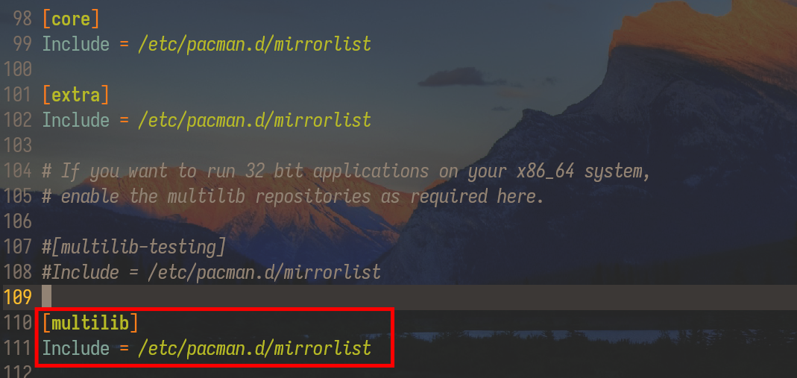

.. ARU (c) 2018 - 2024, Pavel Priluckiy, Vasiliy Stelmachenok and contributors

   ARU is licensed under a
   Creative Commons Attribution-ShareAlike 4.0 International License.

   You should have received a copy of the license along with this
   work. If not, see <https://creativecommons.org/licenses/by-sa/4.0/>.

.. _first-steps:

**************
Первые шаги
**************

.. index:: pacman, settings
.. _pacman-settings:

==========================
Настройка pacman
==========================

.. index:: pacman, key, gpg
.. _gpg-update:

----------------------------
Обновление ключей Arch Linux
----------------------------

Обновление ключей необходимо во избежание дальнейших проблем с установкой
пакетов::

  sudo pacman-key --init               # Инициализация
  sudo pacman-key --populate archlinux # Получить ключи из репозитория
  sudo pacman-key --refresh-keys       # Проверить текущие ключи на актуальность
  sudo pacman -Sy                      # Обновить ключи для всей системы

Данная операция может занять продолжительное время. Для дальнейшего их
автоматического обновления нужно включить службу-таймер, которая
оптимизирует процесс при помощи команды ``archlinux-keyring-wkd-sync``::

    sudo systemctl enable --now archlinux-keyring-wkd-sync.timer

Таким образом ключи будут обновляться раз в неделю.

.. index:: pacman, multilib, wine, steam
.. _multilib-repository:

---------------------------------
Включение 32-битного репозитория
---------------------------------

Убедимся, что конфигурация пакетного менеджера Pacman настроена для получения
доступа к 32-битным зависимостям, нужным в частности для установки Wine и
Steam.

Для этого раскомментируем так называемый *multilib* репозиторий::

  sudo nano /etc/pacman.conf           # Раскоментируйте последние две строчки как на скриншоте

::

  sudo pacman -Suy                     # Обновление репозиториев и всех программ (пакетов)

.. index:: pacman, mirrorlist, reflector
.. _speed-up-system-updates:

-------------------------------
Ускорение обновления системы
-------------------------------

Утилита Reflector отсортирует доступные репозитории по скорости::

  sudo pacman -S reflector rsync curl  # Установка reflector и его зависимостей

Если вы из Европейской части России, то советуем всегда использовать зеркала
Германии, так как их больше всего и они имеют оптимальную свежесть/скорость::

  sudo reflector --verbose --country 'Germany' -l 25 --sort rate --save /etc/pacman.d/mirrorlist

Если вы проживаете не на территории Европейской части РФ или в иной стране, то
просто измените *Germany* на *Russia* или ваше государство.

Можно также вручную отредактировать список зеркал, добавив туда зеркала из
постоянно обновляющегося перечня на сайте Arch Linux
(https://archlinux.org/mirrorlist/)::

  sudo nano /etc/pacman.d/mirrorlist # Рекомендуем прописывать зеркала от Яндекса

.. index:: pacman, settings, parallel-downloading
.. _parallel-downloading:

---------------------------------------------
Одновременная загрузка двух и более пакетов
---------------------------------------------

Начиная с шестой версии pacman поддерживает параллельную загрузку
пакетов. Чтобы её включить отредактируйте */etc/pacman.conf*:

.. code-block:: shell
   :caption: ``sudo nano /etc/pacman.conf`` # Раскомментируйте строчку внутри файла

   # Где 4 - количество пакетов для одновременной загрузки
   ParallelDownloads = 4

.. index:: pacman, settings, disable-timeouts
.. _disable_pacman_timeouts:

-------------------------------------------
Отключение таймаутов при загрузке пакетов
-------------------------------------------

Если вы имеете плохое качество соединения или слабый уровень сигнала,
то при загрузке пакетов при помощи pacman вы могли сталкиваться с
ошибкой превышания лимитов ожидания (таймаутов). Чтобы этого избежать
нужно добавить параметр ``DisableDownloadTimeout`` в ``pacman.conf``
как мы это уже делали ранее с ``ParallelDownloads``:

.. code-block:: shell
   :caption: ``sudo nano /etc/pacman.conf`` # Добавьте строку в секцию [options]

   DisableDownloadTimeout

.. index:: installation, basic, packages
.. _basic-software-installation:

==============================================
Установка базовых пакетов и набора программ
==============================================

Автор считает, что пользователь системы должен сам определять, что и для чего
он должен тащить в свою систему, но все же мы должны дать несколько
рекомендаций к установке определенного ПО, которое точно поможет вам при работе
с данным руководством.

.. index:: installation, packages, basic, grub
.. _mandatory-packages:

--------------------------------
Обязательные к установке пакеты!
--------------------------------

Эта группа пакетов **ОБЯЗАТЕЛЬНА** к установке! Она содержит ряд полезных
инструментов без которых вы не сможете установить множество пакетов из AUR,
включая все те, о которых пойдет речь далее в руководстве. И так как в начале
руководства мы условились пользоваться "дедовским" методом установки AUR
пакетов, дополнительно установим ``git`` для скачивания PKGBUILD и текстовый
редактор ``nano`` для редактирования конфигурационных файлов (вы так же в праве
использовать любой другой)::

 sudo pacman -S base-devel git nano

По желанию можете установить графическую обертку для работы с загрузчиком
GRUB2::

 sudo pacman -S grub-customizer

.. index:: installation, packages, archives
.. _archive-packages:

-----------------------------
Пакеты для работы с архивами
-----------------------------

В Linux есть поддержка целого зоопарка различных архивов и алгоритмов их
сжатия, но чтобы все они работали правильно, необходима установка дополнительных
пакетов::

  # zip, rar, ace, rzip/lcma/lzo, iso
  sudo pacman -S lrzip unrar unzip unace p7zip squashfs-tools

Но они предоставляют только интерфейс командной строки для работы с архивами,
потому стоит так же поставить графическую обертку с минимальным набором
зависимостей::

  sudo pacman -S file-roller

.. index:: installation, packages, applications
.. _applications-packages:

---------------------
Набор прикладного ПО
---------------------

Далее мы установим набор джентельмена в виде браузера (chromium), плеера (VLC)
и торрент-клиента (qbittorrent)::

  sudo pacman -S qbittorrent chromium vlc

Банально, но всё же.

Вдобавок можно отметить легковесный файловый менеджер PCManFM::

  sudo pacman -S pcmanfm-gtk3 gvfs gvfs-mtp

.. warning:: Пакеты начинающиеся с ``gvfs`` нужны для автомонтирования
   различных устройств (например Android смартфонов) и интеграции с
   различными сетевыми хранилищами (Google Disk/SAMBA и т.д.)

Итак, мы установили набор джентльмена и парочку программ, что понадобятся нам в
дальнейшем. Но если вас не устраивает тот или иной компонент, вы всегда можете
найти любой нужный вам пакет по адресу https://www.archlinux.org/packages/.
Если вы не смогли найти нужную вам программу в официальных репозиториях, вы
всегда можете найти всё что душе угодно в AUR (по адресу
https://aur.archlinux.org/packages/).

.. index:: installation, packages, steam
.. _steam-installation:

----------------
Установка Steam
----------------

Если в предыдущем разделе вы активировали в настройках pacman Multilib
репозиторий, то из него можно установить официальный клиент Steam.
Однако, здесь стоит упомянуть о сразу нескольких доступных версиях.

Существует просто steam_ - он содержит в себе клиент Steam с
собственными копиями библиотек к нему. ::

  sudo pacman -S steam ttf-liberation

А есть steam-native-runtime, который использует локально установленные
в систему библиотеки. Разница в том, что последний будет использовать
всегда более свежие версии библиотек, из-за чего опыт работы клиента и
нативных игр Linux может как улучшиться, так и наоборот сломать
какой-либо функционал. Вдобавок, steam-native-runtime_ требует большее
количество 32-битных зависимостей. ::

  sudo pacman -S steam-native-runtime ttf-liberation

Автор рекомендует пользоваться обычной версией, хотя и при
использовании steam-native-runtime_ каких-либо серьёзных проблем замечено не
было.

.. _steam: https://archlinux.org/packages/multilib/x86_64/steam/
.. _steam-native-runtime: https://archlinux.org/packages/multilib/x86_64/steam-native-runtime/

.. index:: installation, drivers, nvidia, amd, intel
.. _drivers-installation:

------------------------------------------------
Установка актуальных драйверов для видеокарты
------------------------------------------------

В установке драйверов для Linux-систем нет ничего сложного, главное просто
учитывать, что от свежести ядра и версии драйвера, будет зависеть получите ли
вы чёрный экран смерти или нет (Шутка).

И да, **устанавливайте драйвера ТОЛЬКО через пакетный менеджер вашего
дистрибутива!**

Забудьте про скачивание драйвера с сайта NVIDIA/AMD, это поможет вам избежать
кучу проблем в дальнейшем.

NVIDIA
------

Рекомендуется использовать модули драйвера из пакета ``nvidia-dkms``,
которые при помощи системы динамических модулей DKMS автоматически
собируться под нужное ядро::

  sudo pacman -S nvidia-dkms nvidia-utils lib32-nvidia-utils nvidia-settings lib32-opencl-nvidia opencl-nvidia libxnvctrl vulkan-icd-loader lib32-vulkan-icd-loader

.. warning:: Для правильной работы DKMS требуется также установить
   заголовки текущей версии ядра. Например, для стандартного ядра
   ``linux`` заголовки требуемые для сборки модулей находится внутри
   пакета ``linux-headers``.

С недавних пор помимо закрытых модулей драйвера NVIDIA также
предоставляет версию модулей с открытым исходным кодом, которые
рекомендуются к использованию начиная с ``560`` ветки драйвера. Их
установка практически ничем не отличается от закрытого варианта кроме
как заменой пакета ``nvidia-dkms`` на ``nvidia-open-dkms``::

  sudo pacman -S nvidia-open-dkms nvidia-utils lib32-nvidia-utils nvidia-settings lib32-opencl-nvidia opencl-nvidia libxnvctrl vulkan-icd-loader lib32-vulkan-icd-loader

Перед установкой драйвера рекомендуется отключить *"Secure Boot"* в
UEFI, ибо из-за этого модули драйвера могут не загрузиться.

NVIDIA (470xx)
---------------

Драйвер NVIDIA для Linux имеет несколько веток с долгосрочной
поддержкой, часть из которых, как например nvidia-470xx-dkms,
оставлены для сохранения совместимости со старыми видеокартами, в
данном случае с поколением GPU Kepler. Если ваша видеокарта относится
именно к этому поколению, то вам нужно установить не последний драйвер
выше, а данную версию из AUR. ::

  sudo pacman -S vulkan-icd-loader lib32-vulkan-icd-loader

  git clone https://aur.archlinux.org/nvidia-470xx-utils
  cd nvidia-470xx-utils
  makepkg -sric

  # 32-битные библиотеки (необходимо для запуска игр через Wine/Steam)
  git clone https://aur.archlinux.org/lib32-nvidia-470xx-utils
  cd lib32-nvidia-470xx-utils
  makepkg -sric

Nouveau (*Только для старых видеокарт*)
------------------------------------------

Для старых видеокарт Nvidia (ниже GeForce 600) рекомендуется использовать
свободную альтернативу драйвера NVIDIA — Nouveau, входящую в состав Mesa. Она
имеет официальную поддержку и обновления в отличии от старых версий закрытого
драйвера NVIDIA (340, 390) и отлично справляется с 2D ускорением. Вдобавок,
Nouveau хорошо работает с Wayland. ::

  sudo pacman -S mesa lib32-mesa libva-mesa-driver lib32-libva-mesa-driver vulkan-nouveau lib32-vulkan-nouveau opencl-rusticl-mesa lib32-opencl-rusticl-mesa

Пакет ``libva-mesa-driver`` нужен для работы аппаратного ускорения
видео в браузерах и видеоплеерах.

AMD
----
::

  sudo pacman -S mesa lib32-mesa vulkan-radeon lib32-vulkan-radeon libva-mesa-driver lib32-libva-mesa-driver vulkan-mesa-layers opencl-rusticl-mesa lib32-opencl-rusticl-mesa

Пакет ``libva-mesa-driver``, также нужны для работы аппаратного
ускорения видео 

Intel
-----
::

  sudo pacman -S mesa lib32-mesa vulkan-intel lib32-vulkan-intel opencl-rusticl-mesa lib32-opencl-rusticl-mesa

.. warning:: Автор не рекомендует выполнять установку морально
   устаревших DDX драйверов, как например ``xf86-video-intel``, так
   как они в большинстве своем заброшены и не получают никаких
   исправлений.  Вместо этого используйте DDX драйвер ``modesetting``,
   который поставляется вместе с пакетом ``xorg-server``. Он
   использует аппартное ускорение на базе glamor и Mesa. Обратите
   внимание, что последние исправления и новые возможности (Как,
   например, опция ``"Tearfree"``) доступны только в Git версии,
   поэтому имеет смысл установить ``xorg-server-git`` из AUR.

.. index:: cleanup, gnome, kde
.. _remove-garbage-packages:

==========================
Удаление лишних пакетов
==========================

К сожалению, если во время установки системы вы выполняли установку
KDE Plasma или GNOME при помощи одноименных групп пакетов, то скорее
всего вы установили себе в систему некоторое количество лишних
пакетов, таких как например ``gnome-software`` или ``discover``,
которые крайне не рекомендуется использовать в Arch Linux взамен
простого использования ``pacman``. Чтобы не выполнять переустановку
всех пакетов, связанных с рабочим окружением, можно выполнить удаление
лишних пакетов при помощи следующих команд в зависимости от
используемого окружения:

.. tab-set::

   .. tab-item:: GNOME

      ::

         sudo pacman -D --asdeps $(pacman -Qqg gnome)
         sudo pacman -D --asexplicit gnome-shell mutter gdm gnome-control-center gnome-console nautilus gnome-session gnome-settings-daemon gvfs gvfs-mtp
         sudo pacman -Rsn $(pacman -Qqgdtt gnome)

   .. tab-item:: KDE Plasma

      ::

         sudo pacman -D --asdeps $(pacman -Qqg plasma)
         sudo pacman -D --asexplicit plasma-desktop breeze-gtk kde-gtk-config plasma-pa bluedevil sddm sddm-kcm plasma-nm
         sudo pacman -Rsn $(pacman -Qqgdtt plasma)

Если вас пугает большой набор непонятных команд - не переживайте, все
что здесь происходит, это помечание всех пакетов из группы пакетов
``gnome`` или ``plasma`` соответственно как неявно установленных, то
есть подтянутых в качестве зависимостей, после чего идет изменение
причины установки базовых пакетов окружения уже как явно
установленных, что позволяет разделить действительно нужные и мусорные
пакеты по причине их установки и удалить все лишние пакеты. Конечно,
всегда думайте головой и проверяйте не подтянулось ли что-то для вас
нужное, однако данный способ гарантирует, что базовые пакеты,
необходимые для работы окружения, не будут удалены, поэтому вы всегда
сможете доустановить нужные вам программы в соответствии со своими
предпочтениями.

Если вы не используйте GNOME или KDE Plasma, то вы можете пропустить
данный шаг, так как для всех остальных рабочих окружений, таких как
Xfce, MATE и LXQt, в соответствующей им группе пакетов есть лишь
предельный минимум того, что действительно нужно.

.. index:: nvidia, tweaks, driver, settings, performance
.. _nvidia-settings:

====================================
Настройка закрытого драйвера NVIDIA
====================================

Драйвер NVIDIA - одно из самых болезненных мест с которым сталкиваются
пользователи при переходе на Linux. В данном разделе мы рассмотрим как
минимизировать количество испытываемой головной боли если вы являетесь
несчастным обладателем видеокарты NVIDIA под Linux.

.. index:: nvidia, xorg, tearing
.. _bad-nvidia-tips:

-------------------------------------------
Распространенные мифы о настройке драйвера
-------------------------------------------

Но прежде чем перейти к исправлению насущных проблем, поговорим о том,
чего делать определенно не стоит, то есть о различных вредных советах,
которые раньше могли иметь смысл, но сейчас уже нет.

Во-первых, автор категорически не рекомендует выполнять настройку
ваших мониторов и генерацию конфига ``xorg.conf`` в целом через
nvidia-settings или nvidia-xconfig как советовалось делать ранее. В
первую очередь потому, что это просто не нужно, так как современные
версии графического сервера Xorg сами выполняют автонастройку и
определение рабочих мониторов, кроме того большинство рабочих
окружений (DE) в своих настройках уже позволяют вам выставить
требуемую частоту обновления нескольких мониторов и их компановку,
перекрывая при этом все изменения сделанные в файле ``xorg.conf``,
который статичен и не может подстраиваться под изменения вашей
конфигурации. Например, подключение второго монитора на лету вызовет
проблемы, так как он не указан в ``xorg.conf``, а автоопределение при
наличии конфигурационного файла перестает работать. Вдобавок,
программа nvidia-settings также является крайне ограниченной в
конфигурациях с гибридной графикой (PRIME) или при использовании
сессий на базе протокола Wayland.

Больше подробностей о проблемах которые могут возникнуть при
использовании nvidia-settings в качестве конфигуратора для Xorg можно
прочитать здесь:

https://unix.stackexchange.com/questions/697517/how-to-correlate-xorg-conf-config-for-nvidia-gpu-with-xrandr-detected-screens/697553#697553

Автор так же рекомендует полностью отказаться от использования
морально устаревшей опции для ``xorg.conf`` как "Force composition
pipeline", так как современных композиторов, поставляемых вместе с
такими рабочими окружениями как GNOME/KDE/Cinnamon/Xfce и т.д.,
полностью достаточно чтобы предотвратить так называемую проблему
тиринга (разрывов экрана). К тому же "Force composition Pipeline"
имеет побочный эффект, создавая сильные задержки отклика, так
называемый input lag. И вызывает проблемы при работе расширения Vulkan
VK_KHR_present_wait, которое требуется для запуска многих игр при
использовании VKD3D-Proton. Подробнее смотрите здесь:
https://github.com/ValveSoftware/Proton/issues/6869.

Если же вы являетесь пользователем тайлинговых оконных менеджеров
(WM), где нет удобных средств настройки из коробки, то автор
рекомендует вам использовать такие средства как xrandr_ и композитор
picom_.

.. _xrandr: https://wiki.archlinux.org/title/Xrandr#Testing_configuration
.. _picom: https://wiki.archlinux.org/title/Picom

.. _fix_poor_cpu_performance:

----------------------------------------------------------------
Повышение производительности CPU на ноутбках с графикой NVIDIA
----------------------------------------------------------------

Обмен кадрами между iGPU и dGPU в следствии их копирования из VRAM в
ОЗУ может вызывать большую нагрузку на процессор, из-за чего
производительность самого CPU может сильно падать на ноутбуках с
гибридной графикой. Page Attribute Table (PAT) это более
оптимизированный метод управления памятью. Метод PAT создает таблицу
типов разделов по определенному адресу, отображенному в регистре, и
использует архитектуру памяти и набор инструкций более эффективно и
быстро. Для его активации в драйвере NVIDIA нужно указать параметр
``NVreg_UsePageAttributeTable=1``. Для этого как обычно создаем файл в
директории ``/etc/modprobe.d/`` или указываем через пробел в тот же
файл, что мы создавали ранее:

.. code-block:: shell
   :caption: ``sudo nano /etc/modprobe.d/nvidia-pat.conf``

   options nvidia NVreg_UsePageAttributeTable=1

См. также: https://bbs.archlinux.org/viewtopic.php?id=242007

.. index:: nvidia, environment, variables, latency
.. _nvidia-env-vars:

---------------------------------
Специальные переменные окружения
---------------------------------

Здесь речь пойдет о переменных окружения, которые влияют на поведение
драйвера при работе с приложениями которые используют API OpenGL или
Vulkan. Указать вы их можете либо в Lutris для конкретных игр, либо в
*"Параметрах Запуска"* игры в Steam (*"Свойства"* -> *"Параметры
запуска"*. После указания всех переменных обязательно добавьте в конце
"*%command%*", для того чтобы Steam понимал, что вы указали именно
системные переменные окружения для запуска игры, а не параметры
специфичные для этой самой игры).

``__GL_THREADED_OPTIMIZATIONS=1`` **(По умолчанию выключено)** -
Активируем многопоточную обработку OpenGL. Используете выборочно для
нативных игр/приложений, ибо иногда может наоборот вызывать регрессию
производительности. Некоторые игры и вовсе могут не запускаться с
данной переменной (К примеру, некоторые нативно-запускаемые части
Metro).

``__GL_MaxFramesAllowed=1`` **(По умолчанию - 2)** - Задает тип буферизации
кадров драйвером. Можете указать значение *"3"* (Тройная буферизация) для
большего количества FPS и улучшения производительности в приложениях/играх с
VSync. Мы рекомендуем задавать вовсе *"1"* (т.е. не использовать буферизацию,
подавать кадры так как они есть). Это может заметно уменьшить значение FPS в
играх, но взамен вы получите лучшие задержки отрисовки и реальный физический
отклик, т.к. кадр будет отображаться вам сразу на экран без лишних этапов его
обработки.

``__GL_YIELD="USLEEP"`` **(По умолчанию без значения)** - Довольно специфичный
параметр, *"USLEEP"* - снижает нагрузку на CPU и некоторым образом помогает в
борьбе с тирингом, а *"NOTHING"* дает больше FPS при этом увеличивая нагрузку
на процессор.

``__GL_SHADER_DISK_CACHE_SKIP_CLEANUP=1`` **(По умолчанию 0)** -
отключает ограничение кэша шейдеров OpenGL/Vulkan (по умолчанию
располагается по пути ``~/.cache/nvidia``). Рекомендуется для
современных нативных игр и DXVK 2.0+, где размер кэша может достигать
более гигабайта.

``__GL_SYNC_DISPLAY_DEVICE`` - указывает монитор с частотой которого
драйвер NVIDIA будет осуществлять синхронизацию. Это нужно для
конфигураций с двумя и более мониторами для предотвращения заиканий на
дисплеях с высокой частотой обновления на некоторых композиторах
(например Muffin). Представим, что у вас есть два дисплея, один 144
Гц, другой 60. В переменную следует указать видеовыход, в который
подключен монитор с наибольшей частотой обновления. Чтобы определить
какой монитор, в какой выход подключен можно использовать утилиту
``xrandr``. Данную переменную имеет смысл указывать глобально, то есть
в файле ``/etc/environment``.

.. code-block:: shell
   :caption: ``sudo nano /etc/environment``

    __GL_SYNC_DISPLAY_DEVICE=HDMI-0 # Это пример, указывайте свое имя выхода

.. index:: modules, mkinitcpio, initramfs
.. _important-modules:

==============================================
Добавление важных модулей в образы initramfs
==============================================

Иногда может понадобиться добавить модули для ядра в начальный
загрузочный образ (initramfs), который содержит в себе всё необходимое
для правильной загрузки ядра, включая необходимые драйверы и программы
для монтирования корневого раздела. Добавление модулей в initramfs
позволяет избежать некоторых проблем, когда загрузка модулей
происходит позже, чем когда они уже фактически нужны для
использования. Так происходит из-за параллельной загрузки сервисов
(юнитов) в systemd. Например, при использовании графического менеджера
входа в систему как SDDM, модули драйвера Nvidia могут быть загружены
позже, чем будет запущен сам сервис SDDM. Из-за этого пользователь
ловит так называемый "Чёрный экран".

За генерацию загрузочных образов могут отвечать различные программы,
но в Arch Linux по умолчанию для этого используется ``mkinitcpio``.
Чтобы добавить необходимые модули нужно создать новый файл со
следующим содержанием:

.. code-block:: shell
   :caption: ``sudo nano /etc/mkinitcpio.conf.d/10-modules.conf``

   MODULES+=(nvidia nvidia_modeset nvidia_uvm nvidia_drm)

Здесь мы добавляем модули драйвера Nvidia в загрузочный образ
initramfs, но в массив (ограничен скобками) вы можете прописать любые
модули ядра, которые считаете наиболее важными и нужными для загрузки
системы.

После добавления новых модулей обязательно нужно пересобрать уже
существующие образы initramfs::

  sudo mkinitcpio -P

.. warning:: Обратите внимание, что добавление большого количества
   модулей может сильно раздуть размер образа initramfs, поэтому перед
   этим убедитесь, что у вас имеется достаточно места в ``/boot`` разделе
   (если таковой имеется).

.. index:: cpu, intel, amd, microcode
.. _microcode-installation:

======================
Установка микрокода
======================

Микрокод - программа реализующая набор инструкций процессора. Она уже встроена
в материнскую плату вашего компьютера, но скорее всего вы её либо не обновляли
вовсе, либо делаете это не часто вместе с обновлением BIOS (UEFI).

Однако у ядра Linux есть возможность применять обновления микрокода
прямо во время загрузки системы. Они содержат множественные
исправления ошибок и улучшения стабильности, поэтому настоятельно
рекомендуется их периодически устанавливать.

Осуществляется это следующими командами::

  sudo pacman -S intel-ucode                  # Установить микрокод Intel
  sudo pacman -S amd-ucode                    # Установить микрокод AMD
  sudo mkinitcpio -P                          # Пересобираем образы initramfs.
  sudo grub-mkconfig -o /boot/grub/grub.cfg   # Обновляем загрузчик, можно так же через grub-customizer.

.. index:: firmware, linux, installation
.. _missing_firmwares:

==================================
Установка дополнительных прошивок
==================================

В Arch Linux и основанных на нем дистрибутивах большинство прошивок
устройств как правило поставляются с пакетом linux-firmware и всех
связанных с ним пакетов (linux-firmware-whence, linux-firmware-bnx2x,
linux-firmware-liquidio, linux-firmware-marvell,
linux-firmware-mellanox, linux-firmware-nfp, linux-firmware-qcom,
linux-firmware-qlogic). Тем не менее вы можете столкнуться с
предупреждением во время пересборки initramfs образов через команду
``sudo mkinitcpio -P`` подобного формата::

  ==> WARNING: Possibly missing firmware for module: XXXXXXXX

Такие предупреждения не являются критическими, однако некоторые
устройства у вас в системе могут работать не полностью или вообще не
работать без требуемых прошивок. Поэтому в первую очередь
рекомендуется попробовать установить все вышеуказанные пакеты
linux-firmware (некоторые из них можно пропустить в силу отсутствия
соответствующих устройств, например linux-firmware-marvell).

Но некоторых прошивок нет в официальных репозиториях дистрибутива,
поэтому их требуется установить отдельно из AUR_ (все пакеты
содержащие файлы прошивок имеют окончание "-firmware"). Рассмотрим на
примере прошивки для модуля aic94xx::

  git clone https://aur.archlinux.org/aic94xx-firmware
  cd aic94xx-firmware
  makepkg -sric

После этого повторите команду ``sudo mkinitcpio -P``. Предупреждение о
пропуске прошивок для модуля aic94xx должно пропасть.

.. _AUR: https://aur.archlinux.org/packages?O=0&SeB=nd&K=-firmware&outdated=&SB=p&SO=d&PP=50&submit=Go

.. vim:set textwidth=70:
