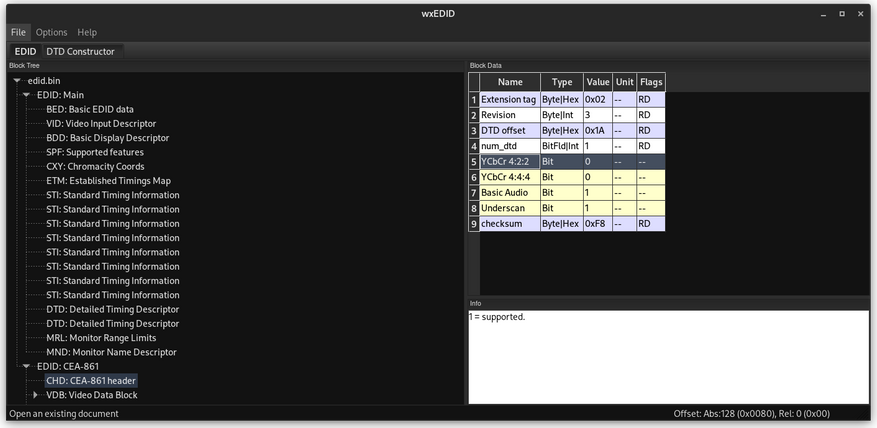
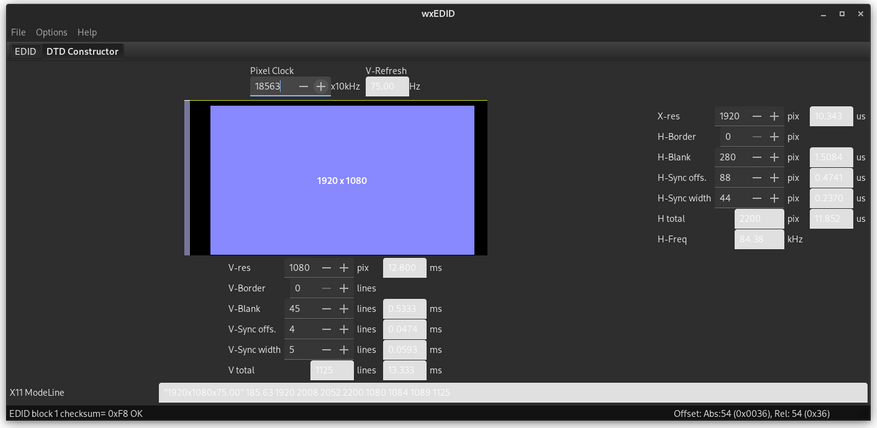
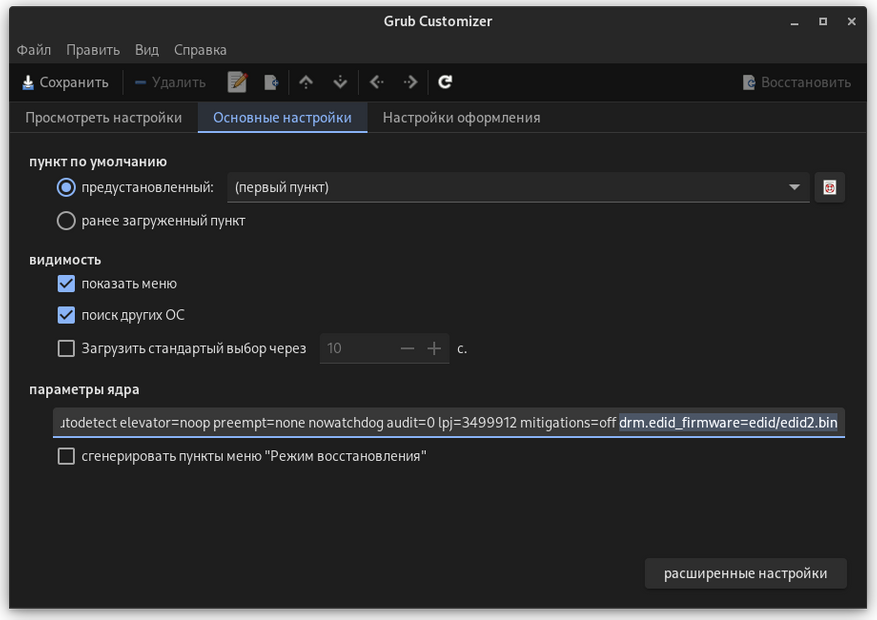

.. ARU (c) 2018 - 2022, Pavel Priluckiy, Vasiliy Stelmachenok and contributors

   ARU is licensed under a
   Creative Commons Attribution-ShareAlike 4.0 International License.

   You should have received a copy of the license along with this
   work. If not, see <https://creativecommons.org/licenses/by-sa/4.0/>.

.. _generic-system-acceleration:

***************************
Базовое ускорение системы
***************************

Переходя к базовой оптимизации системы мне сто́ит напомнить, что чистый
Arch Linux - это фундамент, и требуется уйма надстроек для нормальной
работы системы. Установить компоненты, которые будут отвечать за
электропитание, чистку, оптимизацию и тому подобные вещи, что и
описывается в данном разделе.

.. index:: makepkg-conf, native-compilation, flags, lto
.. _makepkg-conf:

======================
Настройка makepkg.conf
======================

Прежде чем приступать к сборке пакетов, мы должны изменить так
называемые флаги компиляции, что являются указателями для компилятора,
какие инструкции и оптимизации использовать при сборке программ.

``sudo nano /etc/makepkg.conf`` # Редактируем (Где "-O2" - **Это не нуль/ноль**)

**Изменить ваши значения на данные:** ::

  CFLAGS="-march=native -mtune=native -O2 -pipe -fno-plt -fexceptions \
        -Wp,-D_FORTIFY_SOURCE=2 -Wformat -Werror=format-security \
        -fstack-clash-protection -fcf-protection"
  CXXFLAGS="$CFLAGS -Wp,-D_GLIBCXX_ASSERTIONS"
  RUSTFLAGS="-C opt-level=3"
  MAKEFLAGS="-j$(nproc) -l$(nproc)"
  OPTIONS=(strip docs !libtool !staticlibs emptydirs zipman purge !debug lto)

Данные флаги компилятора выжимают максимум производительности при
компиляции, но могут вызывать ошибки сборки в очень редких
приложениях. Если такое случится, то отключите параметр ‘lto’ в строке
options добавив перед ним символ восклицательного знака  ! (*"!lto"*).

.. index:: makepkg, clang, native-compilation, flags
.. _force-clang-usage:

------------------------------------------------------
Форсирование использования Clang при сборке пакетов
------------------------------------------------------

В системах на базе ядра Linux различают две основных группы
компиляторов, это LLVM и GCC. И те, и другие хорошо справляются с
возложенными на них задачами, но LLVM имеет чуть большее преимущество
с точки зрения производительности при меньших потерях в качестве
конечного кода. Поэтому, в целом, применение компиляторов LLVM для
сборки различных пакетов при задании флага -O2 (максимальная
производительность) является совершенно оправданным, и может дать
реальный прирост при работе программ.

Компилятором для языков C/C++ в составе LLVM является Clang и Clang++
соответственно. Его использование при сборке пакетов мы и будем
форсировать через makepkg.conf

Для начала выполним их установку::

  sudo pacman -Syu llvm clang lld

Теперь клонируем уже готовый конфигурационный файл /etc/makepkg.conf
под новыми именем /etc/makepkg-clang.conf::

  sudo cp -r /etc/makepkg.conf /etc/makepkg-clang.conf

Это поможет нам в случае чего откатиться к использованию компиляторов
GCC если возникнут проблемы со сборкой пакетов через LLVM/Clang.

Теперь откроем выше скопированный файл и добавим туда после строки
``CHOST="x86_64-pc-linux-gnu"`` следующее::

  export CC=clang
  export CXX=clang++
  export LD=ld.lld
  export CC_LD=lld
  export CXX_LD=lld
  export AR=llvm-ar
  export NM=llvm-nm
  export STRIP=llvm-strip
  export OBJCOPY=llvm-objcopy
  export OBJDUMP=llvm-objdump
  export READELF=llvm-readelf
  export RANLIB=llvm-ranlib
  export HOSTCC=clang
  export HOSTCXX=clang++
  export HOSTAR=llvm-ar
  export HOSTLD=ld.lld

Отлично, теперь вы можете собрать нужные вам пакеты (программы) через
LLVM/Clang просто добавив к уже известной команде makepkg следующие
параметры::

  makepkg --config /etc/makepkg-clang.conf -sric

.. attention:: Далеко не все пакеты так уж гладко собираются через
   Clang, в частности не пытайтесь собирать им Wine/DXVK, т.к. это
   официально не поддерживается и с 98% вероятностью приведет к ошибке
   сборки. Но в случае неудачи вы всегда можете использовать
   компиляторы GCC, которые у вас заданы в настройках makepkg.conf по
   умолчанию, т.е. просто уберите опцию ``--config
   /etc/makepkg-clang.conf`` из команды ``makepkg``.

Дальнейшеная пересборка пакетов из официальных репозиториев
осуществима через утилиту ``asp``::

  sudo pacman -S asp
  asp checkout ПАКЕТ

Где *ПАКЕТ* - название нужного вам пакета.

Мы рекомендуем вам пересобрать наиболее важные пакеты. Например такие
как драйвера (то есть `mesa
<https://archlinux.org/packages/extra/x86_64/mesa/>`_, `lib32-mesa
<https://archlinux.org/packages/multilib/x86_64/lib32-mesa/>`_, если у
вас Intel/AMD), `Xorg сервер
<https://archlinux.org/packages/extra/x86_64/xorg-server/>`_, а также
связанные с ним компоненты, или `Wayland
<https://archlinux.org/packages/extra/x86_64/wayland/>`_, критически
важные пакеты вашего DE/WM, например: `gnome-shell
<https://aur.archlinux.org/packages/gnome-shell-performance>`_,
`plasma-desktop
<https://archlinux.org/packages/extra/x86_64/plasma-desktop/>`_. А
также композиторы `kwin
<https://archlinux.org/packages/extra/x86_64/kwin/>`_, `mutter
<https://aur.archlinux.org/packages/mutter-performance>`_, picom и
т.д. в зависимости от того, чем именно вы пользуетесь.

Альтернативно, вы можете использовать уже подготовленный репозиторий
`arch-packages <https://github.com/h0tc0d3/arch-packages>`_ с полной
поддержкой сборки пакетов через LLVM/Clang. В этом репозитории
представлены не все возможные пакеты, но самые важные компоненты
системы там есть, которые вы тоже можете пересобрать.

Больше подробностей по теме вы можете найти в данной статье:

https://habr.com/ru/company/ruvds/blog/561286/

.. index:: clang, native-compilation, llvm-bolt-builds, lto, pgo
.. _speeding-up-clang-llvm-compilers:

Ускорение работы компиляторов LLVM/Clang
-----------------------------------------

Дополнительно можно отметить, что после установки Clang вы можете
перекомпилировать его самого через себя, т.е. выполнить пересборку
Clang с помощью бинарного Clang из репозиториев. Это позволит
оптимизировать уже сам компилятор под ваше железо и тем самым ускорить
его работу при сборке уже других программ. Аналогичную операцию вы
можете проделать и с GCC.

Делается это через пакет в AUR::

  # Установка зависимости из AUR
  git clone https://aur.archlinux.org/python-sphinx-automodapi
  cd python-sphinx-automodapi
  makepkg -sric
  cd ..

  # Сборка LLVM
  git clone https://aur.archlinux.org/llvm-git
  cd llvm-git
  makepkg -sric --config /etc/makepkg-clang.conf

.. index:: makepkg, ccache, native-compilation
.. _enabling_ccache:

-----------------------
Включение ccache
-----------------------

В Linux системах есть не так много программ, сборка которых может
занять больше двух часов, но они все таки есть. Потому, было бы
неплохо ускорить повторную компиляцию таких программ как
Wine/Proton-GE и т.д.

ccache - это кэш для компиляторов C/C++, в частности совместимый с
компиляторами GCC/Clang, цель которого состоит в ускорении повторного
процесса компиляции одного и того же кода. Это значит, что если при
сборке программы новой версии, будут замечены полностью идентичные
блоки исходного кода в сравнении с его старой версией, то компиляция
этих исходных текстов производиться не будет. Вместо этого, уже
готовый, скомпилированный код старой версии будет вынут из кэша
ccache. За счёт этого и достигается многократное ускорение процесса
компиляции.

**Установка** ::

  sudo pacman -S ccache

После установки его ещё нужно активировать в ваших настройках makepkg.
Для этого отредактируем конфигурационный файл::

  sudo nano /etc/makepkg.conf

  # Найдите данную строку в собственных настройках, затем уберите восклицательный знак перед *"ccache"*
  BUILDENV=(!distcc color ccache check !sign)

После этого повторная пересборка желаемых программ и их обновление
должны значительно ускориться.

.. attention:: ccache может ломать сборку некоторых программ, поэтому будьте внимательны с его применением.

.. index:: installation, ananicy, zram, nohang, rng-tools, trim, dbus-broker
.. _daemons-and-services:

======================================
Установка полезных служб и демонов
======================================

**1.** `Zramswap <https://aur.archlinux.org/packages/zramswap/>`_ —
это специальный демон, который сжимает оперативную память ресурсами
центрального процессора и создает в ней файл подкачки. Очень ускоряет
систему вне зависимости от количества памяти, однако добавляет
нагрузку на процессор, т.к. его ресурсами и происходит сжатие памяти.
Поэтому, на слабых компьютерах с малым количеством ОЗУ, это может
негативно повлиять на производительность в целом. ::

  git clone https://aur.archlinux.org/zramswap.git  # Скачивание исходников.
  cd zramswap                                       # Переход в zramswap.
  makepkg -sric                                     # Сборка и установка.
  sudo systemctl enable --now zramswap.service      # Включаем службу.

Чтобы немного ускорить работу zram рекомендуется также изменить
алгоритм сжатия памяти::

  echo "ZRAM_COMPRESSION_ALGO=zstd" | sudo tee -a /etc/zramswap.conf

.. warning:: Во избежание конфликтов, после установки zram обязательно
   отключите zswap через добавление параметра ядра ``zswap.enabled=0``.

**1.1** `Nohang <https://github.com/hakavlad/nohang>`_  — это демон
повышающий производительность путём обработки и слежки за потреблением
памяти. ::

  git clone https://aur.archlinux.org/nohang-git.git # Скачивание исходников.
  cd nohang-git                                      # Переход в nohang-git
  makepkg -sric                                      # Сборка и установка.
  sudo systemctl enable --now nohang-desktop         # Включаем службу.

**1.2** `Ananicy CPP <https://gitlab.com/ananicy-cpp/ananicy-cpp>`_ —
это форк одноименного демона, распределяющий приоритет задач. Его
установка очень сильно повышает отклик системы. В отличии от
оригинального Ananicy, данный форк переписан полностью на C++, из-за
чего достигается прирост в скорости работы. ::

  git clone https://aur.archlinux.org/ananicy-cpp.git # Скачивание исходников.
  cd ananicy-cpp                                      # Переход в ananicy-cpp.
  makepkg -sric                                       # Сборка и установка.
  sudo systemctl enable --now ananicy-cpp             # Включаем службу.
  
  # Далее описывается установка дополнительных правил по перераспределению приоритетов процессов
  git clone https://aur.archlinux.org/ananicy-rules-git.git # Скачивание исходников
  cd ananicy-rules-git                                      # Переход в директорию
  makepkg -sric                                             # Сборка и установка
  sudo systemctl restart ananicy-cpp                        # Перезапускаем службу  

**1.3** Включаем `TRIM
<https://ru.wikipedia.org/wiki/Trim_(команда_для_накопителей)>`_ —
очень полезно для SSD. ::

  sudo systemctl enable fstrim.timer    # Включаем службу.
  sudo fstrim -v /                      # Ручной метод.
  sudo fstrim -va /                     # Если первый метод не тримит весь диск.

**1.4** `Сron <https://wiki.archlinux.org/title/cron>`_ — это демон,
который поможет вам очищать вашу систему от мусора полностью
автономно. ::

  sudo pacman -S cronie                         # Установить cron.
  sudo systemctl enable --now cronie.service    # Запускает и включает службу.
  sudo EDITOR=nano crontab -e                   # Редактируем параметр.

И прописываем:

*15 10 * * sun /sbin/pacman -Scc --noconfirm*

Таким образом наша система будет чистить свой кэш раз в неделю, в
воскресенье в 15:10.

**1.5** `rng-tools <https://wiki.archlinux.org/title/Rng-tools>`_ -
демон, что также следит за энтропией системы уже через аппаратный
таймер. Необходим для ускорения запуска системы при высоких
показателях *systemd-analyze blame* (Больше 1 секунды). ::

  sudo pacman -S rng-tools         # Установка
  sudo systemctl enable --now rngd # Включает и запускает службу.

**1.6** `dbus-broker <https://github.com/bus1/dbus-broker>`_ - Это
реализация шины сообщений в соответствии со спецификацией D-Bus. Её
цель - обеспечить высокую производительность и надежность при
сохранении совместимости с эталонной реализацией D-Bus. Обеспечивает
чуть более быстрое общение с видеокартой через PCIe. ::

  sudo pacman -S dbus-broker                         # Уставновка
  sudo systemctl enable --now dbus-broker.service    # Включает и запускает службу.
  sudo systemctl --global enable dbus-broker.service # Включает и запускает службу для всех пользователей.

Если у вас ещё возникает вопрос: "Что действительно нужно установить
из вышеперечисленного?", то просто посмотрите на следующую схему:

.. image:: images/generic-system-acceleration-1.png

.. index:: swap, swappiness, sysctl
.. _swap:

==================
Настойка подкачки
==================

По умолчанию Linux достаточно чрезмерно использует подкачку,
что не всегда хорошо сказывается на домашних системах, а точнее
на их отклике.

Параметр ``vm.swappniness`` определяет то, насколько аггрессивно
страницы оперативной памяти (в Linux вся память представлена в виде
маленьких "гранул" - страниц памяти, как правило 4 КБ) будут
вытесняться в подкачку. То есть, чем выше значение этого параметра,
тем более аггрессивно ядро будет использовать подкачку, и как
следствие экономить физическую оперативную память. На первый взгляд
все нормально, но значением по умолчанию является ``60``, что
достаточно много для систем которые обаладают 8 Гб и более. Нам же
нужно понизить данное значение для повышения отклика (в некоторых
случаях требуется обратное действее, т.е. аггрессивное использование
подкачки, об этом далее). Смысл здесь в следующем: страницы памяти,
занимаемые определенным процессом, могут долгое время не
использоваться, из-за чего ядро, как раз в зависимости от параметра
``vm.swappniness``, будет считать что эти страницы могут быть
вытеснены в подкачку (файл/раздел), однако в случае если эти страницы
станут снова нужны, то процесс их обратного возврата в оперативную
память будет занимать какое-то время (ибо как известно любой
раздел/файл подкачки на диске работает медленее ОЗУ), и это будет
выглядить как замедленее работы приложения. Поэтому рекомендуется
установить значение ``10``::

  sudo nano /etc/sysctl.d/99-sysctl.conf # Редактируем

  vm.swappniness=10

Это приведет к большему количеству страницы висящих в памяти без дела,
в то же время как только эти страницы станут снова нужны они смогут
быстро вернуться в строй без задержек. Подобный эффект можно будет
наглядно увидеть на примере переключения между различными программами.
Если страницы неиспользуемых приложений не будут вытеснены в подкачку,
то переключение между ними может быть осуществлено без каких-либо
замедлений.

Тем не менее, в системах, обладающих малым объемом ОЗУ (4 гб и менее),
установка столь низкого значения может привести к проблеме нехватки
памяти, поэтому в этом случае рекомендуется наоборот указывать более
высокие значения.

В то же время, в случае если в предыдущем разделе вы включили
использование zramswap, то рекомендуемым значением уже будет ``100``.
Т.к. zramswap подразуемвает подкачку непосредственно в памяти, с
предварительным сжатием, то установка ``100`` позволяет оставлять все
неиспользуемые страницы в ОЗУ, но только в сжатом виде, что тоже даёт
экономию памяти, при этом процесс их распаковки будет в разы быстрее
чем процесс загрузки страниц обратно в память из подкачки на диске. Но
стоит учитывать, что процесс сжатия/расжатия страниц даёт
дополнительную нагрузку на процессор.

.. warning:: Автор настоятельно не рекомендует устанавливать значение
   параметра в 0 (отключать подкачку вовсе). Подробнее о том, почему
   это вредно читайте в данной статье -
   https://habr.com/ru/company/flant/blog/348324/. Если вы хотите
   минимизировать использование подкачки, то просто установите
   значение 1 или 5. А лучше - используйте уже упомянутый zramswap.

.. index:: lowlatency, audio, pusleaudio
.. _lowlatency-audio:

=============================
Низкие задержки звука
=============================

Установите следующие пакеты для понижения задержек звука в PulseAudio,
а также удобную графическую панель управления звуком -  *pavucontrol*.

::

  sudo pacman -S pulseaudio pulseaudio-alsa pulseaudio-jack pavucontrol

.. index:: installation, lowlatency, audio, pipewire
.. _pipewire-installation:

------------------------------
Новая альтернатива PulseAudio
------------------------------

`PipeWire <https://wiki.archlinux.org/title/PipeWire_(Русский)>`_ -
это новая альтернатива PulseAudio, которая призвана избавить от
проблем PulseAudio, уменьшить задержки звука и потребление памяти. ::

  sudo pacman -S pipewire pipewire-alsa pipewire-pulse
  systemctl --user enable --now pipewire.service pipewire.socket pipewire-pulse.service wireplumber.service

Дополнительно советуем установить реализацию Jack API. См. раздел
ниже.

-----------------
Реализации JACK
-----------------

Существует три различных реализации JACK API: просто jack из AUR,
jack2 и pipewire-jack. Наглядное сравнение их возможностей показано
таблицей ниже:

.. image:: images/jack-implementations.png

Установите один из вышеуказанных пакетов. Для поддержки 32-битных
приложений также установите пакет lib32-jack из AUR, lib32-jack2 или
lib32-pipewire-jack (соответственно) из репозитория multilib.

Для официальных примеров клиентов и инструментов JACK установите
`jack-example-tools
<https://archlinux.org/packages/extra/x86_64/jack-example-tools/>`_.

Для альтернативной поддержки ALSA MIDI в jack2 установите `a2jmidid.
<https://archlinux.org/packages/community/x86_64/a2jmidid/>`_.

Для поддержки dbus с jack2 установите `jack2-dbus
<https://archlinux.org/packages/extra/x86_64/jack2-dbus/>`_
(рекомендуется).

`realtime-privileges <https://archlinux.org/packages/community/any/realtime-privileges/>`_
- для понижения задержек звука (актуально как для JACK, так и для PipeWire)

.. index:: lowlatency, audio, alsa
.. _alsa:

-------------
Простая ALSA
-------------

ALSA - это тот самый звук (условно, на самом деле это звуковая
подсистема ядра), который идёт напрямую из ядра и является самым
быстрым, так как не вынужден проходить множество программных прослоек
и микширование. ::

  sudo pacman -S alsa alsa-utils alsa-firmware alsa-card-profiles alsa-plugins

Поэтому, если у вас нет потребности в микшировании каналов, записи
аудио через микрофон и вы не слушаете музыку через Bluetooth, то ALSA
может вам подойти.Пакет *alsa-utils* также содержит консольный Микшер
(настройка громкости), который вызывается командой alsamixer.

Вообще, выбор звукового сервера не такая уж сложная задача как вам
может показаться, достаточно взглянуть на следующую схему:

.. image:: images/generic-system-acceleration-2.png

.. index:: startup-acceleration, networkmanager, service, 
.. _startup-acceleration:

===================================================================
Ускорение загрузки системы (Отключение NetworkManager-wait-online)
===================================================================

В большинстве случаев для настройки интернет подключения вы, скорее
всего, будете использовать NetworkManager, т.к. он является в этом
деле швейцарским ножом и поставляется по умолчанию. Однако, если вы
пропишите команду *systemd-analyze blame*, то узнаете, что он
задерживает загрузку системы примерно на ~4 секунды. Чтобы это
исправить выполните::

  sudo systemctl mask NetworkManager-wait-online.service

.. index:: startup-acceleration, hdd, lz4, mkinitcpio
.. _speed-up-hdd-startup:

------------------------------------------------------------------------
Ускорение загрузки ядра на HDD накопителях (*Только для жестких дисков*)
------------------------------------------------------------------------

Убедитесь, что пакет `lz4
<https://archlinux.org/packages/core/x86_64/lz4/>`_ установлен::

  sudo pacman -S lz4

Отредактируйте файл:::

  sudo nano /etc/mkinitcpio.conf

Теперь выполните следующие действия:

-  Добавьте *lz4 lz4_compress* в массив *MODULES* (ограничен скобками)
-  Раскомментируйте или добавьте строку с надписью *COMPRESSION="lz4"*
-  Добавьте строку если её нет -  *COMPRESSION_OPTIONS="-9"*
-  Добавите *shutdown* в массив *HOOKS* (ограничен скобками)

Это ускорит загрузку системы на слабых жёстких дисках благодаря более
подходящему методу сжатия образов ядра.

.. index:: pacman, settings, parallel-downloading
.. _parallel-downloading:

=============================================
Одновременная загрузка двух и более пакетов
=============================================

Начиная с шестой версии pacman поддерживает параллельную загрузку
пакетов. Чтобы её включить отредактируйте */etc/pacman.conf*::

  sudo nano /etc/pacman.conf # Раскомментируйте строчку ниже

  # Где 4 - количество пакетов для одновременной загрузки
  ParallelDownloads = 4

.. index:: powerpill, parallel-downloading
.. _powerpill:

------------------------------------------------------------------
Альтернативно можно использовать powerpill (Спасибо Zee Captain)
------------------------------------------------------------------

::

  git clone https://aur.archlinux.org/powerpill.git
  cd powerpill
  makepkg -sric

После установки выполните обновление баз данных::

  sudo powerpill -Syu

======================
Твики драйверов Mesa
======================

.. index:: amd, sam, bar
.. _force_amd_sam:

--------------------------------------------------------------------------
Форсирование использования AMD SAM *(Только для опытных пользователей)*.
--------------------------------------------------------------------------

AMD Smart Acess Memory (или Resizble Bar) — это технология которая
позволяет процессору получить доступ сразу ко всей видеопамяти GPU, а
не по отдельности для каждого распаянного чипа создавая задержки.
Несмотря на то, что данная технология заявлена только для оборудования
AMD и требует новейших комплектующих для обеспечения своей работы, мы
активируем технологию для видеокарты 10 летней давновсти ATI Radeon HD
7770 и сравним буст производительности в паре игр.

.. danger:: Для включения данной технологии в настройках вашего BIOS
   (UEFI) должна быть включена опция *"Re-Size BAR Support"* и *"Above
   4G Decoding"*. Если таких параметров в вашем BIOS (UEFI) нет -
   скорее всего технология не поддерживается вашей материнской платой
   и не стоит даже пытаться её включить.

Чтобы активировать SAM в Linux нужно отредактировать конфигурацию DRI,
дописав в конфиг следующие строки::

  nano ~/.drirc # Редактируем конфигурационный файл

  # Прописать строки ниже

  <?xml version="1.0" standalone="yes"?>
  <driconf>
    <device>
      <application name="Default">
        <option name="radeonsi_enable_sam" value="true" />
      </application>
    </device>
  </driconf>

Альтернативно её можно активировать через глобальные переменные окружения::

  sudo nano /etc/environment # Редактируем конфигурационный файл

  # Добавить следующие строки
  radeonsi_enable_sam=true
  # Если используете драйвер RADV
  RADV_PERFTEST=sam

Проверить работу технологии можно через команду::

  AMD_DEBUG=info glxinfo | grep smart # Должно быть smart_access_memory = 1

**Пример тестирования технологии на видеокарте старого поколения
(Windows)**

https://youtu.be/tZmPi9tfLbc

.. index:: amd, tweaks
.. _bug_solution_for_vega:

-------------------------------------------------------------------
Решение проблем работы графики Vega 11 (Спасибо @Vochatrak-az-ezm)
-------------------------------------------------------------------

На оборудовании со встроенным видеоядром Vega 11 может встретиться баг
драйвера, при котором возникают случайные зависания графики. Проблема
наиболее актуальна для *Ryzen 2XXXG* и чуть реже встречается на Ryzen
серии *3XXXG*, но потенциально имеет место быть и на более новых
видеоядрах Vega.

Решается через добавление следующих параметров ядра::

  # Редактируем конфигурационный файл в зависимости от того, какой у вас загрузчик
  sudo nano /etc/default/grub

  # Параметры можно дописать к уже имеющимся
  GRUB_CMDLINE_LINUX_DEFAULT="mdgpu.gttsize=8192 amdgpu.lockup_timeout=1000 amdgpu.gpu_recovery=1 amdgpu.noretry=0 amdgpu.ppfeaturemask=0xfffd3fff amdgpu.deep_color=1 systemd.unified_cgroup_hierarchy=true"

На всякий случай можно дописать ещё одну переменную окружения::

  # Прописать строчку ниже
  sudo nano /etc/enviroment

  AMD_DEBUG=nodcc

Для подробностей можете ознакомиться со следующими темами:

https://www.linux.org.ru/forum/linux-hardware/16312119

https://www.linux.org.ru/forum/desktop/16257286

.. index:: intel, amd, mesa, tweaks
.. _multithreaded_opengl:

--------------------------------
Многопоточная OpenGL обработка
--------------------------------

У Mesa есть свой аналог переменной окружения
``__GL_THREADED_OPTIMIZATIONS=1``, так же предназначенный для
активирования многопоточной обработки OpenGL - ``mesa_glthread=true``.
В ряде игр и приложений это даёт сильное увеличение
производительности, но в некоторых либо нет прироста, либо вовсе не
может быть применено.

Чтобы включить его для всей системы нужно либо прописать переменную
окружения в файл ``/etc/environment``, либо используя adriconf_,
включив параметр во вкладке *"Performance"* -> *"Enable offloading GL
driver work to a separate thread"*

.. _adriconf: https://archlinux.org/packages/community/x86_64/adriconf/

.. index:: monitor, overlocking, refresh-rate
.. _monitor-overlocking:

===================================================================
Разгон монитора и исправление цветового диапозона *(НОВЫЙ СПОСОБ)*
===================================================================

В этом разделе мы опишем новый способ разгона монитора, который
является более универсальным чем предыдущий через различные
манипуляции с конфигом Xorg.

Суть способа состоит в редактировании EDID файла вашего монитора, что
позволяет этому способу работать на любой конфигурации.

Для начала найдем нужный нам EDID файл через команду::

   find /sys/devices/pci*/ -name edid

Команда выведет список EDID файлов для различных типов подключения, вы
должны выбрать нужный вам и скопировать его в домашнюю директорию.
Например мне нужен EDID файл для моего монитора который подключен по
HDMI, значит::

  cp -r /sys/devices/pci0000:00/0000:00:01.0/0000:01:00.0/drm/card0/card0-HDMI-A-1/edid ~/

Отлично, теперь выполним установку редактора EDID. В нашем случае это
будет нативный wxedid из AUR, но вы можете воспользоваться любым
другим. ::

  git clone https://aur.archlinux.org/wxedid.git # Стянуть исходники ПО
  cd wxedid                                      # Переходим в директорию
  makepkg -sric                                  # Сборка и установка

Откроем редактор через меню или команду::

  wxedid

После запуска редактора в контекстном меню выбираем **File -> Open EDID
binary** для редактирования нашего EDID файла в домашней директории.

Теперь, для активации полного цветового диапазона меняем данные в строках:

1) SPF: Supported features -> изменить значение vsig_format на 0b00
2) CHD: CEA-861 header -> изменить значение YCbCr4:2:2 и YCbCr4:4:4 на 0
3) VSD: Vendor Specific Data Block -> изменить значение DC_Y444 на 0

Это необходимо чтобы исправить давнюю проблему с неверно выставляемым
в Linux цветовым диапозоном вашего монитора.

Для разгона же вам нужно выбрать *DTD: Detailed Timing Descriptor*. У
вас их может быть несколько, т.к. каждый из них работает для
отдельного разрешения монитора. Вам нужно выбрать тот, у которого
самое большое разрешение. Вы это поймете по строчкам *H-Active pix* и
*V-Active lines*. После этого перейдите во вкладку *DTD Constructor* и
постепенно увеличиваете значение *Pixel Clock* до нужной вам частоты
монитора.

В контекстном меню сохраняем изменения (*File-> Save EDID Binary*) и
выходим из редактора.

Дело осталось за малым, нужно подменить используемый ядром EDID файл.

.. warning:: Следующие шаги нужно пропустить если вы используете
   закрытый драйвер NVIDIA. Читайте далее.

Скопируем модифицированный файл из нашей домашней директории в
``/usr/lib/firmware/edid``::

  sudo mkdir -p /usr/lib/firmware/edid
  sudo cp -r ~/*.bin /usr/lib/firmware/edid/edid2.bin

Теперь добавим параметр ядра ``drm.edid_firmware=edid/edid2.bin``
чтобы за место обычного EDID файла использовался наш. Для GRUB это
можно сделать или вручную через редатирование файла
``/etc/default/grub``, или через grub-customizer как показано ниже.
После этого не забываем сохранить изменения через кнопку *"Сохранить"*
в левом углу ПО или командой ``sudo grub-mkconfig -o
/boot/grub/grub.cfg`` если вы предпочли делать все вручную.

Однако, если у вас ноутбук, то дополнительно нужно добавить файл
``/usr/lib/firmware/edid/edid2.bin`` в образы initramfs. Для этого
редактируем файл ``/etc/mkinitcpio.conf`` и в строке FILES=() пишем
следующее::

  FILES=(/usr/lib/firmware/edid/edid2.bin)

После чего обновляем образы initramfs через команду ``sudo mkinitcpio
-P``.

Затем перезагружаемся и наслаждаемся новой плавностью картинки.

.. warning:: Если вы используете закрытый драйвера NVIDIA, то параметр
   ядра ``drm.edid_firmware`` для вас просто не будет работать. Вместо
   него вы должны прописать параметр ``Option "CustomEDID"
   "HDMI-0:/home/ваше_имя_пользователя/edid.bin"`` (тип подключения
   меняете на требуемый) в ваш конфиг ``/etc/X11/xorg.conf``. Как
   можно понять, при этом разгон не будет работать в Wayland.

**Видео версия**

https://www.youtube.com/watch?v=ax0A9N_2nbw

.. vim:set textwidth=70:
