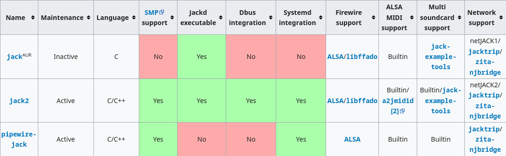

.. ARU (c) 2018 - 2022, Pavel Priluckiy, Vasiliy Stelmachenok and contributors

   ARU is licensed under a
   Creative Commons Attribution-ShareAlike 4.0 International License.

   You should have received a copy of the license along with this
   work. If not, see <https://creativecommons.org/licenses/by-sa/4.0/>.

.. _generic-system-acceleration:

***************************
Базовое ускорение системы
***************************

Переходя к базовой оптимизации системы мне сто́ит напомнить, что чистый
Arch Linux - это фундамент, и требуется уйма надстроек для нормальной
работы системы. Установить компоненты, которые будут отвечать за
электропитание, чистку, оптимизацию и тому подобные вещи, что и
описывается в данном разделе.

.. index:: makepkg-conf, native-compilation, flags, lto
.. _makepkg-conf:

======================
Настройка makepkg.conf
======================

Прежде чем приступать к сборке пакетов, мы должны изменить так
называемые флаги компиляции, что являются указателями для компилятора,
какие инструкции и оптимизации использовать при сборке программ.

Для этого создадим пользовательский конфиг ``~/.makepkg.conf`` в домашней
директории, чтобы переопределить системные настройки:

.. code-block:: shell
  :caption: ``nano ~/.makepkg.conf``

  CFLAGS="-march=native -mtune=native -O2 -pipe -fno-plt -fexceptions \
        -Wp,-D_FORTIFY_SOURCE=2 -Wformat -Werror=format-security \
        -fstack-clash-protection -fcf-protection"
  CXXFLAGS="$CFLAGS -Wp,-D_GLIBCXX_ASSERTIONS"
  RUSTFLAGS="-C opt-level=3 -C target-cpu=native -C link-arg=-z -C link-arg=pack-relative-relocs"
  MAKEFLAGS="-j$(nproc) -l$(nproc)"
  OPTIONS=(strip docs !libtool !staticlibs emptydirs zipman purge !debug lto)

.. note:: Где "-O2" - **Это не нуль/ноль**

Данные флаги компилятора выжимают максимум производительности при
компиляции, но могут вызывать ошибки сборки в очень редких
приложениях. Если такое случится, то отключите параметр ‘lto’ в строке
``options`` добавив перед ним символ восклицательного знака  !
(*"!lto"*).

.. index:: makepkg, ccache, native-compilation
.. _enabling_ccache:

--------------------------------------------
 Использование пространства ОЗУ для сборки 
--------------------------------------------

Для ускорения процесса сборки пакетов можно использовать вместо HDD и SSD опертивную память, а точнее *tmpfs*. Поскольку ОЗУ значительно быстрее любого HDD или SSD, то сборка происходит быстрее. Помимо этого уменьшается нагрузка на систему ввода-вывода. Использовать tmpfs для makepkg можно несколькими способами:

- Непосредственно указывать параметр перед сборкой::
 
  
   BUILDDIR=/tmp/makepkg makepkg 

- Задать параметр (раскомментировать в файле ``/etc/makepkg.conf``) ``BUILDDIR`` для использования директории ``/tmp``::

   BUILDDIR=/tmp/makepkg 

- Создать отдельную директорию *tmpfs* 

-----------------------
Включение ccache
-----------------------

В Linux системах есть не так много программ, сборка которых может
занять больше двух часов, но они все таки есть. Потому, было бы
неплохо ускорить повторную компиляцию таких программ как
Wine/Proton-GE и т.д.

ccache - это кэш для компиляторов C/C++, в частности совместимый с
компиляторами GCC/Clang, цель которого состоит в ускорении повторного
процесса компиляции одного и того же кода. Это значит, что если при
сборке программы новой версии, будут замечены полностью идентичные
блоки исходного кода в сравнении с его старой версией, то компиляция
этих исходных текстов производиться не будет. Вместо этого, уже
готовый, скомпилированный код старой версии будет вынут из кэша
ccache. За счёт этого и достигается многократное ускорение процесса
компиляции.

**Установка** ::

  sudo pacman -S ccache

После установки его ещё нужно активировать в ваших настройках makepkg.
Для этого отредактируем конфигурационный файл

.. code-block:: shell
   :caption: ``nano ~/.makepkg-conf``

   BUILDENV=(!distcc color ccache check !sign)

После этого повторная пересборка желаемых программ и их обновление
должны значительно ускориться.

.. attention:: ccache может ломать сборку некоторых программ, поэтому будьте внимательны с его применением.

.. index:: installation, ananicy, zram, nohang, rng-tools, haveged, trim, dbus-broker
.. _daemons-and-services:

======================================
Установка полезных служб и демонов
======================================

**1.** `zram-generator
<https://aur.archlinux.org/packages/zram-generator/>`_ — демон для
создания блочных устройств ZRAM. ZRAM - это альтернативный механизм
подкачки в ядре Linux, который позволяет избавиться от обычного свопа
на диске и сжимать неиспользуемые страницы прямо внутри памяти
ресурсами CPU. Перед его установкой следует отключить обычный своп на
диске. Как это сделать уже описано в разделе
:ref:`extra-optimizations`. ::

  sudo pacman -S zram-generator

После установки никаких дополнительных команд для запуска демона
производить не нужно. Однако имеет смысл выполнить небольшую
настройку. Для этого создадим файл:

.. code-block:: shell
   :caption: ``sudo nano /etc/systemd/zram-generator.conf``

   [zram0]
   zram-size = ram
   compression-algorithm = zstd
   swap-priority = 100
   fs-type = swap

Здесь мы указываем размер ZRAM равным количеству оперативной памяти, а
также алгоритм сжатия zstd. Это необходимо для большей экономии
памяти, ибо как утверждают разработчики, эффективность сжатия в
среднем равна 1:3. Тем не менее, автор не рекомендует устанавливать
размер ZRAM больше, чем количество имеющийся памяти, т. к. далеко не
все страницы памяти так эффективно сжимаются.

.. warning:: Во избежание конфликтов, после установки zram обязательно
   отключите zswap через добавление параметра ядра ``zswap.enabled=0``.

.. note:: Как уже было сказано ранее, сжатие страниц в памяти
   осуществляется ресурсами CPU, но если он у вас достаточно слабый,
   то вы можете оказаться чувствительными к задержкам на
   распаковку/сжатие большого объема страниц. В этом случае имеет
   смысл либо вернуться к использованию обычного свопа, либо
   использовать менее ресурсоемкий алгоритм сжатия
   (``compression-algorithm``) как ``lzo``.

**1.1** `Nohang <https://github.com/hakavlad/nohang>`_  — это демон
повышающий производительность путём обработки и слежки за потреблением
памяти. ::

  git clone https://aur.archlinux.org/nohang-git.git # Скачивание исходников.
  cd nohang-git                                      # Переход в nohang-git
  makepkg -sric                                      # Сборка и установка.
  sudo systemctl enable --now nohang-desktop         # Включаем службу.

**1.2** `Ananicy CPP <https://gitlab.com/ananicy-cpp/ananicy-cpp>`_ —
это форк одноименного демона, распределяющий приоритет задач. Его
установка очень сильно повышает отклик системы. В отличии от
оригинального Ananicy, данный форк переписан полностью на C++, из-за
чего достигается прирост в скорости работы. ::

  git clone https://aur.archlinux.org/ananicy-cpp.git # Скачивание исходников.
  cd ananicy-cpp                                      # Переход в ananicy-cpp.
  makepkg -sric                                       # Сборка и установка.
  sudo systemctl enable --now ananicy-cpp             # Включаем службу.
  
  # Далее описывается установка дополнительных правил по перераспределению приоритетов процессов
  git clone https://aur.archlinux.org/cachyos-ananicy-rules-git.git
  cd cachyos-ananicy-rules-git
  makepkg -sric
  sudo systemctl restart ananicy-cpp

**1.3** Включаем `TRIM
<https://ru.wikipedia.org/wiki/Trim_(команда_для_накопителей)>`_ —
очень полезно для SSD. ::

  sudo systemctl enable fstrim.timer    # Включаем службу.
  sudo fstrim -v /                      # Ручной метод.
  sudo fstrim -va /                     # Если первый метод не тримит весь диск.

.. warning:: Если вы используйте файловую систему Btrfs и имеете
   версию ядра 6.2+ (текущая версия LTS - 6.1), то выполнять включение
   службы для осуществления периодическего выполнения команды TRIM -
   не нужно, т. к. Btrfs сам выполняет её в асинхронном режиме.

**1.4** Автоматическая очистка кэша pacman.

Кэш пакетов pacman имеет плохое свойство забиваться и занимать большое
количество места на диске. Чтобы этого не происходило, создадим
небольшой демон, который будет автоматически его очищать, например
каждую неделю в Воскресенье в 15:10. В этом нам могут встроенные
средства systemd под названием таймеры. Создадим таймер, выполняющий
команду ``pacman -Scc`` в указанное время::

  sudo systemd-run --on-calendar="Sun 15:10" --unit="pacman-cleaner" /sbin/pacman -Scc

Вот так быстро и просто, одной командой, мы сделали демон, без
редактирования конфигов и прочего. Чтобы убедиться, что наш таймер был
успешно добавлен, вы можете найти его в выводе команды ``systemctl
list-timers`` с припиской ``.timer``.

Больше информации про таймеры systemd вы можете прочитать на Arch
Wiki.

**1.5** `rng-tools <https://wiki.archlinux.org/title/Rng-tools>`_ -
демон, что следит за энтропией системы через аппаратный таймер. Необходим для ускорения запуска системы
при высоких показателях *systemd-analyze blame* (Больше 1 секунды). ::

  sudo pacman -S rng-tools         # Установка
  sudo systemctl enable --now rngd # Включает и запускает службу.

.. warning:: Используйте только на LTS ядрах 4.19 и 5.4. На новых
   ядрах необходимости в использовании нет.

**1.6** `dbus-broker <https://github.com/bus1/dbus-broker>`_ - Это
реализация шины сообщений в соответствии со спецификацией D-Bus. Её
цель - обеспечить высокую производительность и надежность при
сохранении совместимости с эталонной реализацией D-Bus. Обеспечивает
чуть более быстрое общение с видеокартой через PCIe. ::

  sudo pacman -S dbus-broker                         # Уставновка
  sudo systemctl enable --now dbus-broker.service    # Включает и запускает службу.
  sudo systemctl --global enable dbus-broker.service # Включает и запускает службу для всех пользователей.

**1.7** `irqbalance <https://github.com/Irqbalance/irqbalance>`_ - это демон, что автоматически балансирует обработку прерываний
по ядрам процессора. ::

  sudo pacman -S irqbalance
  sudo systemctl enable --now irqbalance

**1.8** `uksmd <https://codeberg.org/pf-kernel/uksmd>`_ - демон,
который автоматически убирает дубликаты страниц в памяти
с одинаковым содержимым, тем самым экономя память. Работает только
если ваше ядро имеет специальный патч, который есть по умолчанию например в
linux-zen ::

  git clone https://aur.archlinux.org/uksmd.git
  cd uksmd
  makepkg -sric
  sudo systemctl enable uksmd

.. index:: swap, swappiness, sysctl
.. _swap:

==================
Настойка подкачки
==================

По умолчанию Linux достаточно чрезмерно использует подкачку,
что не всегда хорошо сказывается на домашних системах, а точнее
на их отклике.

Параметр ``vm.swappiness`` определяет то, насколько аггрессивно
страницы оперативной памяти (в Linux вся память представлена в виде
маленьких "гранул" - страниц памяти, как правило 4 КБ) будут
вытесняться в подкачку. То есть, чем выше значение этого параметра,
тем более аггрессивно ядро будет использовать подкачку, и как
следствие экономить физическую оперативную память. На первый взгляд
все нормально, но значением по умолчанию является ``60``, что
достаточно много для систем которые обаладают 8 Гб и более. Нам же
нужно понизить данное значение для повышения отклика (в некоторых
случаях требуется обратное действее, т.е. аггрессивное использование
подкачки, об этом далее). Смысл здесь в следующем: страницы памяти,
занимаемые определенным процессом, могут долгое время не
использоваться, из-за чего ядро, как раз в зависимости от параметра
``vm.swappiness``, будет считать что эти страницы могут быть
вытеснены в подкачку (файл/раздел), однако в случае если эти страницы
станут снова нужны, то процесс их обратного возврата в оперативную
память будет занимать какое-то время (ибо как известно любой
раздел/файл подкачки на диске работает медленее ОЗУ), и это будет
выглядить как замедленее работы приложения. Поэтому рекомендуется
установить значение ``10``:

.. code-block:: shell
   :caption: ``sudo nano /etc/sysctl.d/swap.conf``

   vm.swappiness=10

Это приведет к большему количеству страницы висящих в памяти без дела,
в то же время как только эти страницы станут снова нужны они смогут
быстро вернуться в строй без задержек. Подобный эффект можно будет
наглядно увидеть на примере переключения между различными программами.
Если страницы неиспользуемых приложений не будут вытеснены в подкачку,
то переключение между ними может быть осуществлено без каких-либо
замедлений.

Тем не менее, в системах, обладающих малым объемом ОЗУ (4 гб и менее),
установка столь низкого значения может привести к проблеме нехватки
памяти, поэтому в этом случае рекомендуется наоборот указывать более
высокие значения.

В то же время, в случае если в предыдущем разделе вы включили
использование zramswap, то рекомендуемым значением уже будет ``100``.
Т.к. zramswap подразуемвает подкачку непосредственно в памяти, с
предварительным сжатием, то установка ``100`` позволяет оставлять все
неиспользуемые страницы в ОЗУ, но только в сжатом виде, что тоже даёт
экономию памяти, при этом процесс их распаковки будет в разы быстрее
чем процесс загрузки страниц обратно в память из подкачки на диске. Но
стоит учитывать, что процесс сжатия/расжатия страниц даёт
дополнительную нагрузку на процессор.

В качестве дополнительной оптимизации zramswap можно выделить
параметр ``vm.page-cluster=0``. Он отвечает за то, 
сколько страниц будут одновременно прочитаны из раздела подкачки.
Значение по умолчанию ``3`` больше рассчитано на жёсткие диски,
чем на SSD или zram. Значение ``1`` увеличивает пропусную способность
на 22% по сравнению с ``0``, однако увеличивает задержки на 55% в
случае с алгоритмом сжатия lz4. Обсуждение и бенчмарки `тут
<https://www.reddit.com/r/Fedora/comments/mzun99/new_zram_tuning_benchmarks/>`_.

.. warning:: Автор настоятельно не рекомендует устанавливать значение
   параметра в 0 (отключать подкачку вовсе). Подробнее о том, почему
   это вредно читайте в данной статье -
   https://habr.com/ru/company/flant/blog/348324/. Если вы хотите
   минимизировать использование подкачки, то просто установите
   значение 1 или 5. А лучше - используйте уже упомянутый zramswap.

.. index:: low_memory, jemalloc
.. _jemalloc:

==============================
Уменьшение потребления памяти
==============================

За счёт использования стороннего аллокатора ``jemalloc`` можно
добиться небольшого уменьшения потребление памяти в некоторых задачах,
и исправить утечки, какие часто встречаются в больших программах. ::

  sudo pacman -S jemalloc

Чтобы его задействовать в обход системного аллокатора нужно экспортировать переменную

.. code-block:: shell
   :caption: ``sudo nano /etc/environment``

   LD_PRELOAD=/usr/lib/libjemalloc.so

Дополнительные источники для прочтения:

https://habr.com/ru/companies/piter/articles/543226/

https://github.com/nodejs/node/issues/21973

https://github.com/lovell/sharp/issues/955

.. warning:: Данный аллокатор памяти работает не для всех приложений,
   в частности с ним не работает Chromium/приложения использующие
   Electron, поэтому рекомендуется либо использовать его выборочно,
   либо пропустите данный шаг.

.. index:: installation, lowlatency, audio, pipewire
.. _lowlatency-audio:

==================================
Низкие задержки звука (PipeWire)
==================================

`PipeWire <https://wiki.archlinux.org/title/PipeWire_(Русский)>`_ -
это новая альтернатива PulseAudio, которая призвана избавить от
проблем PulseAudio, уменьшить задержки звука и потребление памяти. ::

  sudo pacman -S pipewire pipewire-pulse pipewire-jack lib32-pipewire gst-plugin-pipewire wireplumber
  systemctl --user enable --now pipewire pipewire.socket pipewire-pulse wireplumber

.. note:: Пакет ``lib32-pipewire`` нужен для правильной работы звука в
   32-битных играх (в том числе запускаемых через Wine) или
   приложениях.

Для непосредственно уменьшения самих задержек установим дополнительный
пакет ``realtime-privileges`` и добавим пользователя в группу
``realtime``::

  sudo pacman -S realtime-privileges
  sudo usermod -aG realtime "$(whoami)"

Дополнительно советуем установить реализацию Jack API. См. раздел
ниже.

.. index:: pipewire, lowlatency, audio, sound
.. _pipewire_setup:

--------------------
Настройка PipeWire
--------------------

Несмотря на то, что настройки по умолчанию могут работать достаточно
хорошо для большинства оборудования, имеет смысл выполнить
дополнительную настройку для улучшения качества звука (особенно если
вы являетесь обладателем ЦАП или полноценной звуковой карты).

Перед началом создадим пути для хранения конфигурационных файлов в
домашней директории::

  mkdir -p ~/.config/pipewire/pipewire.conf.d

В появившейся директории создадим файл со следующим содержанием:

.. code-block:: shell
  :caption: ``nano ~/.config/pipewire/pipewire.conf.d/10-sound.conf``

   context.properties = {
     default.clock.rate = 96000
     default.clock.allowed-rates = [ 44100 48000 88200 96000 ]
     default.clock.min-quantum = 16
   }

Обратите внимание на параметры ``default.clock.rate`` и
``default.clock.allowed-rates``. Они устанавливают частоту
дискретизации по умолчанию и доступные частоты в целом соответственно.
Вы должны указать их в соответствии с возможностями вашего устройства
вывода звука (звуковой карты/ЦАПа). Чтобы узнать максимально доступную
частоту дискретизации используйте команду (при условии, что установлен
пакет ``pipewire-pulse``)::

  pactl list sinks | grep "Sample Specification" -B 2

Если устройств несколько, то устанавливайте частоту того, которое
используется непосредственно для вывода звука.

Для устройств с большим диапозоном доступных частот в качестве примера
можно привести следующие значения::

  default.clock.rate          = 384000
  default.clock.allowed-rates = [ 44100, 48000, 88200, 96000, 174000, 192000, 384000, 768000 ]

.. index:: pipewire, upmix, 5.1, sound
.. _upmixing-5.1:

^^^^^^^^^^^^^^^^^^^^^^^^^^^
Микширование стерео в 5.1
^^^^^^^^^^^^^^^^^^^^^^^^^^^

PipeWire так же как и PulseAuido позволяет микшировать звук в 5.1.
Эта возможность отключена по умолчанию, но для неё существует заранее
подготовленный конфигурационный файл, который нам нужно просто
перенести в домашнюю директорию::

  mkdir -p ~/.config/pipewire/pipewire-pulse.conf.d
  cp /usr/share/pipewire/client-rt.conf.avail/20-upmix.conf ~/.config/pipewire/pipewire-pulse.conf.d
  cp /usr/share/pipewire/client-rt.conf.avail/20-upmix.conf ~/.config/pipewire/client-rt.conf.d

.. index:: pipewire, choppy, high-load, cpu, sound
.. _choppy-audio:

^^^^^^^^^^^^^^^^^^^^^^^^^^^^^^^^^
Исправление хрипов под нагрузкой
^^^^^^^^^^^^^^^^^^^^^^^^^^^^^^^^^

Некоторые пользователи после перехода на PipeWire могут столкнуться с
появлением "хрипов" во время произведения звука если система находится
под высокой нагрузкой (например фоновой компиляцией или во время игры).
Это происходит потому, что PipeWire старается осуществлять вывод с
звука с наименьшими задержками, что сложно гарантировать когда
система нагружена даже с установленными ``realtime-privileges``.

Для их исправления отредактируем файл, который мы создали выше и
изменим следующие значения для размера буфера по умолчанию:

.. code-block:: shell
  :caption: ``nano ~/.config/pipewire/pipewire.conf.d/10-sound.conf``

   context.properties = {
     default.clock.rate = 96000
     default.clock.allowed-rates = [ 44100 48000 88200 96000 ]
     default.clock.min-quantum = 16
     default.clock.quantum = 4096
     default.clock.max-quantum = 8192
   }

Здесь вы должны изменить только значение параметра ``quantum`` до
4096. Остальные значения как ``default.clock.rate`` и
``default.clock.allowed-rates`` вы должны указывать с учетом
вашего оборудования как уже говорилось выше.

-----------------
Реализации JACK
-----------------

Существует три различных реализации JACK API: просто jack из AUR,
jack2 и pipewire-jack. Наглядное сравнение их возможностей показано
таблицей ниже:

Установите один из вышеуказанных пакетов. Для поддержки 32-битных
приложений также установите пакет lib32-jack из AUR, lib32-jack2 или
lib32-pipewire-jack (соответственно) из репозитория multilib.

Для официальных примеров клиентов и инструментов JACK установите
`jack-example-tools
<https://archlinux.org/packages/extra/x86_64/jack-example-tools/>`_.

Для альтернативной поддержки ALSA MIDI в jack2 установите `a2jmidid.
<https://archlinux.org/packages/community/x86_64/a2jmidid/>`_.

Для поддержки dbus с jack2 установите `jack2-dbus
<https://archlinux.org/packages/extra/x86_64/jack2-dbus/>`_
(рекомендуется).

.. index:: lowlatency, audio, alsa
.. _alsa:

-------------
Простая ALSA
-------------

ALSA - это тот самый звук (условно, на самом деле это звуковая
подсистема ядра), который идёт напрямую из ядра и является самым
быстрым, так как не вынужден проходить множество программных прослоек
и микширование. ::

  sudo pacman -S alsa-lib alsa-utils alsa-firmware alsa-card-profiles alsa-plugins

Поэтому, если у вас нет потребности в микшировании каналов, записи
аудио через микрофон и вы не слушаете музыку через Bluetooth, то ALSA
может вам подойти.Пакет *alsa-utils* также содержит консольный Микшер
(настройка громкости), который вызывается командой alsamixer.

Вообще, выбор звукового сервера не такая уж сложная задача как вам
может показаться, достаточно взглянуть на следующую схему:

.. image:: images/generic-system-acceleration-2.png

.. index:: startup-acceleration, networkmanager, service, 
.. _startup-acceleration:

===================================================================
Ускорение загрузки системы (Отключение NetworkManager-wait-online)
===================================================================

В большинстве случаев для настройки интернет подключения вы, скорее
всего, будете использовать NetworkManager, т.к. он является в этом
деле швейцарским ножом и поставляется по умолчанию. Однако, если вы
пропишите команду *systemd-analyze blame*, то узнаете, что он
задерживает загрузку системы примерно на ~4 секунды. Чтобы это
исправить выполните::

  sudo systemctl mask NetworkManager-wait-online.service

.. index:: startup-acceleration, hdd, lz4, mkinitcpio
.. _speed-up-hdd-startup:

------------------------------------------------------------------------
Ускорение загрузки ядра на HDD накопителях (*Только для жестких дисков*)
------------------------------------------------------------------------

Убедитесь, что пакет `lz4
<https://archlinux.org/packages/core/x86_64/lz4/>`_ установлен::

  sudo pacman -S lz4

Отредактируйте файл:::

  sudo nano /etc/mkinitcpio.conf

Теперь выполните следующие действия:

-  Добавьте *lz4 lz4_compress* в массив *MODULES* (ограничен скобками)
-  Раскомментируйте или добавьте строку с надписью *COMPRESSION="lz4"*
-  Добавьте строку если её нет -  *COMPRESSION_OPTIONS="-9"*
-  Добавите *shutdown* в массив *HOOKS* (ограничен скобками)

Это ускорит загрузку системы на слабых жёстких дисках благодаря более
подходящему методу сжатия образов ядра.

Не забываем обновить все образы initramfs после проделанных
изменений::

  sudo mkinitcpio -P

.. index:: startup-acceleration, hdd, ssd, systemd, mkinitcpio
.. _speed-up-systemd-startup:

--------------------------------------------
Ускорение загрузки системы c помощью systemd
--------------------------------------------

Есть ещё способ ускорить загрузку системы, используя систему инициализации systemd
Для этого нужно убрать ``base`` и ``udev`` из массива HOOKS, и заменить их
на ``systemd`` что бы он выглядел примерно так

.. code-block:: shell
   :caption: sudo nano /etc/mkinitcpio.conf

    HOOKS=(systemd autodetect modconf block filesystems keyboard)

Это немного увеличит образ initramfs, но заметно может ускорить запуск системы.

Не забываем обновить все образы initramfs после проделанных
изменений::

  sudo mkinitcpio -P

======================
Твики драйверов Mesa
======================

.. index:: amd, sam, bar
.. _force_amd_sam:

--------------------------------------------------------------------------
Форсирование использования AMD SAM *(Только для опытных пользователей)*.
--------------------------------------------------------------------------

AMD Smart Acess Memory (или Resizble Bar) — это технология которая
позволяет процессору получить доступ сразу ко всей видеопамяти GPU, а
не по блокам в 256 мегабайт, что приводит к задержкам ввода/вывода при
обмене между CPU и GPU. Несмотря на то, что данная технология заявлена
только для оборудования AMD и требует новейших комплектующих для
обеспечения своей работы, получить её работу можно и на гораздо более
старом оборудовании, например таком как AIT Radeon HD 7700.

.. warning:: Для включения данной технологии в настройках вашего BIOS
   (UEFI) должна быть включена опция *"Re-Size BAR Support"* и *"Above
   4G Decoding"*. Если таких параметров в вашем BIOS (UEFI) нет -
   скорее всего технология не поддерживается вашей материнской платой
   и не стоит даже пытаться её включить.

К сожалению, после недавнего обновления драйверов Mesa, поддержка SAM
была удалена из драйвера OpenGL - radeonsi, но вы по прежнему можете
заставить Mesa использовать SAM при работе в приложениях использующих
Vulkan.

Чтобы активировать SAM в Linux нужно добавить переменные окружения:

.. code-block:: shell
   :caption: ``sudo nano /etc/environment``

   RADV_PERFTEST=sam # Только для Vulkan

.. warning:: Учтите, что в некоторых играх с vkd3d вам может
   понадобиться также экспортировать переменную
   ``VKD3D_CONFIG=no_upload_hvv`` для избежания регрессий
   производительности при использовании вместе с SAM.

   https://www.reddit.com/r/linux_gaming/comments/119hwmt/this_setting_may_help_vkd3d_games_that_have/

.. index:: amd, tweaks
.. _bug_solution_for_vega:

-------------------------------------------------------------------
Решение проблем работы графики Vega 11 (Спасибо @Vochatrak-az-ezm)
-------------------------------------------------------------------

На оборудовании со встроенным видеоядром Vega 11 может встретиться баг
драйвера, при котором возникают случайные зависания графики. Проблема
наиболее актуальна для *Ryzen 2XXXG* и чуть реже встречается на Ryzen
серии *3XXXG*, но потенциально имеет место быть и на более новых
видеоядрах Vega.

Решается через добавление следующих параметров ядра:

.. code-block:: shell
   :caption: ``sudo nano /etc/modprobe.d/90-amdgpu.conf``

   options amdgpu gttsize=8192 lockup_timeout=1000 gpu_recovery=1 noretry=0 ppfeaturemask=0xfffd3fff deep_color=1

На всякий случай можно дописать ещё одну переменную окружения:

.. code-block:: shell
   :caption: ``sudo nano /etc/enviroment``

   AMD_DEBUG=nodcc

Для подробностей можете ознакомиться со следующими темами:

https://www.linux.org.ru/forum/linux-hardware/16312119

https://www.linux.org.ru/forum/desktop/16257286

.. index:: intel, amd, mesa, tweaks
.. _multithreaded_opengl:

--------------------------------
Многопоточная OpenGL обработка
--------------------------------

У Mesa есть свой аналог переменной окружения
``__GL_THREADED_OPTIMIZATIONS=1``, так же предназначенный для
активирования многопоточной обработки OpenGL - ``mesa_glthread=true``.
В ряде игр и приложений это даёт сильное увеличение
производительности, но в некоторых либо нет прироста, либо вовсе не
может быть применено.

Чтобы включить его для всей системы нужно либо прописать переменную
окружения в файл ``/etc/environment``, либо используя adriconf_,
включив параметр во вкладке *"Performance"* -> *"Enable offloading GL
driver work to a separate thread"*

.. _adriconf: https://archlinux.org/packages/community/x86_64/adriconf/

.. index:: intel, amd, mesa, tweaks
.. _amd_lowlatency:

----------------------------------
Понижение задержек для AMD (Xorg)
----------------------------------

Для уменьшения задержек ввода на видеокартах AMD рекомендуется
использовать следующие параметры для Xorg.

.. code-block:: shell
   :linenos:
   :caption: ``sudo nano /etc/X11/xorg.conf.d/20-amdgpu.conf``

    Section "OutputClass"
        Identifier "AMD"
        MatchDriver "amdgpu"
        Driver "amdgpu"
        Option "EnablePageFlip" "off"
        Option "TearFree" "false"
    EndSection

.. vim:set textwidth=70:
