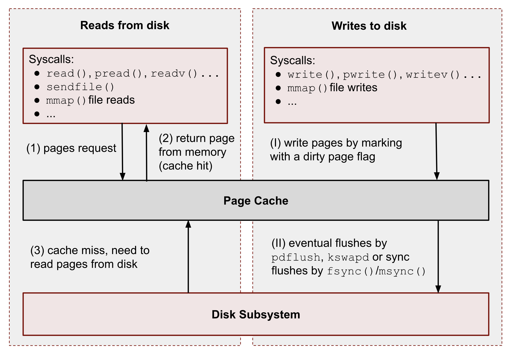

.. ARU (c) 2018 - 2023, Pavel Priluckiy, Vasiliy Stelmachenok and contributors

   ARU is licensed under a
   Creative Commons Attribution-ShareAlike 4.0 International License.

   You should have received a copy of the license along with this
   work. If not, see <https://creativecommons.org/licenses/by-sa/4.0/>.

.. _kernel-tuning:

***************
Тюнинг ядра
***************

=========
Введение
=========

Как и любая другая программа, ядро имеет свои собственные настройки и
параметры, которые контролируют поведение определенных его частей. И
хотя настройки ядра Linux являются менее очевидными для понимания и
часто "скрыты" с глаз обычных пользователей, в данном разделе мы
рассмотрим различные настройки с ядра с целью улучшения
производительности и отзывчивости системы для домашнего ПК или
ноутбука, подобрав наиболее оптимальные значения в зависимости от
вашей конфигурации.

Как мы поймем далее, несмотря на то, что ядро Linux принято считать
монолитным, все настройки ядра относятся к определенным его
подсистемам, поэтому раздел будет разбит на систематические блоки
которые будут выполнять настройку конкретной его части, будь то
подсистема ввод/вывода или сети.

Стоит также отметить, что так как ядро является общей составляющей
всех дистрибутивов Linux, то почти вся информация которая будет
представлена в этом разделе применима не только к Arch Linux, но и к
другим дистрибутивам. Учтите, что некоторые параметры зависят от вашей
версии ядра, которая, по понятным причинам, от одного дистрибутива к
другому может отличаться, поэтому обращайте внимания на примечания, где
указано с какой версии появился тот или иной параметр. Узнать
версию используемого вами ядра можно через команду ``uname -r``.

-------
Зачем?
-------

Часто люди задаются вопросом, зачем пытаться лезть под капот, когда
"очевидно", что все уже настроено и отполировано за тебя. С одной
стороны это отчасти правда, ядро Linux с каждой версией улучшается и
"вылизывается" тысячами разработчиками по всему миру, и, наверное,
параметры о которых пойдет речь далее уже имеют наиболее оптимальные
значения. Но к сожалению, это не совсем так. Или скорее совсем не так.
Во-первых, разработчики часто не могут иметь представления, на каком
конкретном железе будет работать ядро, в следствии этого главным
приоритетом при разработке является совместимость и адаптивность ядра
к как можно большему числу возможных задач и конфигураций. Такой
компромиссный подход к разработке не всегда дает наилучшие результаты
в чем-то конкретном, но зато позволяет ядру Linux одинаково подходить
для работы как на серверах, роутерах, телефонах, микроконтроллерах,
так и простых ПК. Грубо говоря, ядро Linux представляет собой
швейцарский нож от мира IT, которым хоть и можно порезать хлеб, но
удобнее это делать обычным ножом. Наша задача в данном разделе это как
раз заточить ядро под конкретную задачу, в нашем случае это
интерактивное использование на домашнем компьютере.

Если вы переживаете за стабильность вашей системы, то предварительно
сделайте резервную копию, хотя на самом деле все параметры о которых
пойдет речь далее могут быть отключены в любой момент простым
удалением файла настройки, поэтому даже при возникновении проблем со
стабильностью или регрессиями у вас не должно возникнуть проблем с
откатом к стоковым значениям.

--------------
Виды настроек
--------------

В ядре Linux все параметры можно поделить на типы в зависимости от
способа установки их значения [#]_. Часть из них может быть
установлена только на этапе загрузки ядра, то есть в качестве опций
командой строки [#]_. Это то, что мы обычно пониманием под просто
"параметрами ядра". Обычно они указываются в настройках вашего
загрузчика, будь то GRUB, refind или systemd-boot. В разделе
:ref:`kernel-parameters` мы уже упоминали некоторые из них и
прописывали их в в конфигурационном файле загрузчика GRUB. К этой же
категории можно отнести параметры модулей ядра, значения к которым
передаются во время их загрузки. Правда они тоже могут быть переданы
как параметры ядра в конфиге вашего загрузчика в следующем формате:
``module.parameter=value`` (например ``nvidia-drm.modeset=1``). То
есть сначала указывается имя модуля (драйвера), затем имя параметра и
через знак равно передается значение.

~~~~~~~~~
sysctl
~~~~~~~~~

Другой тип, это параметры, значение которых можно изменить прямо во
время работы системы, что называется "на лету". Такие настройки
представлены в виде файлов на псевдофайловой системе procfs, в
директории ``/proc/sys`` [#]_. procfs называется псевдофайловой
потому, что физически она не расположена на диске, а все файлы и
директории создаются самим ядром при запуске системы в оперативной
памяти. По этой причине у них отсутствует размер, и все они имеют
чисто служебный характер. В директории ``/proc/sys/`` каждая настройка
- это отдельный файл, куда мы должны просто передать значение в виде
числа (часто 1 и 0 означают включить/выключить, но некоторые параметры
также могут принимать значения только из определенного диапазона и оно
имеет особый смысл). Все настройки объедены в директории, которые
характеризуют их отношение к чему-то общему. Например, все файлы в
подкаталоге ``vm`` - это настройки для механизма виртуальной памяти
ядра [#]_ , включая настройки для подкачки, кэширования, и т. д. В
``kernel`` - общие настройки ядра [#]_, а в ``net`` [#]_ - настройки
сетевой подсистемы, протоколов TCP и IP. Именно эти три категории мы и
будем рассматривать далее.

Конечно, процесс поиска всех файлов-настроек и установка их значений
средствами командой строки каждый раз весьма утомителен. Поэтому
разработчики создали специальную утилиту под названием ``sysctl``,
которая значительно упрощает данный процесс. Теперь нам не нужно
лазить каждый раз в ``/proc/sys/``. чтобы изменить значение параметров.
Вместо этого достаточно прописать в терминале::

  sysctl -w kernel.sysrq=1

Это то же самое, что и данная команда, которая прописывает значение
напрямую в файл из директории ``/proc/sys/``::

  echo "1" > /proc/sys/kernel/sysrq

Обратите внимание, что для изменения настроек всегда нужны права root
пользователя, поэтому перед каждой такой командой мы должны добавить ``sudo``::

  sudo sysctl -w kernel.sysrq=1

Другим преимуществом sysctl является то, что мы можем делать такие
изменения постоянными, просто прописав соответствующую строку в файл,
который находится в директории ``/etc/sysctl.d/``, например в
``/etc/sysctl.d/99-sysctl.conf``::

  kernel.sysrq = 1

Собственно именно добавлением таким строк мы и будем применять соответствующие настройки.

.. warning:: Настройки прописываемые в файле ``/etc/sysctl.conf`` не
   применяются начиная с версии 21x в systemd, поэтому
   прописывайте их только в файлах, которые расположены в подкаталоге
   ``/etc/sysctl.d``. Имя файла не имеет значения.

~~~~~~~~~~~
tmpfiles.d
~~~~~~~~~~~

К сожалению, далеко не все настройки ядра можно изменить при помощи
sysctl или псевдофайловой ФС ``/proc/sys``. Часть из них является
отладочными, и расположены как файлы в другой псевдофайловой системе -
sysfs, которая в основном отвечает за представление информации об
устройствах, которыми управляет ядро. В директории в ``/sys/kernel``
представлены ряд других полезных параметров, которые мы рассмотрим в
рамках общей темы. Чтобы выполнить установку значения в файлах,
которые находятся ``/sys/kernel/``, мы будем использовать такой
инструмент как systemd-tmpfiles.d [#]_. Он есть только в
дистрибутивах, использующих systemd в качестве системы инициализации,
то есть в большей части дистрибутивов Linux включая Arch. Суть этой
службы состоит в управлении, создании и удалении временных файлов или
редактировании уже существующих. В нашем случае для прописывания
значений в файлы настроек расположенных в ``/sys/kernel/``. Для этого по
аналогии с sysctl нужно создать файл в директории ``/etc/tmpfiles.d``,
например ``/etc/tmpfiles.d/99-settings.conf``. Формат каждой строки в
файле будет следующим::

  w! /sys/kernel/mm/lru_gen/min_ttl_ms - - - - 300

Первый символ - это тип действия, который ``systemd-tmpfiles`` будет
выполнять с указанным по пути файлом. В нашем случае мы будем
использовать только *w!*, то есть прописывать некоторое значение в уже
существующие файлы, а не создавать новые временные. Восклицательный
знак ``!`` указывает, что значение будет прописываться только один раз
при загрузке системы. После пути файла идут четыре прочерка, в них
должны быть указаны права на файл, которые мы хотим изменить, но так
как мы имеем дело со служебными файлами, то мы пишем везде прочерки,
то есть ничего не меняем. В конце указываем значение, которое будет
прописано в файл, то есть значение параметра.

Другими словами, везде, куда не дотянется sysctl, мы будем
использовать ``tmpfiles``.

~~~~~~
udev
~~~~~~

По сути первых двух инструментов уже достаточно, чтобы выполнить
полную настройку ядра, но мы используем ещё одну вещь - правила udev.
Udev [#]_ - менеджер для управления вашими устройствами, который
отслеживает их подключение/выключение, и предоставляет возможность
создавать так называемые "правила", которые вызываются каждый раз,
когда происходит определенной действие с тем или иным устройством.
Внутри этого правила можно указать, при каких событиях и для какого
конкретно устройства (условие для срабатывания) мы будем выполнять
определенную команду или устанавливать определенное значение. Это
очень полезный инструмент, который позволит нам применять определенные
настройки гибче, то есть в зависимости от некоторых условий и
подстраиваясь под определенное железо, которые у вас есть в системе.
Приведу пример, чтобы стало понятнее. Для разных типов носителей
подходит разный планировщик ввода/вывода. Для обычных SSD -
``mq-deadline``, для HDD - ``bfq``. Правила udev позволят нам при
подключении определенного типа устройства сразу выбирать нужный
планировщик и дополнительные параметры для него, даже если у вас в
системе есть и SSD, и HDD одновременно. Подробнее планировщики
ввода/вывода будут рассмотрены далее вместе с синтаксисом самих
правил.

=========================
Оптимизация ввода/вывода
=========================

Фууух, что-ж, надеюсь вы не устали от всего этого скучного бреда выше
и мы можем наконец-то переходить к сути. Начнем с оптимизации
ввода/вывода, то бишь к настройке свопа, различных кэшей и
планировщиков.

---------------------------
Настройка подкачки (Swap)
---------------------------

Прежде чем перейти непосредственно к настройке необходимо понять
принцип работы механизма подкачки в Linux (да-да, опять теория). Это
важно, так как в этой теме ходит целая куча различных мифов, которые
мы сейчас разберем.

Итак, для начала чрезвычайно важно понять, что ядро Linux разбивает
всю вашу память на маленькие "гранулы" - страницы памяти, как правило
по 4 КБ (для x86 архитектуры), не больше и не меньше. Это может
казаться странным, но если не вдаваться в технические подробности, то
такой подход позволяет ядру Linux проявлять достаточно большую
гибкость, так как данные страницы могут быть одинаково обработаны
ядром вне зависимости от того, что в них записано, предотвращая
обильную фрагментацию. Тем не менее, все страницы памяти можно разбить
на несколько типов. Сейчас мы не будем рассматривать их все, но
остановимся на самых главных:

- Файловая "подложка" или *файловые страницы* - это страницы в которых
  ядро "отображает", то есть представляет данные файла, считываемые с
  диска в виде страниц в памяти. С этими страницами тесно связано
  понятие страничного кэша (page cache) [#]_. Если какая-то программа
  открывает какой-то новый файл и читает из него информацию, то в
  первый раз ядро считывает эти данные с диска и сохраняет их в
  страничном кэше, а все последующие операции ввода и вывода к этому
  же файлу будут осуществляться уже при использовании кэша, что
  значительно ускоряет все базовые операции чтения/записи, при этом не
  создавая нагрузки на сам диск. При этом память для таких страниц
  выделяется по требованию. Если программа открыла файл, но ничего из
  него не читает, то никакой реальной памяти для таких страниц
  выделено не будет. Собственно, то, что вы видите в графе "Кэш" в
  любой программе аналоге системного монитора в Linux - и есть
  страничный кэш. Обратите внимание, что исполняемые файлы (программы)
  тоже загружаются в память как файловые страницы.

(Licensed under the CC BY-NC 4.0. © Vladislav Biriukov, All rights reserved)

- Очевидно, что далеко не все данные, которыми оперирует программа,
  могут быть представлены в виде реальных файлов на диске, поэтому
  были созданы *анонимные страницы*, которые, как следует из названия,
  не ассоциированы с файлами. Программы запрашивают их у ядра во время
  своей работы для динамических данных. Если вы разработчик, то вы
  наверняка сталкивались с такими понятиями как "Куча" (Heap) и "Стэк"
  (Stack). Так вот, ядро хранит данные из кучи и стэка именно в
  анонимных страницах памяти.

- Грязные страницы (dirty pages) - по сути это подвид файловых
  страниц, ключевое отличие которых состоит в том, что программы в них
  пишут какие-то изменения, а так как ядро кэширует все файлы во
  избежание излишней нагрузки на диск, то изменения которые программа
  делает в файле на самом деле происходят сначала в кэше, и только
  потом синхронизируются с реальным файлом на диске. Более подробно об
  этом виде страниц и процессе их синхронизации с диском мы поговорим
  в следующем разделе.

Вернемся к подкачке. Один из самых больших мифов, связанных с
подкачкой, состоит в том, что пользователи рассматривают её как некую
"дополнительную память", которую свободно можно использовать в случае
нехватки реальной, то есть физической памяти. Это конечно же не так,
хотя бы потому, что процессор имеет доступ к оперированию только
данными, которые находятся внутри ОЗУ. В случае нехватки памяти у ядра
есть по сути всего один вариант - это освобождать уже имеющуюся память
от тех страниц, которые не используются в данный момент. Да, память не
берется из воздуха, и подкачка - это просто "чердак", куда ядро
скидывает все неиспользуемые вещи, чтобы освободить место для новых
или более часто используемых страниц. При этом для программ не
меняется ровным счетом ничего, ибо они как и раньше могут обратиться к
данным в памяти, которые были расположены на странице, которая была
вытеснена ядром в подкачку, но когда программа это сделает, ядро
найдет эту страницу, считает её из подкачки и обратно загрузит её в
оперативную память. Это ещё одно преимущество механизма виртуальной
памяти, повсеместно используемого ядром Linux.

Вопрос лишь в том, какие именно страницы нужно "вытеснить" из памяти.
На самом деле, это достаточно сложный вопрос. Прежде всего, конечно же
это будут именно анонимные страницы, так как файловые страницы и так
по сути ассоциированы с данными на диске, следовательно в случае чего
их так же можно повторно считать, и выгружать их в подкачку просто не
имеет никакого смысла, что и происходит на практике. Но что если
анонимных страниц много, а часть из них реально используется
программами в данный момент? Какие из них тогда должны первым делом
попасть в подкачку? На данный и многие другие вопросы отвечает
специальный алгоритм в ядре Linux, называемый :abbr:`LRU (Least
recently used)` (а поныне и MGLRU). Если очень упрощенно, то данный
алгоритм ведет учет использования каждой страницы, то есть количество
обращений к ней, и на основе данной статистики предполагает, какие из
них реже всего используются процессами, и следовательно какие из
них можно без проблем выгрузить в подкачку.

Рядовые пользователи часто не до конца понимают, какие именно данные
расположены у них в подкачке. Теперь мы можем дать чёткий ответ: в
подкачке хранятся только неиспользуемые анонимные страницы памяти.

Мы разобрались с основополагающими понятиями, и наконец-то можем
переходить к настройке. Для настройки поведения подкачки используется
параметр sysctl ``vm.swappiness`` (значение по умолчанию 60). Вокруг
него так же ходит целый ряд заблуждений, что приводит к неправильным
умозаключениям. Итак, во-первых, ``vm.swappiness`` напрямую никак не
влияет на то, когда у вас начнет использоваться подкачка, то есть его
значение - это вовсе не процент занятой памяти, при достижении которого
начинает использоваться подкачка. Ядро всегда начинает использовать
подкачку только в ситуациях нехватки памяти (это, как правило, когда
занято 85-90% ОЗУ). 

Во-вторых, параметр ``vm.swappiness`` влияет только на предпочтение
ядра к вытеснению определенного типа страниц в случае этой самой
нехватки. Он принимает значения от ``0`` до ``200`` (начиная с версии
ядра 5.8 и выше, до этого максимальным значением было 100). Для более
наглядного понимания, параметр ``vm.swappiness`` можно представить в
виде весов, где более низкие (ниже 100) значения приводят к склонности
ядра сначала вытеснять все страницы из файлового кэша, а более высокие
(больше 100) - освобождение анонимных страниц из памяти в подкачку.
Значение ``100`` - это своего рода баланс, при котором ядро будет в
одинаковой степени стараться вытеснять как файловые, так и анонимные
страницы.

Другим крайне распространенным заблуждением является то, что более
низкие значения ``vm.swappiness`` уменьшают использование подкачки -
следовательно уменьшается нагрузка на диск, и что это якобы
увеличивает отзывчивость системы. На деле это лишь на половину правда,
так как, да, ядро при низких значениях старается откладывать
использование подкачки, хотя это и не значит, что она вообще не будет
использоваться, но важно понять, что это происходит за счёт более
агрессивного вытеснения файловых страниц из страничного кэша - что
точно так же приводит к нагрузке на ввод/вывод. Почему? Потому что
каждый раз, когда ядро очищает страничный кэш, это приводит к тому,
что все ранее хранящиеся в нем данные снова придется считывать с
диска по новой.

Во-вторых, нагрузка на ввод/вывод, которую создаёт подкачка
оказывается слишком переоценена. Для современных SSD накопителей
переварить такую нагрузку без замедления работы системы не составит
труда. Тем не менее, если страница была вытеснена в своп, то любая
операция обращения к ней будет в разы медленнее, чем если бы она
находилась в ОЗУ, даже если ваш носитель это NVMe накопитель, то операция записи
страницы в файл/раздел подкачки и последующая операция чтения из него
будет в любом случае затратна. Но даже если у вас HDD, то вам на помощь
спешит Zswap - ещё один механизм ядра Linux, позволяющий значительно
снизить нагрузку на диск и ускорить процесс вытеснения. Он
представляет собой буфер в памяти, в который попадают анонимные
страницы, которые на самом деле должны попасть в подкачку (то есть на
диск) и сжимаются внутри него, экономя тем самым драгоценную память
(насколько это возможно). Если пул страниц Zswap заполнится (по
умолчанию он равен 20%), то ядро выполнит выгрузку страниц из Zswap в
подкачку.

На сегодняшний день механизм Zswap используется во многих
дистрибутивах Linux *по умолчанию*, в том числе в Arch, просто вы об
этом могли не знать, и потому могли думать, что ядро "насилует" ваш
диск при малейшем использовании подкачки. Никакой дополнительной
настройки для его работы как правило не требуется.

Учитывая всё вышеперечисленное, автор рекомендует устанавливать
значение ``vm.swappiness`` в ``100``. Это позволит ядру равномерно
вытеснять в подкачку оба типа страниц. В современных реалиях
выкручивание параметра в низкие значения не приводит к желаемому
эффекту. Конечно, всё индивидуально, и имеет смысл поиграться на своем
железе, чтобы понять что лучше подходит лично вам имея данный багаж
знаний по теме. Зафиксировать это значение можно через конфиг sysctl:

.. code-block:: shell
   :linenos:
   :caption: sudo nano /etc/sysctl.d/90-sysctl.conf

   vm.swappiness = 100

.. _zram:

------
ZRAM
------

Но что делать, если у вас и правда очень медленный носитель или вы
хотите минимизировать нагрузку на ввод/вывод и износ диска? В этом
случае лучшим решением является использование ZRAM - вида подкачки,
при котором все неиспользуемые анонимные страницы не выгружаются на
диск, а сжимаются прямо в памяти, тем самым создавая определенную
экономию без нагрузки на ввод/вывод. Если Zswap являлся лишь
промежуточным буфером, из которого страницы всё равно могли быть
вытеснены прямиком в обычный своп, то здесь вся ваша память сама может
стать подкачкой благодаря эффективному сжатию данных без потерь.
Конечно, стоит учитывать, что сжатие и расжатие страниц происходит
ресурсами процессора, и это имеет определенные накладные расходы, но
они довольно несущественны для современных процессоров, чтобы ими
можно было пренебречь. Тем не менее, всегда можно выбрать более
"легковесный" алгоритм сжатия.

Об установке ZRAM было уже коротко рассказано в разделе
:ref:`generic-system-acceleration`. Однако не во всех дистрибутивах
Linux есть служба ``zram-generator``, поэтому покажем универсальный способ
его настройки, основанный на обычных правилах udev.

Прежде чем мы перейдем к настройке ZRAM надо уточнить, что
одновременное использование ZRAM и zswap имеет неопределенный эффект.
С одной стороны, это вполне возможно, и в этом случае Zswap становится
промежуточным буфером уже для ZRAM, но это не имеет особого смысла,
так как они оба занимаются одним и тем же - сжатием данных внутри ОЗУ.
ZRAM также имеет ведет свою статистику о том, какие страницы и в каком
количестве были сжаты, и которая может быть искажена, в силу того что
помимо него в системе может работать Zswap, поэтому настоятельно
рекомендуется его отключить перед использованием ZRAM. Для этого
достаточно указать параметр ядра ``zswap.enabled=0`` в конфиге вашего
загрузчика, либо во время работы системы::

  echo 0 > /sys/module/zswap/parameters/enabled

Если у вас затруднения с настройкой вашего загрузчика (а такое вполне
может быть на атомарных системах), то вы можете сохранить изменения
через создания файла в директории ``/etc/tmpfiles.d`` со следующим
содержимым:

    .. code-block:: shell
       :linenos:
       :caption: sudo nano /etc/tmpfiles.d/90-disable-zswap.conf

       w! /sys/module/zswap/parameters/enabled - - - - 0

Как отключить обычный своп файл было показано в разделе :ref:`extra-optimizations`.

Перейдем к настройке ZRAM. Обратите внимание, что среди "мейнстримных"
дистрибутивов Linux (как например Fedora) ZRAM начинают поставлять по
умолчанию вместо обычного свопа. Поэтому сначала проверьте, не
задействован ли ZRAM уже в вашей системе. Сделать это можно очень
просто через команду ``zramctl``, либо проверив по наличию файла
``/dev/zram0``, который представляет собой блочное устройство куда
будут попадать все сжимаемые страницы (этакий виртуальный раздел
подкачки).

Если же нет, то продолжаем. Для начала нам нужно форсировать загрузку
модуля ZRAM, для этого нужно создать файл в директории
``/etc/modules-load.d/30-zram.conf`` и прописать в него всего одну
строчку:

    .. code-block:: shell
       :linenos:
       :caption: sudo nano /etc/modules-load.d/zram.conf

       zram

Теперь используя правила udev, мы будем создавать наше блочное
устройство ``/dev/zram0`` и делать из него раздел подкачки. Для этого
создадим файл в директории ``/etc/udev/rules.d/30-zram.rules``:

    .. code-block:: shell
       :linenos:
       :caption: sudo nano /etc/udev/rules.d/30-zram.rules

        ACTION=="add", KERNEL=="zram0", ATTR{comp_algorithm}="zstd", ATTR{disksize}="8G", RUN="/usr/bin/mkswap -U clear /dev/%k", TAG+="systemd"

Теперь подробно о том, что из себя представляет само udev правило. В
начале мы указываем при каком действии мы хотим, чтобы оно
срабатывало. В нашем случае это ``ACTION=="add"``, то есть появление
нового блочного устройства под названием ``KERNEL=="zram0"``. Это
блочное устройство создается ядром автоматически при загрузке модуля
ZRAM, форсированную загрузку которого мы уже прописали выше. Здесь
можно заметить, что все проверки в правилах udev осуществляются через
``==``.

А дальше мы говорим, что в этом случае нужно делать. Во-первых, мы
меняем значение атрибута (в udev правилах все они пишутся как
``ATTR{name}``, где *name* - имя атрибута) ``comp_algorithm`` нашего
блочного устройства, который указывает на используемый алгоритм
сжатия. Для ZRAM в ядре предложены три алгоритма сжатия: ``lzo``,
``lz4``, ``zstd``. В подавляющем большинстве случаев вы должны
использовать только ``zstd``, так как это наиболее оптимальный
алгоритм по соотношению скорости/эффективности сжатия. LZ4 может быть
быстрее при расжатии, но в остальном он не имеет больших преимуществ.
LZO следует использовать только на очень слабых процессорах, которые
просто не тянут сжатие большого объема страниц через Zstd.

Следующим атрибутом мы меняем ``disksize`` - это размер блочного
устройства. Теперь очень важно: размер блочного устройства - это тот
объем **несжатых страниц**, который может попасть внутрь ZRAM, и он
может быть равен объему ОЗУ или даже быть в два раза больше него. Как
это возможно? Представим, что у вас 4 Гб ОЗУ. Вы устанавливаете объем
ZRAM тоже в 4 Гб. Вы полностью забиваете всю свою память, открывая 300
вкладок в Chromium, и любой системный монитор или аналог ``htop``
покажет вам, что подкачка тоже полностью забита, но проблема в том,
что это тот размер страниц, которые попали в ZRAM до сжатия. То есть на
деле у вас в ОЗУ вытесненные страницы занимают в разы меньший объем
*из-за сжатия*. Увидеть это можно через команду ``zramctl``, вывод
которой может быть следующим::

    NAME       ALGORITHM DISKSIZE DATA COMPR  TOTAL STREAMS MOUNTPOINT
    /dev/zram0 zstd           15G   1G  232M 243.3M      16 [SWAP]

Здесь колонка ``DATA`` показывает какой объем страниц попал в
``/dev/zram0``. Если вы опять откроете ``htop`` или другой аналог
системного монитора, то вы увидите точно такой же объем того сколько у
вас "занято" подкачки, но вот колонка ``COMPR`` показывает уже
реальный размер вытесненных внутрь ZRAM страниц *после сжатия*,
который очевидно будет меньше в 2-3 раза. Именно поэтому я рекомендую
вам установить объем блочного устройства ZRAM, который в два раза
больше, чем объем всей вашей памяти (**8Gb - Это пример, замените его
на то, сколько у вас ОЗУ и умножьте это на два**). Конечно, здесь нужно оговориться,
что не все страницы бывают так уж хорошо сжимаемыми, но в большинстве
случаев они будут помещаться без каких-либо проблем.

Надеюсь это добавило понимание того, почему не всегда нужно верить
цифрам, которые вам говорит, например, команда ``free``. Завершает наше
udev правило действие, которое мы хотим сделать с нашим блочным
устройством - запустить команду ``mkswap``, чтобы сделать из нашего
``/dev/zram0`` раздел подкачки.

Всё, что нам осталось теперь - это добавить запись в ``/etc/fstab``,
что ``/dev/zram0`` это вообще-то наша подкачка и установить ей
приоритет ``100``.

    .. code-block:: shell
       :linenos:
       :caption: sudo nano /etc/fstab

        /dev/zram0 none swap defaults,pri=100 0 0

На этом все, теперь можно перезагружаться и проверять работу через
``zramctl``. Если такой способ для вас показался слишком сложным, то
обратитесь к использованию ``zram-generator`` как уже было показано
ранее.

Значение же ``vm.swappiness`` при использовании ZRAM рекомендуется
установить в ``150``, так как более низкие значения приведут к
излишнему вытеснению из файлового кэша, а анонимные страницы, которые
потенциально могут быть легко сжаты, будут вытесняться в последний
момент, что нежелательно. А вот при значении ``150``, файловый кэш
будет дольше оставаться нетронутым, благодаря чему обращения к ранее
открытым файлам останутся быстрыми, но при этом анонимные страницы
просто сожмутся внутри памяти. Такой подход минимизирует нагрузку на
ввод/вывод.

----------------------------
Настройка грязных страниц
----------------------------

Как уже было сказано выше, грязные страницы - это страницы, в которые
программы осуществляют запись. Так как запись сначала попадает в
страничный кэш, а на деле программы думают, что пишут прямо в файл,
был создан механизм автоматической синхронизации файлов на диске с их
"отображением" в страничном кэше. Сброс данных из ОЗУ на диск
осуществляется специальным демоном ``pdflush``, который работает в
зависимости от некоторых условий:

==========
Источники
==========

Список источников используемых при составлении раздела:

.. [#] https://medium.com/@justaboutcloud/a-dive-deep-into-kernel-parameters-part-1-kernel-boot-parameters-139905e3432
.. [#] https://www.kernel.org/doc/html/latest/admin-guide/kernel-parameters.html
.. [#] https://www.kernel.org/doc/html/latest/admin-guide/sysctl/index.html
.. [#] https://www.kernel.org/doc/html/latest/admin-guide/sysctl/vm.html
.. [#] https://www.kernel.org/doc/html/latest/admin-guide/sysctl/kernel.html
.. [#] https://www.kernel.org/doc/html/latest/admin-guide/sysctl/net.html
.. [#] https://www.freedesktop.org/software/systemd/man/systemd-tmpfiles.html
.. [#] https://www.freedesktop.org/software/systemd/man/udev.html
.. [#] https://biriukov.dev/docs/page-cache/2-essential-page-cache-theory/

.. vim:set textwidth=70:
