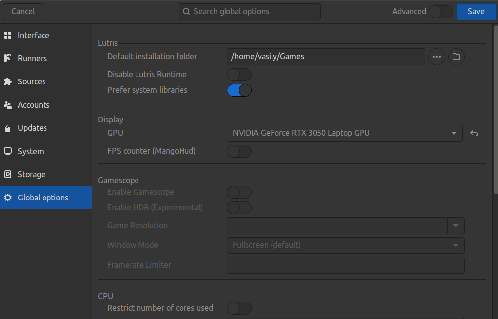
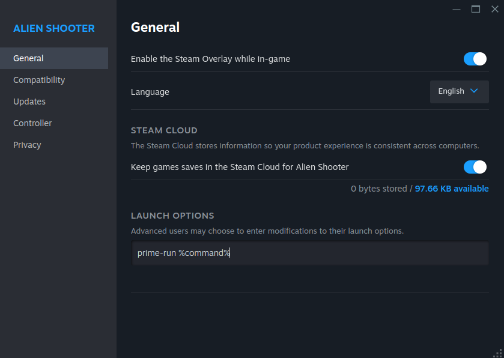
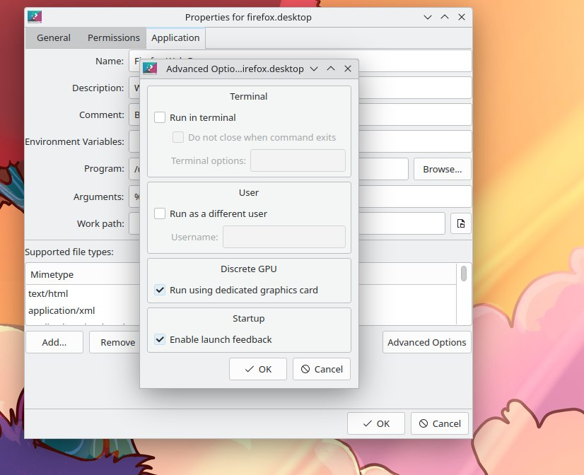
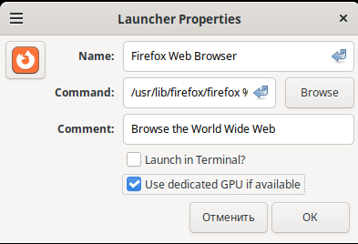

.. ARU (c) 2018 - 2025, Pavel Priluckiy, Vasiliy Stelmachenok and contributors

   ARU is licensed under a
   Creative Commons Attribution-ShareAlike 4.0 International License.

   You should have received a copy of the license along with this
   work. If not, see <https://creativecommons.org/licenses/by-sa/4.0/>.

.. index:: prime, dgpu, igpu
.. _hybrid_graphics:

******************************
Гибридная графика в ноутбуках
******************************

Гибридная графика - это аппаратная конфигурация, в которой есть две и более
видеокарт, которые могут работать в тандеме друг с другом. Такой подход
встречается в основном в ноутбуках, где есть интегрированная графика (iGPU) от
процессора и дискретная графика (dGPU). Его основное преимущество заключается в
том, что интегрированная графика должна (но не обязательно) использоваться
только для малозатратных задач, таких как серфинг в Интернете, просмотр видео и
т. д. А дискретная графика используется для видеоигр, видеомонтажа,
3D-моделирования и так далее. Следовательно, если два GPU разделяют "большие" и
"маленькие" задачи, и в данный момент выполняются только "маленькие" задачи, то
нет никакого смысла в работе dGPU, поэтому его можно просто временно отключить
(то есть усыпить), тем самым значительно снизив энергопотребление. Таким
образом, когда dGPU снова понадобится (мы запустим приложение, которое его
использует), он проснется и возобновит работу.

.. index:: prime, optimus, bumblebee
.. _what_is_prime:

=========================
Что такое PRIME?
=========================

PRIME - это универсальная технология для работы с различными наборами гибридной
графики в Linux, такими как NVIDIA Optimus/AMD Dynamic Switchable Graphics.
PRIME Offload - это реализация идеи переноса выполнения рендеринга с одного GPU
на другой, но вот отображением уже готовых кадров на экран заниматься будет тот
GPU, который управляет дисплеем в данный момент, как правило это встроенная
графика. Поддержка PRIME в закрытом драйвере NVIDIA фактически началась только
с драйвера 435.17, поэтому если вы являетесь пользователем устаревшей ветки
драйверов 390xx или даже 340xx, PRIME Offload не будет работать для вас.

Обратите внимание, что автор настоятельно не рекомендует вам использовать
устаревшие способы использования гибридной графики, такие как nvidia-xrun или
Bumblebee. Они устарели и не поддерживаются (Bumblebee не обновлялся уже более
8 лет), работают исключительно на убогих хаках и имеют низкую
производительность. В то же время открытый драйвер Nouveau поддерживает PRIME
Offload, что может стать неплохой альтернативой для старых dGPU.

Кроме того, пожалуйста, избегайте использования таких инструментов, как
optimus-manager. Они могут показаться вам очень удобными, но поверьте, они
могут вызвать множество проблем, и они вам на самом деле не нужны, если ваш
графический процессор поддерживает PRIME Offload и динамическое управление
питанием.

.. index:: xorg, kms, modeset
.. _setup_prime:

===================
Настройка PRIME
===================

В Arch Linux никакой дополнительной настройки системы, в частности графического
сервера Xorg, не требуется. Для современных версий драйвера все должно работать
из коробки при условии, что все модули NVIDIA загружаются правильно, а
проверить это можно при помощи команды ``lspci -k | grep "Kernel driver in use:
nvidia"``, вы уже можете полноценно использовать вашу дискретную видеокарту. 
.. note:: Если модули драйвера NVIDIA по какой-то причине не загружаются,
убедитесь, что вы отключили *Secure Boot* в настройках UEFI.

Для конфигураций, где обе видеокарты управляются открытыми драйверами Mesa (к
примеру AMD+AMD, AMD+Intel или даже Intel+NVIDIA, где дискретная графика NVIDIA
находится под управлением открытого драйвера Nouveau), ничего настраивать не
нужно и для использования дискретной графики нужно лишь указать переменную
окружения ``DRI_PRIME=1`` перед запуском приложений или игр по аналогии со
всеми переменными, которые будут описаны далее для NVIDIA или использовать уже
готовые графические способы.

.. index:: rtd3, nvidia
.. _dynamic_power_managment:

---------------------------------
Динамическое управление питанием
---------------------------------

Поддержка динамического управления питанием вашей дискретной видеокарты
позволяет драйверу полностью отключать её питание на время простоя, то есть
когда в ней нет необходимости, она просто уходит в состоянии сна не потребляя
никакой энергии. К сожалению, она доступна не для всех и работает только для
мобильных видеокарт NVIDIA начиная с поколения Turing (16xx/20xx) и выше. Для
видеокарт поколения Ampere её поддержка включена по умолчанию и никаких
дополнительных действий производить не нужно, однако если вы являетесь
обладателем графики именно поколения Turing, то вам так же понадобиться создать
дополнительные файлы настройки и правила udev, которые будут выполнять
настройку динамического управления питания при каждом запуске. Для этого просто
создайте файл под названием ``/etc/udev/rules.d/71-nvidia.rules`` со следующим
содержанием:

.. code-block:: shell
   :caption: ``sudo nano /etc/udev/rules.d/71-nvidia.rules``

   ACTION=="add|bind", SUBSYSTEM=="pci", DRIVERS=="nvidia", ATTR{vendor}=="0x10de", ATTR{class}=="0x03[0-9]*", TEST=="power/control", ATTR{power/control}="auto"
   ACTION=="remove|unbind", SUBSYSTEM=="pci", DRIVERS=="nvidia", ATTR{vendor}=="0x10de", ATTR{class}=="0x03[0-9]*", TEST=="power/control", ATTR{power/control}="on"

.. warning:: Динамическое управление питание на текущий момент не работает для
   видеокарт поколения Turing при использовании открытых модулей драйвера
   NVIDIA (``nvidia-open-dkms``) [#]_.

Вам также потребуется изменить значение параметра для модуля драйвера NVIDIA,
который и активирует работу динамического управления питанием:

.. code-block:: shell
   :caption: ``sudo nano /etc/modprobe.d/nvidia-dynamic-powermanagment.conf``

   options nvidia NVreg_DynamicPowerManagement=0x02

После чего рекомендуется обновить образы initramfs через команду ``sudo
mkinitcpio -P`` и перезагрузиться. Чтобы убедиться, что все работает правильно
нужно проверить вывод команды ``cat /proc/driver/nvidia/gpus/*/power``, он
должен быть примерно следующим::

   Runtime D3 status:          Enabled (fine-grained)
   Video Memory:               Active

   GPU Hardware Support:
    Video Memory Self Refresh: Supported
    Video Memory Off:          Supported

   S0ix Power Management:
    Platform Support:          Supported
    Status:                    Disabled

.. index:: prime-run
.. _usage_prime_offload:

============================
Использование PRIME Offload
============================

Чтобы указать, что вы хотите использовать дискретную графику вместо встроенной,
перед запуском программы необходимо указать несколько переменных окружения::

   __NV_PRIME_RENDER_OFFLOAD=1 __VK_LAYER_NV_optimus=NVIDIA_only __GLX_VENDOR_LIBRARY_NAME=nvidia <program>

Такой набор переменных выглядит очень громоздким и его легко забыть, поэтому вы
можете установить пакет ``nvidia-prime`` (``sudo pacman -S nvidia-prime``),
который содержит скрипт-псевдоним ``prime-run`` для всех этих переменных. Тогда
запуск приложения с его помощью будет выглядеть следующим образом::

   prime-run  <program>

Где ``<program>`` - это имя команды, запускающей ваше приложение. Например, вы
можете запустить команду ``glxinfo``, чтобы проверить корректность работы PRIME
Offload::

   prime-run glxinfo | grep OpenGL

Если вывод данной команды даёт вам упоминание вашей дискретной видеокарты,
значит вы всё сделали правильно. При возникновении проблем, советуем вам
перепроверить правильность установки драйвера NVIDIA и загрузки всех модулей.

.. index:: plasma, gnome, cinnamon, steam, lutris
.. _graphical_way:

----------------------
Графический способ
----------------------

Возможно, запуск всех необходимых приложений через терминал с помощью
``prime-run`` покажется вам не слишком удобным, но некоторые приложения
позволяют вам указывать запуск игр/других приложений с использованием
дискретной графики через специальные настройки.

.. index:: lutris, games
.. _lutris:

~~~~~~~
Lutris
~~~~~~~

Чтобы настроить запуск игр с использованием дискретной графики в Lutris, нужно
зайти в настройки (три полоски в правом верхнем углу окна и кнопка
*"Настройки"*). Далее перейдите в раздел *"Global options" -> "Display" ->
GPU"*. Здесь вы выбираете графический процессор, с которым будет запускаться
игра.

.. index:: steam, games
.. _steam:

~~~~~~
Steam
~~~~~~

В Steam нет специальных настроек для запуска игр с дискретной графикой, но вы
можете нажать на *"Шестеренку"* и перейти в *"Свойства"* перед запуском игры,
после чего прописать команду ``prime-run %command%`` или указанные ранее
переменные окружения, например:

.. index:: desktop, prime
.. _desktop_environments:

~~~~~~~~~~~~~~~~~~~~~~
Графические окружения
~~~~~~~~~~~~~~~~~~~~~~

Ряд пользовательских окружений таких как KDE Plasma, Cinnamon и GNOME имеют
встроенную интеграцию с PRIME при помощи специального инструмента как
``switcheroo-control``. Чтобы получить заветную удобную кнопку для запуска
приложений с использованием дискретной графики в данных окружениях и без
необходимости лезть в терминал, вы должны установить данный пакет и включить
соответствующую службу::

  sudo pacman -S switcheroo-control
  sudo systemctl enable --now switcheroo-control

.. note:: Использование switcheroo-control позволяет работать описанным ниже
   графическим способам на всех конфигурациях PRIME, в которых даже нет NVIDIA
   dGPU, например AMD+AMD.

.. index:: plasma
.. _plasma_way:

""""""""""""
KDE Plasma
""""""""""""

После установки ``switcheroo-control`` щелкните правой кнопкой мыши на нужную
вам значок приложения на рабочем столе или в меню приложений, затем перейдите в
*"Свойства"* -> *"Приложение"* -> *"Дополнительные параметры"* -> *"Запускать с
использованием дискретной графики"*.

.. _cinnamon_way:

""""""""""
Cinnamon
""""""""""

По аналогии с Plasma в Cinnamon, вы также можете зайти в меню приложений,
кликнуть правой кнопкой мыши по значку приложения и в появившемся контекстном
меню выбрать *"Свойства"*, после чего в появившемся меню поставить флажок
*"Использовать выделенный графический процессор, если он доступен"*.

"""""""
GNOME
"""""""

В GNOME также следует щелкнуть правой кнопкой мыши по значку приложения и
выбрать *"Запустить с дискретной графикой"*. Но учтите, что GNOME не запоминает
этот выбор, и в следующий раз, когда вы просто щелкните по значку, приложение
все равно будет работать с интегрированной графикой.

.. index:: dgpu, nvidia, x11
.. _troubleshooting:

===========================
Устранение проблем с PRIME
===========================

.. index:: external-monitor, laggy
.. _external_monitor_laggy:

--------------------------------
Внешний монитор сильно тормозит
--------------------------------

Это известная проблема с драйвером NVIDIA, связанная с тем, что порт для
подключения монитором управляется NVIDIA dGPU, в то время как композитинг и
отображение кадров выполняется с учетом работы iGPU. Вам следует установить
последнюю версию драйвера NVIDIA и использовать Wayland с композитором,
поддерживающим явную синхронизацию. Для GNOME это было исправлено в версии
46.2. Для Plasma 6 это, вероятно, было исправлено в версии 6.1, хотя некоторые
пользователи сообщают о нормальной работе уже в версии 6.0. В других
окружениях/оконных менеджерах эта проблема все еще присутствует, поэтому для ее
устранения необходимо перейти на последнюю версию GNOME или Plasma.

В случае работы в окружениях на базе протокола X11 вы также можете решить эту
проблему переставив iGPU и dGPU местами, сделав тем самым дискретную графику
NVIDIA главным GPU, что позволяет избавиться от тормозов. Чтобы это сделать
нужно создать следующий конфиг:

.. code-block:: shell
   :caption: ``sudo nano /etc/X11/xorg.conf.d/10-gpu.conf``

   Section "ServerLayout"
     Identifier "layout"
     Screen 0 "nvidia"
     Inactive "integrated"
   EndSection

   Section "Device"
       Identifier  "nvidia"
       Driver      "nvidia"
       BusID       "PCI:1:0:0" # Например: "PCI:1:0:0"
   EndSection

   Section "Screen"
       Identifier "nvidia"
       Device "nvidia"
       Option "AllowEmptyInitialConfiguration"
   EndSection

   Section "Device"
       Identifier  "integrated"
       Driver      "modesetting"
   EndSection

   Section "Screen"
       Identifier "integrated"
       Device "integrated"
   EndSection

В поле "BusID" вы должны указать собственное значение номера шины вашего dGPU в
том формате, в котором он указан в примере. Изменить нужно лишь первую цифру из
примера с ``1`` на ваш номер шины, если конечно он уже не равен ``1``. Его вы
можете узнать при помощи следующей команды: ``lspci -Dd "10de:*:030x" | cut -f
2 -d ":" | awk '{x=$0+0;print x}'``. После сохранения файла и перезагрузки
вашим GPU по умолчанию должна стать NVIDIA графика.

.. [#] https://forums.developer.nvidia.com/t/clarifying-560-series-drivers-open-sourcedness-vs-kernel-module-type-proprietary/292698/2
