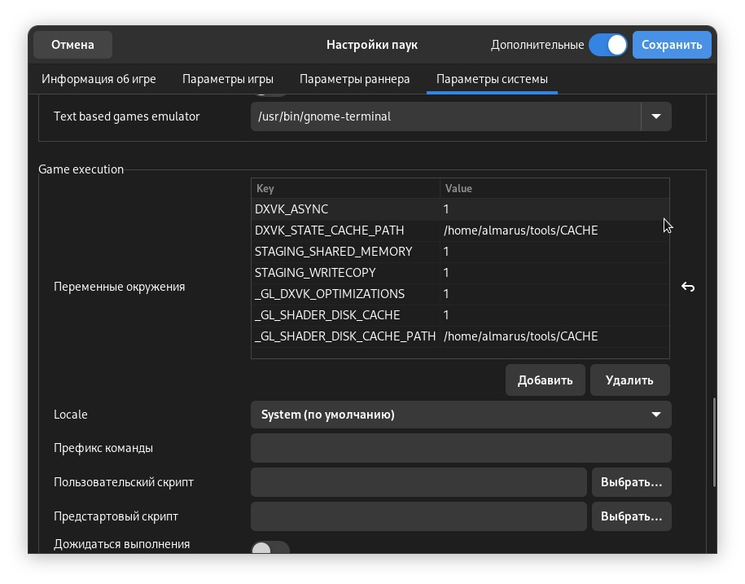
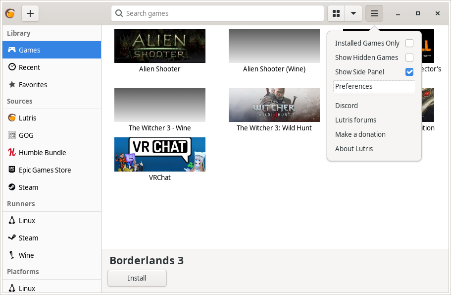
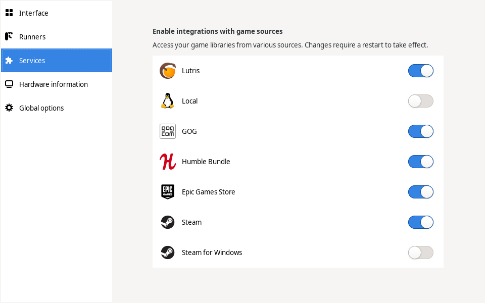

.. ARU (c) 2018 - 2023, Pavel Priluckiy, Vasiliy Stelmachenok and contributors

   ARU is licensed under a
   Creative Commons Attribution-ShareAlike 4.0 International License.

   You should have received a copy of the license along with this
   work. If not, see <https://creativecommons.org/licenses/by-sa/4.0/>.

.. _linux-gaming:

********************
Wine / Linux Gaming
********************

.. index:: wine, wine-builds, gaming
.. _main-components:

=========================
Основные составляющие
=========================

Переходя к запуску Windows-игр на Linux-системах, сто́ит иметь в виду, что
никаких эмуляторов Windows на Linux не существует, и весь запуск
осуществляется с помощью открытой реализации Windows API — Wine, а также
средств ретрансляции команд DirectX в доступные графические API на Linux
(Vulkan, OpenGL) с помощью DXVK или иных ретранслятора кода.

.. index:: about, wine, gaming
.. _about-wine:

----------------------
Что такое Wine?
----------------------

Wine - слой совместимости для запуска Windows-приложений (в том числе игр) из
под Linux (Unix-подобных систем). Благодаря нему вы по факту сможете поиграть
в большинство игр из вашей библиотеки Steam/GOG/Epic Games Store. Исключением
разве что являются игры с встроенными анти-чит системами, хотя благодаря
усилиям Valve, вероятно, это уже не будет являться такой большой проблемой.
Конечно, все не так гладко как хотелось бы, ведь для запуска и обеспечения
работоспособности многих программ/игр придется ещё изрядно повозиться с его
настройкой, однако сама такая возможность в принципе является незаменимой для
Linux пользователей, в частности геймеров.

.. index:: wine-builds, gaming
.. _wine-builds:

-------------
Сборки Wine
-------------

Существуют различные сборки Wine. Подобный зоопарк появился ввиду накопления
большого количества различных патчей (сторонних изменений) которые по какой-то
причине не могут быть приняты в обычный Wine. Кроме того, стоит понимать что,
как и в случае с ядрами, обычный Wine это прежде всего свободная реализация
Windows API, которая подразумевает запуск любых Windows приложений. При этом
он не заточен конкретно под игры или любой другой софт. Именно поэтому в том
числе и появились такие вещи как Proton от компании Valve, *являющимся по сути
тем же Wine*, но с упором именно на игровую составляющую, исправляющий многие
проблемы обычного Wine связанные с играми.

На текущий момент есть две официальные "сборки" Wine которые поддерживаются
непосредственно разработчиками:

* wine - обычная, стабильная версия, содержащая только проверенные изменения
  от разработчиков, и которая условно универсальна для любых приложений.

* wine-staging - содержащая те изменение которые пока не могут попасть в
  обычную версию, но которые могут помочь исправить определенные баги и
  улучшить работу конкретных программ и частей Wine.

Но существуют также много альтернативных сборок основанных на Wine-staging с
упором именно на игры, о них написано далее.

.. index:: installation, wine-staging, gaming, dependencies
.. _wine-staging:

^^^^^^^^^^^^^^^^^^^^^^^^^^^^^^^^^^^^^^^^^^^^^^
Установка wine-staging вместе с зависимостями
^^^^^^^^^^^^^^^^^^^^^^^^^^^^^^^^^^^^^^^^^^^^^^

Бинарные версии ПО всегда доступны в репозиториях и очень удобны, но они не
могут обеспечить достойный уровень производительности. Для начала советуюм
поставить wine-staging вместе со всеми зависимостями, а уже затем будем
собирать различные кастомные сборки.

::

 sudo pacman -S wine-staging winetricks wine-mono giflib lib32-giflib libpng lib32-libpng libldap lib32-libldap gnutls lib32-gnutls mpg123 lib32-mpg123 openal lib32-openal v4l-utils lib32-v4l-utils libpulse lib32-libpulse libgpg-error lib32-libgpg-error alsa-plugins lib32-alsa-plugins alsa-lib lib32-alsa-lib libjpeg-turbo lib32-libjpeg-turbo sqlite lib32-sqlite libxcomposite lib32-libxcomposite libxinerama lib32-libgcrypt libgcrypt lib32-libxinerama ncurses lib32-ncurses opencl-icd-loader lib32-opencl-icd-loader libxslt lib32-libxslt libva lib32-libva gtk3 lib32-gtk3 gst-plugins-base-libs lib32-gst-plugins-base-libs vulkan-icd-loader lib32-vulkan-icd-loader

.. note:: Если вы не хотите устанавливать себе в систему целый ворох 32-битных
   пакетов, то вы можете собрать кастомную версию Wine с использованием режима
   WoW64, что описано ниже в разделе :ref:`wine-wow64-build`.

.. index:: installation, wine, wine-builds
.. _alternative-wine-builds:

------------------------------
Альтернативные сборки Wine
------------------------------

По умолчанию обычные сборки Wine недостаточно хорошо заточены для комфортной
игры ввиду их универсальности, т.к. это все таки свободная реализация WinAPI и
она не обязана использоваться только для запуска игр из под Windows в Linux.
Но существуют также альтернативные сборки Wine, с большим количеством
различных патчей и улучшений, нацеленных в основном как раз на игры.

.. index:: installation, wine, wine-builds, wine-tkg, native-compilation
.. _wine-tkg-git:

^^^^^^^^^^^
WINE-TKG
^^^^^^^^^^^

`WINE-TKG <https://github.com/Frogging-Family/wine-tkg-git>`_ - это, наверное,
лучшая сборка Wine для опытных пользователей которые хотят улучшить свой опыт
игры под линуксом. Преимуществом данной сборки перед другими является огромное
количество вложенных в неё патчей из разных источников (В том числе
портированных из Proton). Поэтому мы настоятельно рекомендуем её к установке
если вы хотите получить не только больше производительности, но и
совместимости с различными Windows играми.

**Установка** 

::

  git clone https://github.com/Frogging-Family/wine-tkg-git.git
  cd wine-tkg-git/wine-tkg-git

По аналогии с linux-tkg, wine-tkg предоставляет возможность предварительно
настроить себя перед установкой на применение различных патчей и твиков через
редактирование файла *customization.cfg*::

  nano customization.cfg

Здесь нас интересует не так много настроек. По сути можете оставлять все
значения по умолчанию, кроме следующих параметров:

``_use_ntsync="true"`` - К сожалению, текущие реализации воспроизведения
работы примитивов синхронизации между потоками приложений для wineserver,
такие как Esync и Fsync, работают с недостаточной точностью и полностью не
воссоздают то же поведение, которое есть в Windows, что имеет такие неприятные
эффекты, как кратковременные и практически незаметные глазу скачки FPS, а
также проблемы с запуском целого ряда игр и приложений. Чтобы это исправить
было предложено создать отдельный модуль в ядре Linux, который полностью
реализует работу примитивов синхронизации Windows с максимальной
производительностью, называемый ``ntsync`` (ранее известный под названием
winesync/fastsync). Для Wine были подготовлены патчи, которые заменяют
встроенную реализацию в wineserver с использованием данного модуля, применение
которых и активирует данная опция. Обратите внимание, что на данный момент для
использования NTSync вам нужно установить одно из предложенных ядер в разделе
:ref:`custom-kernels`, которое содержит модуль ``ntsync``, к примеру
``linux-zen`` или ``linux-cachyos``, иначе будет использоваться встроенная
синхронизация внутри wineserver, которая отличается низкой производительностью
в многопоточных приложениях Windows запускаемых через Wine. Крайне
рекомендуется к включению.

``_launch_with_dedicated_gpu="false"`` - Активирует запуск приложений через
дискретный графический процессор на ноутбуках с PRIME. Работает только когда
установлен пакет ``switcheroo-control`` и включена соответствующая служба.
Если у вас ноутбук, то установите ``true``.

``_update_winevulkan="true"`` - Включает свежие обновления библиотеки
winevulkan. Обязательно оставляйте включенным.

``_FS_bypass_compositor="true"`` - Задействует обход композитора приложениями
запускаемыми через Wine. Очень полезная и нужная опция для исправления проблем
задержек и заиканий в играх, в случае когда системный композитор пытается
лишний раз произвести композитинг над окном с игрой запущенной через Wine.
Обязательно включаем.

``_proton_fs_hack="true"`` - Включает еще один очень нужный патч. Вносит
исправление  с помощью которого изменяя разрешение игры в полноэкранном режиме
у вас не будет изменяться разрешение вашего рабочего стола. Включаем.

``_msvcrt_nativebuiltin="true"`` - Делает встроенную реализацию библиотек MS
VC++ в Wine предпочтительной к использованию. Чинит запуск некоторых игр,
поэтому желательно включить.

``_win10_default="false"`` - Устанавливает в качестве версии по умолчанию
Windows 10 в Wine. Не рекомендуется к включению в виду того, что это может
задействовать vkd3d в некоторых играх работающих на DirectX 12, что однако
ведет к ухудшению производительности по сравнению с DXVK при возможности
запустить игру с DirectX 11.

``_wayland_driver="true"`` - Включает использование нативной поддержки Wayland
в Wine. Обратите внимание, что работает только для версий Wine 9 и выше.
Обратите внимание, что поддержка Wayland в Wine на текущий момент реализована
не полностью и все ещё находится в процессе доработки, однако на текущем этапе
её развития вы уже можете запускать игры, получая хороший уровень
производительности. При переключении обратно на использование X сессии Wine
вернется к использованию классического драйвера ``winex11.drv``. Обратите
внимание, что даже собрав Wine с данным параметром, поддержка Wayland по
умолчанию будет выключена, чтобы её задействовать вам нужно будет выполнить
команду внутри нужно префикса::

  wine reg.exe add HKCU\\Software\\Wine\\Drivers /v Graphics /d x11,wayland

.. attention:: По умолчанию wine-tkg не использует нативные флаги которые мы
   указывали ранее в ``/etc/makepkg.conf``. Их нужно указать вручную
   отредактировав *wine-tkg-profiles/advanced-customization.cfg*::

    nano wine-tkg-profiles/advanced-customization.cfg # Отредактируйте строчки ниже

    _GCC_FLAGS="-O2 -ftree-vectorize -march=native"

    _CROSS_FLAGS="-O2 -ftree-vectorize -march=native"

На этом все, остальные настройки оставьте по умолчанию.

Теперь можно перейти к самой сборке и установке wine-tkg: ``makepkg -sric``

.. index:: installation, proton, gaming, native-compilation
.. _proton-ge-custom:

^^^^^^^^^^^^^^^^^^
Proton-GE-Custom
^^^^^^^^^^^^^^^^^^

Proton-GE-Custom это форк проекта Proton для запуска Windows-игр с
дополнительными патчами и оптимизациями не вошедшими в основную ветку Proton,
а также улучшение совместимости с некоторыми играми (например, Warframe).
Позволяет играть во многие проекты которые не заводятся с обычным Wine или
Proton.

**I. Установка (бинарная версия):**::

  git clone https://aur.archlinux.org/proton-ge-custom-bin
  cd proton-ge-custom-bin
  makepkg -sric

**II. Установка (компиляция, имеет много зависимостей):**::

  git clone https://aur.archlinux.org/proton-ge-custom
  cd proton-ge-custom
  makepkg -sric

Дабы использовать Proton-GE в качестве альтернативы обычному Proton, после
установки Proton-GE-Custom вам нужно перезапустить Steam и зайти в *Свойства*
нужной вам игры, прожать в: *Совместность -> Принудительно использовать
определенный инструмент совместности Steam Play -> Proton-9.XX-GE-1*. Готово,
теперь можно запустить игру.

.. index:: installation, wine, wow64, nomultilib
.. _wine-wow64-build:

^^^^^^^^^^^^^^^^^^^^^^^^^^^^^^^^^^
Сборка Wine-tkg без лишнего мусора
^^^^^^^^^^^^^^^^^^^^^^^^^^^^^^^^^^

Должно быть вы заметили, что во время установки wine-staging вместе с ним мы устанавливали
целую кипу различных 32-битных зависимостей, которые по сути дубликатами
соответствующих нативных библиотек используемых Wine, но в 32-разрядном
эквиваленте. Это необходимо, чтобы Wine имел возможность запускать 32-битные Windows
приложения. Конечно, такой расклад не очень приятен, ведь все эти зависимости
часто используются только лишь Wine, а все остальные программы уже давно
отказались от поддержки 32 бит (исключение - Steam). Хорошая новость в том, что с недавних пор Wine
поддерживает запуск 32-битных приложений без единой лишней библиотеки!

Новая экспериментальная подсистема WoW64 - это ещё один встроенный транслятор
Wine, который осуществляет переход нативных библиотечных вызовов из 32 бит в
64 бит, сохраняя при этом возможность запуска 32-битных приложений.

К сожалению, чтобы задействовать новый WoW64 нужно выполнить пересборку Wine с
включением некоторых дополнительных флагов. Удобно сделать это для Wine-tkg::

  git clone https://github.com/Frogging-Family/wine-tkg-git.git
  cd wine-tkg-git/wine-tkg-git
  nano wine-tkg-profiles/advanced-customization.cfg # Отредактируем строчки ниже

  _NOLIB32="wow64" # Задействуем новый режим

  makepkg -sric # Сборка и установка

После выставления всех нужных флагов и компиляции вы получите полностью
64-битный Wine, на что вам укажет специальная строчка в логах ::

  starting L"Z:\\XXX.exe" in experimental wow64 mode

.. index:: installation, wine, about, prefixes
.. _wine-usage:

--------------------
Использование Wine
--------------------

Использование Wine на деле является довольно простым. Чтобы запустить любое
Windows-приложение достаточно использовать простую команду::

  wine программа.exe

.. danger:: НИКОГДА НЕ ЗАПУСКАЕТЕ WINE ИЗ ПОД SUDO/ROOT! Это поможет
   вам избежать проблем в будущем, в том числе с безопасностью.

Немного иной командой запускаются MSI установщики::

  wine msiexec /i программа.msi

При использовании Wine важным понятием является префикс (его также называют
бутылкой). Префикс, это как бы файловая система Windows в миниатюре, а по
совместительству это рабочая директория, где будут устанавливаться/работать
все Windows программы которые вы будете запускать из под Wine. Стоит понимать,
что программы запускаемые через Wine по прежнему будут думать что они работают
в Windows, хотя на самом деле это не так. Поэтому Wine и понадобилось
воссоздать файловую структуру каталогов Windows внутри Linux (Unix). Префикс
по умолчанию - это скрытая директория *~/.wine* в папке вашего пользователя.
Если вы её откроете то увидите следующее:

.. image:: https://codeberg.org/ventureo/ARU/raw/branch/main/archive/ARU/images/image3.png

Как мы видим, в префиксе находятся файлы с расширением .reg (файлы реестра
Windows), директории *dosdevices* и *drive_c*. Файлы реестра используются Wine
для, собственно, воссоздания работы реестра Windows в Linux. К ним также будут
обращаться программы запускаемые через Wine. Директория *dosdevices* содержит
символические ссылки на примонтированные устройства (разделы) в вашей системе
Linux. Это понадобилось для того чтобы представить их в виде MS-DOS томов, ибо
Windows приложения опять таки не знают что они работают под Linux, и им нужны
привычные им диски D, E и т.д. Один из таких "виртуальных дисков"
располагается в другом каталоге - *drive_c* (диск C:). Если вы его откроете то
увидите "замечательную" структуру каталогов Windows:

.. image:: https://codeberg.org/ventureo/ARU/raw/branch/main/archive/ARU/images/image8.png

Именно сюда и будут устанавливаться все Windows программы и работать они как
правило тоже будут именно рамках этой директории.

Вы можете переназначить префикс по умолчанию через переменную окружения
*WINEPREFIX*, указав Wine использовать другую директорию для его расположения
вместо *~/.wine*. Например::

  WINEPREFIX=~/Games wine game.exe # Если директории не было, Wine её создаст.

Учитывайте, что при смене префикса через переменную окружения WINEPREFIX не
переносится его содержимое, т.е. программы установленные в одном префиксе не
будут скопированы в новый. Но если вам нужно просто сменить название префикса
с сохранением его содержимого, то просто переименуете название директории, а
затем переназначьте переменную, например::

  mv ~/old_wineprefix ~/new_wineprefix
  WINEPREFIX=~/.new_wineprefix wine приложение.exe

Префиксы бывают 32-битные и 64-битные в соответствии с разрядностью систем
Windows (по умолчанию создаются 64-битные). Указать разрядность префикса можно
через переменную *WINEARCH*. Для запуска старых видеоигр мы рекомендуем
использовать 32-битный префикс во избежание проблем с совместимостью::

  WINEPREFIX=~/.wine32 WINEARCH=win32 wine oldgame.exe

Если вы уже создали 64-битный префикс, то переназначить его разрядность через
переменную *WINEARCH* не получится. Создайте новый и перенесите нужную вам
программу.

Проверить разрядность уже существующего префикса можно командой (можно также
проверить по наличию директории *"Program Files (x86)"* внутри префикса)::

  grep '#arch' ~/.wine/system.reg

(Где '.wine' - путь до нужного вам префикса)

.. index:: wine, envars, staging, shared_memory, writecopy
.. _wine_envvars:

----------------------------------
Переменные окружения Wine-Staging
----------------------------------

Набор патчей ``wine-staging`` добавляет некоторые дополнительные переменные
окружения, которые задействуют дополнительные оптимизации.

``STAGING_WRITECOPY=1`` - Wine будет выполнять загрузку одинаковых dll
библиотек, требуемых приложениям, только один раз за время работы, и создавать
копию, только при наличии модификаций, что должно значительно снизить
потребление памяти. Это также больше соответствует оригинальному поведению
Windows.

Указывать данные переменные следует перед командой запуска Wine или в
настройках Lutris.

.. index:: installation, native-compilation, dxvk, async, lowlatency, gaming
.. _dxvk:

-----
DXVK
-----

В Linux отсутствует полноценная реализация DirectX по вполне понятным
причинам. Но присутствуют альтернативные графические API, работающие под любые
платформы. Прежде всего это OpenGL и Vulkan. В следствии этого в Wine есть так
называемый ретранслятор кода - wined3d. Он переводит вызовы DirectX в
известные любой Linux системе OpenGL вызовы. Однако OpenGL не одно и тоже что
и DirectX, поэтому возникают множество проблем. Самая главная из которых -
значительно более худшая производительность OpenGL по сравнению с DirectX.
Именно поэтому если вы запустите любую игру через "голый" Wine вы получите
ужасный FPS, т.к. она будет работать с использованием wined3d. По этой причине
был разработан другой ретранслятор кода - DXVK. Он переводит DirectX вызовы
уже не в OpenGL, а в Vulkan - более современный графический API, который
достигает паритета по возможностям и производительности с DirectX.

Установка DXVK - это первое что должен сделать любой игрок который собирается
запустить Windows-игру под Linux. Но для любой версии Proton DXVK уже есть из
коробки, а вот для Wine его придется устанавливать вручную.

Мы рекомендуем собирать `dxvk-mingw
<https://github.com/loathingKernel/PKGBUILDs/tree/master/public/dxvk-mingw>`_
из GitHub для лучшей производительности и активации асинхронного патча.
Асинхронный патч, как понятно из названия, позволяет выполнять компиляцию
шейдеров в асинхронных потоках. Такой подход позволяет минимизировать заикания
во время игры, которые могут происходить когда вы прогружаете новую локацию
или объект на игровой карте, то есть компилируйте новые шейдеры. В некоторых
играх он даже немного повышает FPS и делает график времени кадра более
"гладким". Патч не был одобрен разработчиками DXVK потому, что он потенциально
вызывал проблемы в онлайн-играх с анти-чит системами, и теперь для него
требуется отдельная установка.

.. warning:: Важно! Асинхронный патч может быть не актуален начиная с версии
   DXVK 2.0 и выше, т. к. начиная с данной версии DXVK использует так
   называемое расширение Vulkan VK_EXT_graphics_pipeline_library (сокращенно
   GPL), которое должно уменьшить количество зависаний в играх во время
   компиляции шейдеров, то есть имеет аналогичный асинхронному патчу эффект,
   не имея специфичных для него болячек, вроде сломаного кэширования шейдеров,
   поэтому мы рекомендуем использовать его вместо асинхронного патча. Обратите
   внимание, что на текущий момент расширение GPL полноценно поддерживается
   только драйвером NVIDIA начиная с версии 515.49.10 и выше. Работа над
   поддержкой расширения в Mesa также ведется. Кроме этого никаких
   дополнительных действий для работы GPL не требуется.

   Хотя игры работающие на основе движка Unreal Engine 4/5 можно "заставить"
   правильно работать с GPL если изменить некоторые параметры движка
   отредактировав файл
   ``%LOCALAPPDATA%/game_name/Saved/Config/WindowsNoEditor/Engine.ini`` (путь
   расположен в префиксе Wine и может отличаться от игры к игре)::

       [/script/engine.renderersettings]
       r.Shaders.Optimize=1
       r.CreateShadersOnLoad=1
       niagara.CreateShadersOnLoad=1
       r.ShaderDevelopmentMode=0
       r.CompileShadersForDevelopment=0

   Аналогично для игр использующих UE3 существует параметр
   ``bInitializeShadersOnDemand=False`` (спасибо @Iglu47 для предоставленную
   информацию).

   Больше подробностей о проблемах и причинах для отказа от асинхронного
   патча можно прочитать здесь:
   https://github.com/GloriousEggroll/proton-ge-custom/commit/6def823481abc0ab21bf3b6622b89dc26998f5a5

**Установка:**::

  git clone https://github.com/loathingKernel/PKGBUILDs
  cd PKGBUILDs/public/dxvk-mingw
  mv PKGBUILD.testing PKGBUILD
  sed -i 's/-march=haswell -mtune=haswell/-march=native -mtune=native/g' PKGBUILD # Нативные флаги
  makepkg -sric # Сборка и установка

Активировать асинхронную компиляцию шейдеров можно через переменную окружения
*DXVK_ASYNC=1*.

После установки пакета DXVK не задействуется сразу, его библиотеки ещё нужно
"распаковать" по отдельности в каждый префикс Wine (это не относиться к играм
запускаемым через Lutris/Proton, в них DXVK включён по умолчанию)::

   WINEPREFIX=~/prefix setup_dxvk install # Где "prefix" - это путь до вашего префикса Wine

.. warning:: DXVK осуществляет ретрансляцию вызовов только для игр использующих версии DirectX 9, 10 и 11.
   Для DirectX 12 для понадобиться использовать vkd3d. Подробнее о нем вы можете прочитать ниже.

.. danger:: С осторожностью используйте *DXVK_ASYNC=1* в онлайн-играх!

.. index:: installation, wine, vkd3d, gaming, native-compilation
.. _vkd3d:

-------------
vkd3d
-------------

vkd3d - это ретранслятор кода, аналогичный DXVK, но уже конкретно для версии
DirectX 12. Стоит отметить, что существует две отдельно разрабатываемые версии
vkd3d, одна из которых разрабатывается командой Wine, а другая - Valve. Мы
рекомендуем вам использовать ту что от Valve, т.к. она наиболее заточена под
современные игры, а также достаточно хорошо поддерживает Raytracing.

**Установка vkd3d-proton**

Для Proton и Lutris установка vkd3d задействован по умолчанию, и никаких
дополнительных манипуляций обычно не требуется. Однако для обычного Wine нужна
его отдельная установка. Мы установим vkd3d-proton из AUR,
нативно-скомпилировав его под свой процессор::

  git clone https://aur.archlinux.org/vkd3d-proton-mingw.git # Скачивание исходников
  cd vkd3d-proton-mingw                                      # Переход в директорию
  sed -i 's/-march=nocona -mtune=core-avx2 -pipe/-march=native -mtune=native -pipe/g' PKGBUILD # Нативные флаги
  makepkg -sric                                              # Сборка и установка

Так же как и в случае с DXVK, после установки пакета, vkd3d нужно
предварительно распоковать в нужный Wine префикс::

  setup_vkd3d_proton install ~/.wineprefix

(Где '~/.wineprefix' - это путь до нужного вам префикса)

Кроме того, обязательно измените версию Windows вашего префикса на *"Windows
10"*::

  WINEPREFIX=~/.wineprefix winecfg

.. image:: images/vkd3d-configure.png

.. index:: wine, dxvk, gaming, about
.. _wine-references:

------------------------------------
Полезные ссылки по теме Wine и DXVK
------------------------------------

**Скачать готовые сборки Wine и DXVK**

https://github.com/Kron4ek/Wine-Builds

https://mirror.cachyos.org/?search=wine

**Почитать, что это такое**

https://www.newalive.net/234-sborki-dxvk-i-d9vk.html

https://www.newalive.net/231-wine-tk-glitch.html

.. index:: gamemode, lutris, gaming
.. _additional-components:

=================================
Дополнительные компоненты
=================================

Не являются обязательными, но могут помочь повысить производительность системы
или облегчить настройку.

.. index:: installation, gamemode, lutris, gaming
.. _lutris-and-additions:

--------
Lutris
--------

Lutris - это удобный графический интерфейс по обслуживанию всей вашей игровой
библиотеки (включая все купленные игры Steam/GOG/Epic Games) в одном
приложении. Через него вы сможете достаточно просто запускать нативные игры,
игры запускаемые при помощи эмуляторов, и конечно Wine. Все это объединено в
одном приложении-комбайне, содержащим много настроек и интеграций с различными
сервисами.

**Установка**

Все проще некуда::

 sudo pacman -S lutris

Тем не менее, стоит удостовериться что вы установили полный набор зависимостей
для Wine. Об этом вы можете прочитать в предыдущих разделах.

.. image:: images/lutris.png

**Интеграция с GOG/Epic/Steam**

Сразу после установки стоит сделать некоторые базовые вещи. А именно подключить
интеграцию с сервисами Steam/GOG/Epic Games. Это позволит синхронизировать
локальную библиотеку Lutris'a вместе с перечисленными площадками и выполнять
установку игр в два клика. Подключать все конечно не обязательно, так что
делайте это если считаете нужным.

**1.** Зайдем в настройки: В правом верхнем углу найдите три горизонтальные
полоски и в контекстном меню выберите *"Preferences"*. После этого выберите
*"Services"* и включите те сервисы, которыми вы пользуетесь.

**1.1**

**1.2**

**2.** Теперь вернитесь в главное окно и наведите курсор на левую панель в
графу *"Sources"*, и ниже выбирите нужную вам платформу. Справа от курсора
будет иконка входа. После этого перед вами появится окно авторизации, после
прохождения которой у вас появится возможность устанавливать и запускать все
игры из вашей внешней библиотеки (Steam/GOG/Epic Games).

Пример подключения аккаунта GOG представлен ниже на скриншотах.

**2.1**

.. image:: images/lutris-auth-icon.png

**2.2**

.. image:: images/lutris-gog-auth.png

**2.3**

.. image:: images/lutris-gog-library.png

Аналогичная операция проделывается с Epic Games Store:

**2.4**

.. image:: images/lutris-auth-epic-icon.png

**2.5**

.. image:: images/lutris-epic-auth.png

**2.6**

.. image:: images/lutris-epic-library.png

.. index:: installation, gamemode, gaming, lutris
.. _gamemode:

--------------
Gamemode
--------------

Gamemode - утилита для максимальной выжимки системы во время игры. Установку
gamemode можно выполнить следующей командой::

 sudo pacman -S gamemode lib32-gamemode

Lutris, как правило использует gamemode по умолчанию (в случае его наличия в
системе), однако вы также можете активировать или деактивировать его в
параметрах. 

Для запуска игры в ручную с использованием gamemode необходимо выполнить
команду::

 gamemoderun ./game

Для запуска игр через Steam с использованием gamemode необходимо прописать
команду в параметрах запуска игры (находятся в свойствах игры в Steam)::

 gamemoderun %command%

Из коробки gamemode применяет не так много оптимизаций, поэтому есть смысл
включить использование некоторых параметров, которые отключены по умолчанию.
Задействовать их можно создав конфиг для gamemode (комментарии сопровождаются
символом ``;`` в начале)::

  mkdir -p ~/.config/gamemode
  nano ~/.config/gamemode/gamemode.ini # Пропишите следующее строчки

  [general]
  ; Повышает приоритет игры до максимума
  renice=19

  ; Отключает раздельные блокировки шины памяти.
  ; Одна инструкция с раздельной блокировкой может занимать шину
  ; памяти в течение примерно 1 000 тактов, что может приводить к
  ; кратковременным зависаниям системы в таких играх как God of War.
  disable_splitlock=1

  ; Устанавливает режим работы процессора на максимальную производительность
  desiredgov=performance

  [gpu]
  ; Установит профиль вашей видеокарты NVIDIA на максимальную
  ; производительность на время игры.
  nv_powermizer_mode=1

  ; Аналогично для AMD. Не забывайте следить за температурой вашего GPU!
  amd_performance_level=high

.. index:: amd, fsr, image-scaling, gaming
.. _amd-fsr:

-------------------------------------------
AMD FidelityFX Super Resolution в Wine
-------------------------------------------

Возможно, вы слышали о волшебной технологии DLSS от Nvidia, которая позволяет
поднять FPS почти в два раза и при этом не потратить ни копейки на новое
оборудование. Вот и компания AMD совсем недавно представила похожую технологию,
которая получила помпезное название AMD FidelityFX Super Resolution или
сокращенно FSR. Новая технология масштабирования картинки от AMD не требует
наличия дорого́й карты или каких-то аппаратных блоков ускорения, что в отличие
от DLSS, должно позволить использовать технологию везде и совершенно бесплатно.
А благодаря чудесным патчам от энтузиастов для Wine мы можем применять эту
волшебную технологию для любой Windows-игры.

**I. Установка**

Чтобы установить патч от энтузиастов придется немного помудрить с нашим wine-tkg.

Его установка описывалась выше, но чтобы задействовать сторонний патч на FSR в
Wine нужно отредактировать одну строку в *customization.cfg*::

  nano customization.cfg

  # Найдите строчку _community_patches="" и добавьте в неё следующее:

  _community_patches="amd_fsr_fshack.mypatch"

  # Обязательно оставьте при этом включенными данные параметры:
  _protonify, _msvcrt_nativebuiltin, _proton_fs_hack, _proton_rawinput.
  Без них ничего работать не будет.

И пересоберите ваш wine-tkg: ``makepkg -sric``

**II. Установка**

Если вам кажется первый способ немного муторным, то вы можете просто
использовать уже готовые сборки с FSR патчем в Lutris:

.. image:: images/linux-gaming-1.png

И затем выбрать её для нужной вам игры:

.. image:: images/linux-gaming-2.png

**III. Установка**

FSR патч также по умолчанию задействован в Proton-GE-Custom. Про его установку
вы можете прочитать ниже в соответствующем разделе.

**Как использовать**

Несмотря на то, что мы выполнили установку патченной версии Wine одним из
вышеописанных способов, технологию FSR ещё нужно активировать.

Сделать это можно руками, через переменные окружения *WINE_FULLSCREEN_FSR=1*
или в Lutris:

.. image:: images/linux-gaming-3.png

Важно помнить, что эта технология работает **только в полноэкранном режиме
игры**.

Регулировать резкость итогового изображения можно через переменную окружения
*WINE_FULLSCREEN_FSR_STRENGTH=N*, где N - это уровень резкости изображения от 0
до 5. Чем выше значение, тем меньше резкость. По умолчанию установлено значение
*"2"*, мы рекомендуем использовать значение *"3"*.

.. index:: nvidia, dlss, proton, image-scaling, gaming
.. _nvidia-dlss-with-proton:

-------------------------------------------------------
Использование DLSS с видеокартами NVIDIA через Proton
-------------------------------------------------------

Для того чтобы использовать DLSS вам потребуется:

* Видеокарта поддерживающая данную технологию (видеокарты серии RTX и выше).

* Убедиться, что используемая версия Proton не ниже **6.3-8**! (**поддержка
  DLSS начинается с данной версии!**)

* Указать параметры запуска игры в свойствах игры Steam
  ``PROTON_HIDE_NVIDIA_GPU=0 PROTON_ENABLE_NVAPI=1``

* Некоторые игры, как правило, которые используют DX11, для корректной работы
  могут также потребовать включения *dxgi.nvapiHack = False* в *dxvk.conf.* Для
  этого выполните инструкции ниже::

     mkdir -p ~/.config/dxvk/dxvk.conf
     echo "dxgi.nvapiHack = False" > ~/.config/dxvk/dxvk.conf

  После этого не забудьте дописать *DXVK_CONFIG_FILE=~/.config/dxvk/dxvk.conf*
  в приведённом ниже примере перед ``%command%``.

Пример для использования в Steam::

 PROTON_HIDE_NVIDIA_GPU=0 PROTON_ENABLE_NVAPI=1 %command%

.. attention:: Поскольку для DLSS необходимо специальное машинное обучение, то
   для запуска необходимо чтобы игра поддерживала DLSS, т.е. в настройках игры
   должен быть параметр включения данной функции. **Иначе DLSS работать не
   будет!** 

.. index:: gamescope, fps, installation
.. _gamescope:

----------
Gamescope
----------

Gamescope - это сессионный композитор, используемый для повышения
производительности в играх. По сути, он запускает отдельный менеджер
окон специально для вашей игры поверх текущего графического окружения.
Преимуществом Gamescope являтся снижение задержек во время игры и
возможность произвольно изменять собственное разрешение окна и
разрешение экрана для игры, при этом не меняя исходное разрешение
вашего рабочего окружения. У gamescope также есть встроенная поддержка
технологий FSR и NVIDIA Image Scaling.

**Установка** ::

  sudo pacman -S gamescope

**Использование**

Прямо перед командой запуска игры (gamescope работает как для Wine,
так и для нативных игр) добавьте команду ``gamescope``.

Чтобы изменить разрешение в котором будет работать gamescope
используйте параметры ``-W`` и ``-H`` для ширины и высоты
соотвественно. Аналогичные параметры есть для указания ширины и высоты
окна с игрой ``-w`` и ``-h``.

Используйте параметр ``-F`` с аргументами ``fsr`` или ``nis`` для
задействования технологий AMD FSR и NVIDIA Image Scaling
соотвественно.

Для достижения растягивающего масштабирования используйте ``-S stretch``.
Например при запуске CS2 с параметрами
``gamescope -f -w 2048 -h 1536 -W 3440 -H 1440 -r 165 -S stretch --``
получаем картинку 4:3 без черных полос по бокам. ``-r`` отвечает за герцовку.

.. warning:: Для правильной работы с закрытым драйвером NVIDIA на последних
   версиях требуется бета версия Vulkan драйвера 535.43.20.

.. warning:: Если Gamescope не выводит изображение на видеокартах AMD,
   используйте переменую окружения ``RADV_DEBUG=nodcc`` или
   ``R600_DEBUG=nodcc``.

.. index:: setup, gamescope, tty, latency
.. _tty_gamescope:

^^^^^^^^^^^^^^^^^^^^^^^^^^^^^^^^^^^
Запуск gamescope в отдельном tty
^^^^^^^^^^^^^^^^^^^^^^^^^^^^^^^^^^^

Как следует из данного определения, gamescope является сессионным
композитором. Это также означает, что он может быть запущен как часть уже
запущенной графической сессии (т. е. внутри графического окружения), так и сам
представлять собой независимую графическую сессию. Для того, чтобы gamescope
смог стать автономным композитором необходимо запустить его в отдельном tty,
т.е. вне другой графической среды. По сути такой прием аналогичен запуску
отдельного X сервера, но в случае с gamescope это позволяет ему получить
некоторые дополнительные возможности, которые нельзя получить при запуске из
под графической среды если она сама их не поддерживает (например в случае с
GNOME):

- Поддержка VRR (при указании опции ``--adaptive-sync``)
- Поддержка прямого отображения кадров минуя дополнительные этапы обработки,
  что значительно уменьшает задержки ввода (при указании
  ``--immediate-flips``)

Для того чтобы запустить gamescope в таком режиме вам нужно перейти в
отдельный, незанятый другой графической сессией, tty, например tty3, при
помощи сочетания клавиш ``Ctrl+Alt+F3`` (последняя цифра указывает номер TTY).
После этого перед вами появится приглашение для ввода логина и пароля от
вашего пользователя. Если авторизация прошла успешно, то перед вами появится
приглашение вашей системной оболочки. В ней вы должны запустить gamescope
вместе с указанием приложения, которое вы хотите использовать внутри сессии
gamescope. Например::

  gamescope -W 1920 -H 1080 -e -f --xwayland-count 2 --immediate-flips -r 144 -O HDMI-0 -- wine ~/Games/game.exe

Ключи ``-W`` и ``-H`` указывают ширину и высоту выбранного ключом ``-O``
вывода соответственно, а ключ ``-r`` указывает частоту развертки. После ``--``
идет команда запуска приложения, которое вы хотите запустить внутри gamescope.
Обратите внимание, что вы так же можете запустить клиент Steam внутри
gamescope, и все запускаемые вами игры тоже будут работать внутри этой сессии.
Специально для Steam также нужно экспортировать переменную окружения (указать
перед командой gamescope) ``STEAM_MULTIPLE_XWAYLANDS=1`` для того чтобы можно
было использовать Steam одновременно с вашей обычной графической сессией
(возврат на которую осуществляется при помощи сочетания клавиш
``Ctrl+Alt+F1``) и gamescope сессией на другом tty.

.. index:: fps, monitoring, mangohud, dxvk
.. _fps_monitoring:

------------------------------
Мониторинг FPS в играх.
------------------------------

.. index:: installation, fps, monitoring, mangohud
.. _mangohud:

^^^^^^^^^^^^^
Mangohud
^^^^^^^^^^^^^

Включение мониторинга в играх как в MSI Afterburner.

.. image:: https://codeberg.org/ventureo/ARU/raw/branch/main/archive/ARU/images/image9.png
  :align: center

**Установка** ::

  sudo pacman -S lib32-mangohud mangohud

Графический помощник для настройки вашего MangoHud. ::

  sudo pacman -S goverlay

Для использования mangohud в играх через Steam необходимо добавить команду в
параметры запуска игры (находятся в свойствах игры Steam)::

 mangohud %command% 

(Для указания нескольких команд необходимо разделять их **пробелом**)

.. index:: installation, fps, monitoring, dxvk
.. _dxvk-hud:

^^^^^^^^^^^^^^^^^^^^^^^^^^^^^^^^^^^^^^^^^^^^^^^^^^^^^^^^^^^^^^^^^^^^^^^^^^
Альтернатива: DXVK Hud (*Только для игр запускаемых через Wine/Proton*)
^^^^^^^^^^^^^^^^^^^^^^^^^^^^^^^^^^^^^^^^^^^^^^^^^^^^^^^^^^^^^^^^^^^^^^^^^^

Вы также можете использовать встроенную в DXVK альтернативу для мониторинга -
DXVK Hud. Он не такой гибкий как MangoHud, но также способен выводить значения
FPS, график времени кадра, нагрузку на GPU. Использовать данный HUD можно задав
переменную окружения *DXVK_HUD*. К примеру, ``DXVK_HUD=fps,frametimes,gpuload``
выводит информацию о FPS, времени кадра, и нагрузке на GPU.

Полный список значений переменной вы можете узнать - `здесь
<https://github.com/doitsujin/dxvk#hud>`_.

.. index:: installation, xpad, gamepad, usb
.. _gamepad_setup:

--------------------------
Настройка геймпадов (USB)
--------------------------

К сожалению далеко не все Xbox-совместимые геймпады распознаются встроенным
драйвером Xpad при подключении посредством USB, поэтому приходится явно
указывать его использование для данных устройств. Делается это при помощи
правил Udev (менеджера устройств в Linux). Но перед их написанием нужно
определить ID вендора и самого устройства. Это можно сделать через команду
``lsusb`` (если у вас её нет, то установите пакет ``usbutils``)::

  lsusb

После вы получите информацию о всех подключенных USB устройствах системе. Нас
интересует два числа разделяемых двоеточием, это и будет ID производителя и
самого устройства (в примере ниже это ``11c1`` и ``2001`` соответственно). ::

 ...
 Bus 001 Device 002: ID 11c1:2001  Controller
 ...

После этого создадим правило udev с произвольным именем файла:

.. code-block:: shell
  :caption: ``sudo nano /etc/udev/rules.d/10-xbox-gamepad.rules``

    # Generic xbox controller
    ACTION=="add", ATTRS{idVendor}=="11c1", ATTRS{idProduct}=="2001", RUN+="/sbin/modprobe xpad" RUN+="/bin/sh -c 'echo %s{idVendor} %s{idProduct} > /sys/bus/usb/drivers/xpad/new_id'"

В аттрибуты ``idVendor`` и ``idProduct`` мы указываем полученные значения из команды
lsusb (не забудьте про кавычки!).

Теперь нам нужно загрузить новые правила через следующую команду::

  sudo udevadm control --reload-rules

Переподключите ваш геймпад к компьютеру и он должен стать доступным для
использования (проверить можно через наличие файла ``/dev/input/js0``).

.. index:: installation, gamepad, xpadneo, dkms
.. _xpadneo-dkms-git:

---------------------------
Установка xpadneo-dkms-git
---------------------------

В ядре Linux есть драйвер для поддержки геймпадов Xbox 360 и других
выдающих себя за него. Изменения в драйвер попадают довольно редко,
поэтому лучше установить форк драйвера - `xpadneo-dkms-git
<https://github.com/paroj/xpad>`__, это позволит избежать проблем с
поддержкой ряда устройств.

**Установка** ::

  git clone https://aur.archlinux.org/xpadneo-dkms-git
  cd xpadneo-dkms-git
  makepkg -sric

.. vim:set textwidth=78:
