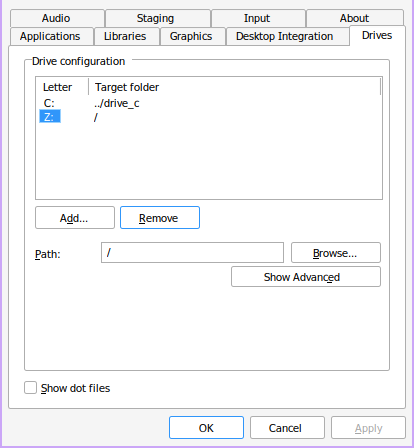
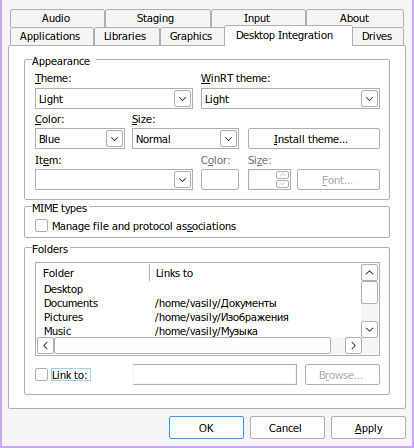

.. ARU (c) 2018 - 2024, Pavel Priluckiy, Vasiliy Stelmachenok and contributors

   ARU is licensed under a
   Creative Commons Attribution-ShareAlike 4.0 International License.

   You should have received a copy of the license along with this
   work. If not, see <https://creativecommons.org/licenses/by-sa/4.0/>.

.. _linux-gaming:

********************
Wine / Linux Gaming
********************

.. index:: wine, wine-builds, gaming
.. _main-components:

=========================
Основные составляющие
=========================

Переходя к запуску Windows-игр на Linux-системах, сто́ит иметь в виду, что
никаких эмуляторов Windows на Linux не существует, и весь запуск
осуществляется с помощью открытой реализации Windows API — Wine, а также
средств ретрансляции (перевода) команд DirectX в доступные графические API на Linux
(Vulkan, OpenGL) с помощью DXVK или иных ретранслятора кода.

.. index:: about, wine, gaming
.. _about-wine:

----------------------
Что такое Wine?
----------------------

Wine - слой совместимости для запуска Windows-приложений (в том числе игр) из
под Linux (Unix-подобных систем). Благодаря нему вы по факту сможете поиграть
в большинство игр из вашей библиотеки Steam/GOG/Epic Games Store. Исключением
являются игры с встроенными анти-чит системами, хотя благодаря усилиям Valve,
на текущий момент под Linux есть официальная поддержка как минимум двух
анти-чит систем: Easy Anti Cheat (EAC) и Battle Eye. Несмотря на это, чтобы
игра с использованием данных античитов заработала нужно чтобы разработчики
включили специальный слой совместимости между Proton и игрой, что не всегда
приветствуется по тем или иным причинам, и даже те игры, которые потенциально
могут отлично работать, все ещё не имеют официальной поддержки Proton со
стороны разработчиков. Также следует иметь ввиду, что для запуска и
обеспечения работоспособности некоторых программ или игр приходится немного
повозиться с настройкой, однако сама возможность запуска уже является
незаменимой для Linux пользователей, в частности геймеров.

.. index:: wine-builds, gaming
.. _wine-builds:

-------------
Сборки Wine
-------------

Существуют различные сборки Wine. Подобный зоопарк появился ввиду накопления
большого количества различных патчей (сторонних изменений) которые по какой-то
причине не могут быть приняты в обычный Wine. Кроме того, стоит понимать что,
как и в случае с ядрами, обычный Wine это прежде всего свободная реализация
Windows API, которая подразумевает запуск любых Windows приложений. При этом
он не заточен конкретно под игры или любой другой софт. Именно поэтому в том
числе и появились такие вещи как Proton от компании Valve, *являющимся по сути
тем же Wine*, но с упором именно на игровую составляющую, исправляющий многие
проблемы обычного Wine связанные с играми.

На текущий момент есть две официальные "сборки" Wine, которые поддерживаются
непосредственно разработчиками:

* wine - обычная, стабильная версия, содержащая только проверенные изменения
  от разработчиков, и которая условно универсальна для запуска любых
  приложений.

* wine-staging - версия, содержащая те изменения, которые пока не могут
  попасть в обычную по тем или иным причинам, но которые могут помочь
  исправить определенные баги и улучшить работу конкретных программ и частей
  Wine.

Существуют также много альтернативных сборок основанных на wine-staging с
упором именно на игры, о которых написано далее.

.. index:: installation, wine, wine-builds, wine-pure, native-compilation, wow64
.. _wine-pure-build:

-------------------
Установка wine-pure
-------------------

Проблема обычных версий Wine в том, что они заточены в первую очередь на
предоставление "правильной" и "эталонной" реализации Windows API в Unix.
Задачей проекта Wine никогда не было реализовать полноценный запуск всех
Windows игр под Linux в ущерб технической каноничности реализуемого API,
поэтому когда в Wine отправляются изменения, которые не полностью
удовлетворяют подобным требованиям, но при этом помогающие решить проблему
запуска или улучшить работоспособность той или иной игры, то они как правило
сразу не принимаются, а либо оседают в ``wine-staging``, либо в сторонних
сборках как версия Wine используемая Proton.

`wine-pure <https://github.com/ventureoo/PKGBUILDs/tree/main/wine-pure>`_ -
сборка Wine, сделанная с целью упростить процесс сборки и установки Wine, в
отличии от Wine-TKG не требует предварительной настройки, содержит минимальный
набор патчей необходимый для комфортной игры. Ключевые особенности:

- По умолчанию использует WoW64, транслятор, который осуществляет перевод
  32-битных библиотечных вызовов в 64-разрядные, тем самым не требуя установки
  большого количества 32-битных зависимостей, сохраняя при этом возможность
  полноценного запуска 32-битных Windows приложений.

- Добавлен патч для поддержки модуля NTSync, позволяющего получить более
  точное поведение синхронизации потоков как в Windows в отличии от Esync и
  Fsync, а также повысить производительность [#]_.

- Содержит все патчи, применяемые в wine-staigng, кроме Esync из-за наличия
  NTSync.

- По умолчанию активирована нативная поддержка Wayland. Это позволяет получить
  хороший уровень производительности, а также заметно более низкую задержку и
  отклик, чем при использовании Xwayland.

- Установлены флаги ``-O3`` и ``-march=native`` для нативной компиляции под
  ваш процессор.

- Удалены лишние и редко используемые компоненты, такие как поддержка Cups,
  SANE, V4L, pcap, xxf86vm, xinerama.

- Включена поддержка альтернативного бэкенда для проигрывания видео на базе
  набора библиотек FFmpeg.

**Установка**

Перед сборкой Wine необходимо установить заголовочный файл, описывающий
полные возможности примитивов NTSync::

  git clone https://aur.archlinux.org/ntsync-header
  cd ntsync-header
  makepkg -sricCf

После чего можно приступать к сборке самого wine::

  git clone https://github.com/ventureoo/PKGBUILDs
  cd PKGBUILDs/wine-pure
  makepkg -sricCf

Обратите внимание, что на данный момент для использования NTSync вам нужно
установить из AUR пакет ``ntsync-dkms``, который содержит модуль ядра
``ntsync``, либо же ядро в котором этот модуль уже есть, например
``linux-zen`` или ``linux-cachyos``, иначе будет использоваться встроенная
синхронизация wineserver, которая отличается низкой производительностью в
многопоточных приложениях Windows запускаемых через Wine.

.. [#] https://lore.kernel.org/lkml/20240131021356.10322-3-zfigura@codeweavers.com/T/

.. index:: installation, proton, gaming, native-compilation
.. _proton-ge-custom:

^^^^^^^^^^^^^^^^^^
Proton-GE-Custom
^^^^^^^^^^^^^^^^^^

Proton-GE-Custom это форк проекта Proton для запуска Windows-игр с
дополнительными патчами и оптимизациями не вошедшими в основную ветку Proton,
а также улучшение совместимости с некоторыми играми (например, Warframe).
Позволяет играть во многие проекты которые не заводятся с обычным Wine или
Proton.

**I. Установка (бинарная версия):**::

  git clone https://aur.archlinux.org/proton-ge-custom-bin
  cd proton-ge-custom-bin
  makepkg -sric

**II. Установка (компиляция, имеет много зависимостей):**::

  git clone https://aur.archlinux.org/proton-ge-custom
  cd proton-ge-custom
  makepkg -sric

Дабы использовать Proton-GE в качестве альтернативы обычному Proton, после
установки Proton-GE-Custom вам нужно перезапустить Steam и зайти в *Свойства*
нужной вам игры, прожать в: *Совместность -> Принудительно использовать
определенный инструмент совместности Steam Play -> Proton-9.XX-GE-1*. Готово,
теперь можно запустить игру.

.. index:: installation, wine, about, prefixes
.. _wine-usage:

--------------------
Использование Wine
--------------------

Использование Wine на деле является довольно простым. Чтобы запустить любое
Windows-приложение достаточно использовать простую команду::

  wine программа.exe

.. danger:: Никогда не запускаете wine из под sudo/root! Это поможет
   вам избежать проблем в будущем, в том числе с безопасностью.

При использовании Wine основополагающим понятием является префикс (в народе
его также называют бутылкой). Префикс, это искусственно воссозданное
окружение, которое на деле представляет собой обычную директорию, внутри
напоминающую собой файловую систему Windows в миниатюре. Внутри префикса будут
устанавливаться и работать практически все Windows программы, которые вы
будете запускать при помощи Wine. Стоит понимать, что программы запускаемые
через Wine по прежнему будут думать, что они работают в Windows, хотя на самом
деле это не так. Именно поэтому Wine и понадобилось воссоздать файловую
структуру каталогов Windows внутри Linux (Unix). Так называемый префикс по
умолчанию - это скрытая директория *~/.wine* в папке вашего пользователя. Если
вы её откроете то увидите следующее:

.. image:: https://codeberg.org/ventureo/ARU/raw/branch/main/archive/ARU/images/image3.png

Как мы видим, в префиксе находятся файлы с расширением .reg (файлы реестра
Windows), директории *dosdevices* и *drive_c*. Файлы реестра используются Wine
для, собственно, воссоздания работы реестра Windows в Linux. К ним также будут
обращаться программы запускаемые через Wine. Директория *dosdevices* содержит
символические ссылки на примонтированные устройства (разделы) в вашей системе
Linux. Это понадобилось для того чтобы представить их в виде MS-DOS томов, ибо
Windows приложения опять таки не знают, что они работают под Linux, и им нужны
привычные им диски D, E и т.д. Один из таких "виртуальных дисков", а именно
главный диск C, располагается в другом каталоге - *drive_c*. Если вы его
откроете, то увидите как раз таки "замечательную" и привычную структуру
каталогов Windows:

.. image:: https://codeberg.org/ventureo/ARU/raw/branch/main/archive/ARU/images/image8.png

Именно сюда как правило и будут устанавливаться ваши Windows программы, а
также сохранятся все их временные и постоянные данные.

Вы можете переназначить используемый префикс через переменную окружения
*WINEPREFIX*, указав Wine использовать другую директорию для его расположения
вместо *~/.wine*. Например::

  WINEPREFIX=~/Games wine game.exe # Если директории не было, Wine её создаст.

Учитывайте, что при смене префикса через переменную окружения ``WINEPREFIX``
не переносится его содержимое, т.е. программы установленные в одном префиксе
не будут скопированы в новый. Поэтому вам нужно будет вручную их перенести в
новый префикс. Это не распространяется на те программы, которые расположены
вне используемого префикса, например, если вы запускаете exe-файл из папки
*Загрузки*, то он все так же будут запускаться, однако следует учитывать, что
установку игр и других программ все же лучше выполнять внутрь префикса, так
как некоторые программы (например такие как различные пиратские установщики
игр), могут не работать правильно при запуске вне префикса. Кроме того, доступ
Wine к файлам, находящимся вне рамок префикса, может быть нежелательным с точки
зрения безопасности, так как не следует забывать, что Wine все ещё не является
100% защитой от любых вредоносных Windows программ, которые вы через него
запускаете. Чтобы полностью ограничить доступ Wine ко всем файлам, находящимся
вне префикса читайте далее.

.. index:: installation, wine, prefix, setup, isolation
.. _prefix_setup:

^^^^^^^^^^^^^^^^^^^
Настройка префикса
^^^^^^^^^^^^^^^^^^^

Как уже было отмечено в самом начале, не все игры и программы работают
идеально под Wine, но работу некоторых программ можно улучшить за счёт
грамотной настройки префикса, о чем и будет идти речь в данном разделе.

.. index:: installation, wine, isolation, prefix
.. _wine_isolation:

""""""""""""""""""""""""""""""""""""""""""""""""""""
Изоляция Wine программ от доступа к файловой системе
""""""""""""""""""""""""""""""""""""""""""""""""""""

По умолчанию Wine создаёт внутри префикса символические ссылки, по существу
представляющие собой "мостик" для доступа приложений ко всей остальной
файловой системе. Это необходимо как раз таки для того, чтобы вы могли
запускать exe-файлы, которые находятся вне рамок вашего префикса, но это имеет
за собой угрозу компрометации ваших личных данных, так как запускаемая
программа может оказаться троянским конем, который как раз таки может
исследовать префикс и пройти внутрь по всем "виртуальным дискам", которые
ведут напрямую к вашей файловой системе Linux. Хотя Wine работает в рамках
полномочий вашей учетной записи и не может ни коим образом повлиять на
системные файлы, возможность считывать данные внутри вашей домашней директории
по прежнему остается. Вот почему важно полностью "изолировать" работу Windows
приложений только внутри префикса Wine. Чтобы это сделать достаточно открыть
утилиту ``winecfg``, перейти во вкладку *"Диски"* (*Drives*), выбрать диск
*Z:*, который представляет собой символическую ссылку на ваш корневой раздел,
и нажать кнопку *Удалить* (*Remove*):

Кроме диска *Z:* могут присутствовать символические ссылки также и на другие
смонтированные носители, их тоже рекомендуется аналогично удалить, так чтобы
остался доступ только к диску *C:*, который представляет собой простую
директорию внутри префикса.

Уже это значительно увеличит вашу безопасность, однако это ещё всё. Wine так
же создает символические ссылки и внутри диска воображаемого диска C:, а
точнее в ``drive_c/users/имя_вашего_пользователя``, которые связывают имена
классических пользовательских папок в Windows, например такими как *"Мои
документы"*, *"Загрузки"* с соответствующими аналогами в Linux, такими как
*~/Документы* и *~/Загрузки* (если у вас установлена русская локаль), что так
же создает определенную угрозу компрометации личных данных. Чтобы
предотвратить произвольный доступ к ним нужно не выходя из утилиты ``winecfg``
перейти во вкладку *"Вид и интеграции"* (*Desktop Integration*), в категории
*Папки* (*Folders*) выбрать соответствующую папку и снять галочку с
*"Привязать к"* (*Link to*). То же самое нужно проделать так со всеми
доступными папками:

После этого не забываем перед выходом прожать кнопку *"Применить"* (*Apply*).

.. index:: seutp, wine, prefix, unity, games, fix-input
.. _wine_fix_input_in_unity_games:

""""""""""""""""""""""""""""""""""""""""""""""""""""""""""
Проблема потери управления при смени фокуса на другое окно
""""""""""""""""""""""""""""""""""""""""""""""""""""""""""

Пользователи Wine могли встретить один очень раздражающий баг, когда при
переключении с окна с игрой на другое окно, и последующим возвращением фокуса
обратно на окно с игрой, Wine перестает реагировать на нажатия клавиш. Чаще
всего эта проблема встречается в играх, созданных на базе движка Unity, но
может быть и в других.

Чтобы предотвратить возникновение этой проблемы достаточно изменить значение
одного ключа реестра Wine, что можно сделать несколькими способами:

.. tab-set::

   .. tab-item:: Через терминал

      ::

         wine reg ADD 'HKEY_CURRENT_USER\Software\Wine\X11 Driver' /v UseTakeFocus /d 'N' /f

   .. tab-item:: Интерактивный способ

       Значение ключа реестра можно изменить и интерактивным способом через 
       встроенную программу "Реестра" в Wine::

          wine regedit

       Чтобы создать ключ как показано на скриншоте нужно выбрать в
       контекстном меню *Правка* (*Edit*) -> *Создать* (*New*) -> *Строковый
       параметр* (*String value*)-> Ввести имя параметра ``UseTakeFocus`` ->
       Установить значение ``N``.

       .. image:: images/wine-regedit-1.png

Естественно, в случае если вы хотите решить эту проблему не только для игр,
находящихся в префиксе по умолчанию (``~/.wine``), то вы должны сопроводить
нужную команду (в зависимости от выбранного способа), соответственно
установленным значением переменной ``WINEPREFIX``, так как любые изменения в
реестре Wine локальны только для текущего выбранного префикса.

.. index:: seutp, wine, prefix, dotnet, black_window, flickering
.. _fix_black_launcher_windows:

"""""""""""""""""""""""""""""""""""""""""""""""
Исправление чёрных окон лаунчеров на базе .NET
"""""""""""""""""""""""""""""""""""""""""""""""

К сожалению, Wine пока ещё очень плохо справляется с правильным отображением
различного рода "лаунчеров", в частности тех, которые используют весьма
Windows-специфические графические тулкиты, вроде того же 4-го .NET, который
часто можно встретить в различных "запускалках" пиратских версий игр. Часто
встречаемая проблема - это либо полностью чёрное, либо мерцающее окно
лаунчера. Как правило чтобы это исправить достаточно отключить аппаратное
ускорение видео для таких окон, отредактировав очередной ключ реестра:

.. tab-set::

   .. tab-item:: Через терминал

      ::

         wine reg add "HKEY_CURRENT_USER\\SOFTWARE\\Microsoft\\Avalon.Graphics" /v DisableHWAcceleration /t REG_DWORD /d 1 /f
         

   .. tab-item:: Интерактивный способ

       Значение ключа реестра можно изменить и интерактивным способом через 
       встроенную программу "Реестра" в Wine::

          wine regedit

       Чтобы создать ключ как показано на скриншоте нужно сначала выбрать
       раздел ``HKEY_CURRENT_USER\Software\Microsoft``, потом контекстном меню
       выбрать *Правка (Edit)* -> *Создать (New)* -> *Раздел (Key)* ->
       ``Avalon.Graphics`` и уже выбрав данный новый раздел, перейти снова в
       *Правка (Edit)* -> *Создать (New)* -> *Параметр DWORD (DWORD value)* ->
       ``DisableHWAcceleration`` -> Установить значение ``1``.

       .. image:: images/wine-regedit-2.png

Как и всегда не забываем, чтобы изменения реестра работают только в рамках
текущего префикса, поэтому если у вас есть несколько проблемных лаунчеров в
разных префиксах, то подставляйте соответствующую директорию префикса в
переменную ``WINEPREFIX``.

.. index:: seutp, wine, prefix, cef, black_window
.. _fix_cef_based_launchers:

""""""""""""""""""""""""""""""""""""""""""""""
Исправление чёрных окон лаунчеров на базе CEF
""""""""""""""""""""""""""""""""""""""""""""""

Аналогичные проблемы возникают с другими лаунчерами, которые базируются не на
.NET, а на CEF (Chromium Embedded Framework). Такие лаунчеры очень часто
встречаются среди разработанных большими компаниями: Epic Games Store, Origin,
Battle.net, Lesta Game Center, Ubisoft Connect, лаунчер Genshin Impact и
многие другие. Одним словом, практически все известные сервисы и платформы для
запуска игр. Проблема с их правильным отображением состоит в том, что CEF по
умолчанию использует так называемый *Cross Process Rendering*, который, как
понятно из названия, позволяет рисовать окно приложения сразу с использованием
нескольких процессов, что очень плохо работает в Wine, из-за чего возникают
различные артефакты или уже известные чёрные окна.

Исправить проблемы с такими лаунчерами можно только указав для них
дополнительные аргументы запуска, а именно: ``--single-process --disable-gpu
--disable-gpu-compositing``.

Например, в случае с Battle.net:

.. tab-set::

   .. tab-item:: Запуск через терминал

      ::

         wine "Battle.net Launcher.exe" --single-process --disable-gpu --disable-gpu-compositing

   .. tab-item:: Запуск через Lutris

      В Lutris аргументы запуска указываются в параметрах игры как показано на
      скриншоте.

       .. image:: images/lutris-game-options.png

      Не забываем сохранять проделанные изменения!

.. note:: Данная проблема особенно актуальна при использовании нативного
   Wayland драйвера в Wine, так как на текущий момент он вообще не умеет
   работать с Cross Process Rendering.

.. index:: installation, native-compilation, dxvk, async, lowlatency, gaming
.. _dxvk:

-----
DXVK
-----

В Linux отсутствует полноценная реализация DirectX по вполне понятным
причинам. Но присутствуют альтернативные графические API, работающие под любые
платформы. Прежде всего это OpenGL и Vulkan. В следствии этого в Wine есть так
называемый ретранслятор кода - wined3d. Он переводит вызовы DirectX в
известные любой Linux системе OpenGL вызовы. Однако OpenGL не одно и тоже что
и DirectX, поэтому возникают множество проблем. Самая главная из которых -
значительно более худшая производительность OpenGL по сравнению с DirectX.
Именно поэтому если вы запустите любую игру через "голый" Wine вы получите
ужасный FPS, т.к. она будет работать с использованием wined3d. По этой причине
был разработан другой ретранслятор кода - DXVK. Он переводит DirectX вызовы
уже не в OpenGL, а в Vulkan - более современный графический API, который
достигает паритета по возможностям и производительности с DirectX.

Установка DXVK - это первое что должен сделать любой игрок который собирается
запустить Windows-игру под Linux. Хотя при использовании любой версии Proton
DXVK уже есть из коробки, для игр запускаемых через обычный Wine его придется
устанавливать вручную.

Мы рекомендуем устанавливать `dxvk-pure-git
<https://github.com/ventureoo/PKGBUILDs/tree/main/dxvk-pure-git>`_ для лучшей
производительности:

.. warning:: Последние версии DXVK требуют поддержки драйвером вашего GPU
   версии по крайне мере API Vulkan 1.3. Если вы являетесь обладателем
   видеокарты NVIDIA поколения Kepler (Geforce GTX 6xx/7xx), то вы ограничены
   поддержкой Vulkan 1.2, и вам нет смысла устанавливать DXVK по этой
   инструкции. Вместо этого используйте последнюю доступную версию DXVK
   1.10.3, которую можно выбрать к использованию в настройках Lutris.

**Установка:**::

  git clone https://github.com/ventureoo/PKGBUILDs
  cd dxvk-pure-git
  makepkg -sric

После установки пакета DXVK не задействуется сразу же. Так как фактически DXVK
представляет собой набор DLL библиотек, то мы должны установить их внутрь Wine
префикса. Для пользователей графических помощников, таких как Lutris делать
это вручную не требуется, но следует указать новую свежеустановленную версию
DXVK.

.. tab-set::

   .. tab-item:: Ручной способ

      В классическом варианте установка DXVK внутрь префикса это простой
      перенос всех DLL библиотек в специальные директории. Однако автор
      рекомендует создавать символические ссылки на системные пути, чтобы не
      копировать каждый раз новые DLL библиотеки в префикс (в примере ниже это
      ``~/.wine``) при обновлении пакета::

         ln -s -f /usr/share/dxvk/x32/*.dll ~/.wine/drive_c/windows/syswow64
         ln -s -f /usr/share/dxvk/x64/*.dll ~/.wine/drive_c/windows/system32

      После чего необходимо специально указать Wine, чтобы вместо встроенной реализации
      DirectX через wined3d использовались реализация в первую очередь из сторонних
      DLL библиотек, то есть DXVK::

          wine reg add 'HKEY_CURRENT_USER\Software\Wine\DllOverrides' /v d3d8 /d native,builtin /f
          wine reg add 'HKEY_CURRENT_USER\Software\Wine\DllOverrides' /v d3d9 /d native,builtin /f
          wine reg add 'HKEY_CURRENT_USER\Software\Wine\DllOverrides' /v d3d10core /d native,builtin /f
          wine reg add 'HKEY_CURRENT_USER\Software\Wine\DllOverrides' /v d3d11 /d native,builtin /f
          wine reg add 'HKEY_CURRENT_USER\Software\Wine\DllOverrides' /v dxgi /d native,builtin /f

   .. tab-item:: При использовании Lutris

       Если вы используете графический помощник Lutris, то как уже было сказано
       выполнять рутинные действия по переносу DLL библиотек внутрь префикса не
       нужно, однако Lutris хранит все используемые им версии DXVK в
       специальной директории, куда нужно поместить и только что установленную
       версию DXVK. Для этого следует создать символическую ссылку, что
       позволит каждый раз не переносить DLL библиотеки с новыми версиями
       пакета::

          ln -s /usr/share/dxvk ~/.local/share/lutris/runtime/dxvk/dxvk-git

       После перезапуска Lutris в соответствующем поле выбора версии DXVK
       появится новая версия ``dxvk-git``, которая и будет представлять собой
       только что свеже скомпилированную версию DXVK.

       .. image:: images/lutris-dxvk-1.png

.. warning:: DXVK осуществляет ретрансляцию вызовов только для игр
   использующих версии DirectX 8, 9, 10 и 11. Для DirectX 12 понадобиться
   использовать vkd3d-proton. Подробнее о нем вы можете прочитать ниже.

.. note:: Начиная с версии 2.0 и выше DXVK компилирует шейдеры заранее, так
   чтобы бы вы не сталкивались с заиканиями непосредственно вовремя игры. К
   сожалению, не во всех играх это работает как следует, к таковым относятся
   некоторые проекты разработанные на движке Unreal Engine. Тем не менее, с
   помощью определенных опций самого движка все же можно позволить DXVK
   собирать шейдеры в фоне во время загрузки игры. Для игр на базе Unreal
   Engine 4/5 нужно отредактировав файл
   ``%LOCALAPPDATA%/game_name/Saved/Config/WindowsNoEditor/Engine.ini`` (путь
   к конфигурационному файлу внутри префикса может отличаться от игры к игре)::

       [/script/engine.renderersettings]
       r.Shaders.Optimize=1
       r.CreateShadersOnLoad=1
       niagara.CreateShadersOnLoad=1
       r.ShaderDevelopmentMode=0
       r.CompileShadersForDevelopment=0

   Аналогично для игр использующих UnrealEngine 3 существует параметр
   ``bInitializeShadersOnDemand=False`` (спасибо @Iglu47 для предоставленную
   информацию).

.. index:: installation, wine, vkd3d, gaming, native-compilation
.. _vkd3d:

-------------
vkd3d
-------------

vkd3d - это ретранслятор кода, аналогичный DXVK, но уже конкретно для версии
DirectX 12. Стоит отметить, что существует две отдельно разрабатываемые версии
vkd3d, одна из которых разрабатывается командой Wine, а другая - Valve. Мы
рекомендуем вам использовать ту что от Valve, т.к. она наиболее заточена под
современные игры, а также достаточно хорошо поддерживает Raytracing.

**Установка vkd3d-proton**

Вместо обычных бинарных сборок мы установим vkd3d-proton из AUR,
нативно-скомпилировав его под свой процессор::

  git clone https://aur.archlinux.org/vkd3d-proton-mingw.git # Скачивание исходников
  cd vkd3d-proton-mingw                                      # Переход в директорию
  makepkg -sric                                              # Сборка и установка

Так же как и в случае с DXVK, после установки пакета, если речь про ручную
установку, библиотеки vkd3d-proton нужно сначала скопировать в нужный Wine
префикс и форсировать их использование, либо указать их в качестве
используемых при использовании в Lutris.

.. tab-set::

   .. tab-item:: Ручной способ

      Для использования DLL библиотек vkd3d-proton в рамках выбранного
      префикса (в примере это ``~/.wine``) нужно перенести их внутрь
      специальных директорий, где находятся все DLL библиотеки известные Wine,
      соответствующей разрядности. Тем не менее, автор рекомендует создавать
      символические ссылки в нужные системные пути, чтобы не нужно было каждый
      раз переносить новые версии DLL библиотек внутрь префикса при обновлении
      пакета::

         ln -s -f /usr/share/vkd3d-proton/x86/*.dll ~/.wine/drive_c/windows/syswow64
         ln -s -f /usr/share/vkd3d-proton/x64/*.dll ~/.wine/drive_c/windows/system32

      А также следует указать форсированное использование vkd3d-proton вместо
      встроенной в Wine реализации vkd3d::

         wine reg add 'HKEY_CURRENT_USER\Software\Wine\DllOverrides' /v d3d12 /d native,builtin /f
         wine reg add 'HKEY_CURRENT_USER\Software\Wine\DllOverrides' /v d3d12core /d native,builtin /f

   .. tab-item:: При использовании Lutris

      При использовании графического помощника Lutris переносить DLL
      библиотеки внутрь префикса не нужно, так как он уже делает это за вас,
      однако нужно поместить DLL библиотеки vkd3d-proton в специальную
      директорию, чтобы они стали доступными для выбора в качестве версии
      vkd3d-proton в Lutris::

          ln -s /usr/share/vkd3d-proton ~/.local/share/lutris/runtime/vkd3d/vkd3d-proton-git

      После перезапуска Lutris новая версия vkd3d-proton под названием
      ``vkd3d-proton-git`` станет доступна в окне выбора версии:

      .. image:: images/lutris-vkd3d-1.png

.. index:: wine, dxvk, gaming, about
.. _wine-references:

------------------------------------
Полезные ссылки по теме Wine и DXVK
------------------------------------

**Скачать готовые сборки Wine и DXVK**

https://github.com/Kron4ek/Wine-Builds

https://mirror.cachyos.org/?search=wine

**Почитать, что это такое**

https://www.newalive.net/234-sborki-dxvk-i-d9vk.html

https://www.newalive.net/231-wine-tk-glitch.html

.. index:: gamemode, lutris, gaming
.. _additional-components:

=================================
Дополнительные компоненты
=================================

Не являются обязательными, но могут помочь повысить производительность системы
или облегчить настройку.

.. index:: installation, gamemode, lutris, gaming
.. _lutris-and-additions:

--------
Lutris
--------

Lutris - это удобный графический интерфейс по обслуживанию всей вашей игровой
библиотеки (включая все купленные игры Steam/GOG/Epic Games) в одном
приложении. Через него вы сможете достаточно просто запускать нативные игры,
игры запускаемые при помощи эмуляторов, и конечно Wine. Все это объединено в
одном приложении-комбайне, содержащим много настроек и интеграций с различными
сервисами.

**Установка**

Все проще некуда::

 sudo pacman -S lutris

Тем не менее, стоит удостовериться что вы установили полный набор зависимостей
для Wine. Об этом вы можете прочитать в предыдущих разделах.

.. image:: images/lutris.png

**Интеграция с GOG/Epic/Steam**

Сразу после установки стоит сделать некоторые базовые вещи. А именно подключить
интеграцию с сервисами Steam/GOG/Epic Games. Это позволит синхронизировать
локальную библиотеку Lutris'a вместе с перечисленными площадками и выполнять
установку игр в два клика. Подключать все конечно не обязательно, так что
делайте это если считаете нужным.

**1.** Зайдем в настройки: В правом верхнем углу найдите три горизонтальные
полоски и в контекстном меню выберите *"Preferences"*. После этого выберите
*"Services"* и включите те сервисы, которыми вы пользуетесь.

**1.1**

.. image:: images/lutris-context-menu.png

**1.2**

.. image:: images/lutris-preferences.png

**2.** Теперь вернитесь в главное окно и наведите курсор на левую панель в
графу *"Sources"*, и ниже выбирите нужную вам платформу. Справа от курсора
будет иконка входа. После этого перед вами появится окно авторизации, после
прохождения которой у вас появится возможность устанавливать и запускать все
игры из вашей внешней библиотеки (Steam/GOG/Epic Games).

Пример подключения аккаунта GOG представлен ниже на скриншотах.

**2.1**

.. image:: images/lutris-auth-icon.png

**2.2**

.. image:: images/lutris-gog-auth.png

**2.3**

.. image:: images/lutris-gog-library.png

Аналогичная операция проделывается с Epic Games Store:

**2.4**

.. image:: images/lutris-auth-epic-icon.png

**2.5**

.. image:: images/lutris-epic-auth.png

**2.6**

.. image:: images/lutris-epic-library.png

.. index:: installation, gamemode, gaming, lutris
.. _gamemode:

--------------
Gamemode
--------------

Gamemode - утилита для максимальной выжимки системы во время игры. Установку
gamemode можно выполнить следующей командой::

 sudo pacman -S gamemode lib32-gamemode

Lutris, как правило использует gamemode по умолчанию (в случае его наличия в
системе), однако вы также можете активировать или деактивировать его в
параметрах. 

Для запуска игры в ручную с использованием gamemode необходимо выполнить
команду::

 gamemoderun ./game

Для запуска игр через Steam с использованием gamemode необходимо прописать
команду в параметрах запуска игры (находятся в свойствах игры в Steam)::

 gamemoderun %command%

Из коробки gamemode применяет не так много оптимизаций, поэтому есть смысл
включить использование некоторых параметров, которые отключены по умолчанию.
Задействовать их можно создав конфиг для gamemode (комментарии сопровождаются
символом ``;`` в начале)::

  mkdir -p ~/.config/gamemode
  nano ~/.config/gamemode/gamemode.ini # Пропишите следующее строчки

  [general]
  ; Повышает приоритет игры до максимума
  renice=19

  ; Отключает раздельные блокировки шины памяти.
  ; Одна инструкция с раздельной блокировкой может занимать шину
  ; памяти в течение примерно 1 000 тактов, что может приводить к
  ; кратковременным зависаниям системы в таких играх как God of War.
  disable_splitlock=1

  ; Устанавливает режим работы процессора на максимальную производительность
  desiredgov=performance

  [gpu]
  ; Установит профиль вашей видеокарты NVIDIA на максимальную
  ; производительность на время игры.
  nv_powermizer_mode=1

  ; Аналогично для AMD. Не забывайте следить за температурой вашего GPU!
  amd_performance_level=high
  
.. warning:: Ananicy/Ananicy-cpp и gamemode конфликтуют - не используйте их вместе!

.. index:: nvidia, dlss, proton, image-scaling, gaming
.. _nvidia-dlss-with-proton:

-------------------------------------------------------
Использование DLSS с видеокартами NVIDIA через Proton
-------------------------------------------------------

Для того чтобы использовать DLSS вам потребуется:

* Видеокарта поддерживающая данную технологию (видеокарты серии RTX и выше).

* Убедиться, что используемая версия Proton не ниже **6.3-8**! (**поддержка
  DLSS начинается с данной версии!**)

* Указать параметры запуска игры в свойствах игры Steam
  ``PROTON_HIDE_NVIDIA_GPU=0 PROTON_ENABLE_NVAPI=1``

* Некоторые игры, как правило, которые используют DX11, для корректной работы
  могут также потребовать включения *dxgi.nvapiHack = False* в *dxvk.conf.* Для
  этого выполните инструкции ниже::

     mkdir -p ~/.config/dxvk/dxvk.conf
     echo "dxgi.nvapiHack = False" > ~/.config/dxvk/dxvk.conf

  После этого не забудьте дописать *DXVK_CONFIG_FILE=~/.config/dxvk/dxvk.conf*
  в приведённом ниже примере перед ``%command%``.

Пример для использования в Steam::

 PROTON_HIDE_NVIDIA_GPU=0 PROTON_ENABLE_NVAPI=1 %command%

.. attention:: Поскольку для DLSS необходимо специальное машинное обучение, то
   для запуска необходимо чтобы игра поддерживала DLSS, т.е. в настройках игры
   должен быть параметр включения данной функции. **Иначе DLSS работать не
   будет!** 

.. index:: gamescope, fps, installation
.. _gamescope:

----------
Gamescope
----------

Gamescope - это сессионный композитор, используемый для повышения
производительности в играх. По сути, он запускает отдельный менеджер
окон специально для вашей игры поверх текущего графического окружения.
Преимуществом Gamescope являтся снижение задержек во время игры и
возможность произвольно изменять собственное разрешение окна и
разрешение экрана для игры, при этом не меняя исходное разрешение
вашего рабочего окружения. У gamescope также есть встроенная поддержка
технологий FSR и NVIDIA Image Scaling.

**Установка** ::

  sudo pacman -S gamescope

**Использование**

Прямо перед командой запуска игры (gamescope работает как для Wine,
так и для нативных игр) добавьте команду ``gamescope``.

Чтобы изменить разрешение в котором будет работать gamescope
используйте параметры ``-W`` и ``-H`` для ширины и высоты
соотвественно. Аналогичные параметры есть для указания ширины и высоты
окна с игрой ``-w`` и ``-h``.

Используйте параметр ``-F`` с аргументами ``fsr`` или ``nis`` для
задействования технологий AMD FSR и NVIDIA Image Scaling
соотвественно.

Для достижения растягивающего масштабирования используйте ``-S stretch``.
Например при запуске CS2 с параметрами
``gamescope -f -w 2048 -h 1536 -W 3440 -H 1440 -r 165 -S stretch --``
получаем картинку 4:3 без черных полос по бокам. ``-r`` отвечает за герцовку.

.. warning:: Для правильной работы с закрытым драйвером NVIDIA на последних
   версиях требуется бета версия Vulkan драйвера 535.43.20.

.. warning:: Если Gamescope не выводит изображение на видеокартах AMD,
   используйте переменую окружения ``RADV_DEBUG=nodcc`` или
   ``R600_DEBUG=nodcc``.

.. index:: setup, gamescope, tty, latency
.. _tty_gamescope:

^^^^^^^^^^^^^^^^^^^^^^^^^^^^^^^^^^^
Запуск gamescope в отдельном tty
^^^^^^^^^^^^^^^^^^^^^^^^^^^^^^^^^^^

Как следует из данного определения, gamescope является сессионным
композитором. Это также означает, что он может быть запущен как часть уже
запущенной графической сессии (т. е. внутри графического окружения), так и сам
представлять собой независимую графическую сессию. Для того, чтобы gamescope
смог стать автономным композитором необходимо запустить его в отдельном tty,
т.е. вне другой графической среды. По сути такой прием аналогичен запуску
отдельного X сервера, но в случае с gamescope это позволяет ему получить
некоторые дополнительные возможности, которые нельзя получить при запуске из
под графической среды если она сама их не поддерживает (например в случае с
GNOME):

- Поддержка VRR (при указании опции ``--adaptive-sync``)
- Поддержка прямого отображения кадров минуя дополнительные этапы обработки,
  что значительно уменьшает задержки ввода (при указании
  ``--immediate-flips``)

Для того чтобы запустить gamescope в таком режиме вам нужно перейти в
отдельный, незанятый другой графической сессией, tty, например tty3, при
помощи сочетания клавиш ``Ctrl+Alt+F3`` (последняя цифра указывает номер TTY).
После этого перед вами появится приглашение для ввода логина и пароля от
вашего пользователя. Если авторизация прошла успешно, то перед вами появится
приглашение вашей системной оболочки. В ней вы должны запустить gamescope
вместе с указанием приложения, которое вы хотите использовать внутри сессии
gamescope. Например::

  gamescope -W 1920 -H 1080 -e -f --xwayland-count 2 --immediate-flips -r 144 -O HDMI-0 -- wine ~/Games/game.exe

Ключи ``-W`` и ``-H`` указывают ширину и высоту выбранного ключом ``-O``
вывода соответственно, а ключ ``-r`` указывает частоту развертки. После ``--``
идет команда запуска приложения, которое вы хотите запустить внутри gamescope.
Обратите внимание, что вы так же можете запустить клиент Steam внутри
gamescope, и все запускаемые вами игры тоже будут работать внутри этой сессии.
Специально для Steam также нужно экспортировать переменную окружения (указать
перед командой gamescope) ``STEAM_MULTIPLE_XWAYLANDS=1`` для того чтобы можно
было использовать Steam одновременно с вашей обычной графической сессией
(возврат на которую осуществляется при помощи сочетания клавиш
``Ctrl+Alt+F1``) и gamescope сессией на другом tty.

.. index:: fps, monitoring, mangohud, dxvk
.. _fps_monitoring:

------------------------------
Мониторинг FPS в играх.
------------------------------

.. index:: installation, fps, monitoring, mangohud
.. _mangohud:

^^^^^^^^^^^^^
Mangohud
^^^^^^^^^^^^^

Включение мониторинга в играх как в MSI Afterburner.

.. image:: https://codeberg.org/ventureo/ARU/raw/branch/main/archive/ARU/images/image9.png
  :align: center

**Установка** ::

  sudo pacman -S lib32-mangohud mangohud

Графический помощник для настройки вашего MangoHud. ::

  sudo pacman -S goverlay

Для использования mangohud в играх через Steam необходимо добавить команду в
параметры запуска игры (находятся в свойствах игры Steam)::

 mangohud %command% 

(Для указания нескольких команд необходимо разделять их **пробелом**)

.. index:: installation, fps, monitoring, dxvk
.. _dxvk-hud:

^^^^^^^^^^^^^^^^^^^^^^^^^^^^^^^^^^^^^^^^^^^^^^^^^^^^^^^^^^^^^^^^^^^^^^^^^^
Альтернатива: DXVK Hud (*Только для игр запускаемых через Wine/Proton*)
^^^^^^^^^^^^^^^^^^^^^^^^^^^^^^^^^^^^^^^^^^^^^^^^^^^^^^^^^^^^^^^^^^^^^^^^^^

Вы также можете использовать встроенную в DXVK альтернативу для мониторинга -
DXVK Hud. Он не такой гибкий как MangoHud, но также способен выводить значения
FPS, график времени кадра, нагрузку на GPU. Использовать данный HUD можно задав
переменную окружения *DXVK_HUD*. К примеру, ``DXVK_HUD=fps,frametimes,gpuload``
выводит информацию о FPS, времени кадра, и нагрузке на GPU.

Полный список значений переменной вы можете узнать - `здесь
<https://github.com/doitsujin/dxvk#hud>`__.

.. index:: installation, xpad, xpadneo, xone, gamepad, usb, bluetooth
.. _gamepad_setup:

-------------------------
Настройка геймпадов Xbox
-------------------------

.. index:: xpad, usb, gamepad
.. _xpad_setup:

^^^^^^^^^^^^^^^^^^^^^^^^^^^^^^
Настройка стандартного xpad
^^^^^^^^^^^^^^^^^^^^^^^^^^^^^^

К сожалению далеко не все Xbox-совместимые геймпады распознаются встроенным
драйвером Xpad при подключении посредством USB, поэтому приходится явно
указывать его использование для данных устройств. Делается это при помощи
правил Udev (менеджера устройств в Linux). Но перед их написанием нужно
определить ID вендора и самого устройства. Это можно сделать через команду
``lsusb`` (если у вас её нет, то установите пакет ``usbutils``)::

  lsusb

После вы получите информацию о всех подключенных USB устройствах системе. Нас
интересует два числа разделяемых двоеточием, это и будет ID производителя и
самого устройства (в примере ниже это ``11c1`` и ``2001`` соответственно). ::

 ...
 Bus 001 Device 002: ID 11c1:2001  Controller
 ...

После этого создадим правило udev с произвольным именем файла:

.. code-block:: shell
  :caption: ``sudo nano /etc/udev/rules.d/10-xbox-gamepad.rules``

    # Generic xbox controller
    ACTION=="add", ATTRS{idVendor}=="11c1", ATTRS{idProduct}=="2001", \
        RUN+="/sbin/modprobe xpad", \
        RUN+="/bin/sh -c 'echo %s{idVendor} %s{idProduct} > /sys/bus/usb/drivers/xpad/new_id'"

В аттрибуты ``idVendor`` и ``idProduct`` мы указываем полученные значения из команды
lsusb (не забудьте про кавычки!).

Теперь нам нужно загрузить новые правила через следующую команду::

  sudo udevadm control --reload-rules

Переподключите ваш геймпад к компьютеру и он должен стать доступным для
использования (проверить можно через наличие файла ``/dev/input/js0``).

.. index:: installation, gamepad, xpadneo, dkms, bluetooth
.. _xpadneo-dkms-git:

^^^^^^^^^^^^^^^^^^^^^^^^^^^^^^^^^^^^^^^^
Драйвер xpadneo с поддержкой Bluetooth
^^^^^^^^^^^^^^^^^^^^^^^^^^^^^^^^^^^^^^^^

И драйвер xpad, и драйвер xone не поддерживают работу с геймпадами,
работающими через Bluetooth. Xpadneo - это новый драйвер для поддержки работы
всех последних контроллеров от Microsoft, например таких как контроллер
Microsoft Xbox One S, и их клонов, подключаемых через Bluetooth.

Среди преимуществ драйвера следует отметить следующее:

- Поддержка Trigger Force Feedback (чего даже нет в Microsoft Windows)

- Поддержка подключения более одного контроллера

- Поддержка индекации уровня заряда

Полный список возможностей драйвера можно увидеть `здесь
<https://github.com/atar-axis/xpadneo#advantages-of-this-driver>`__.

**Установка** ::

  git clone https://aur.archlinux.org/xpadneo-dkms
  cd xpadneo-dkms
  makepkg -sric

.. vim:set textwidth=78:
