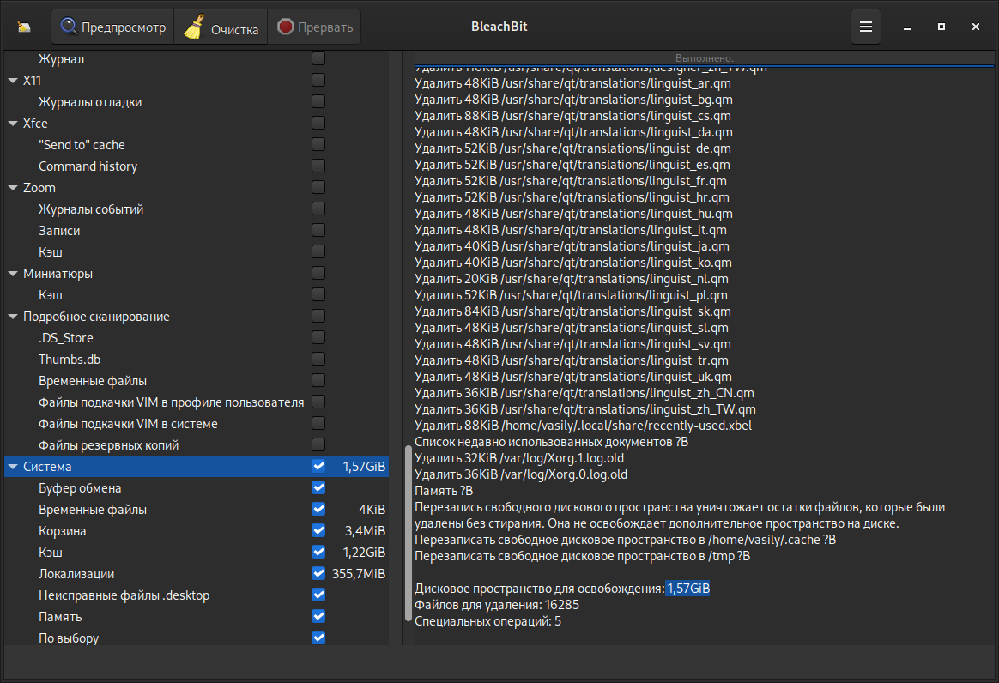
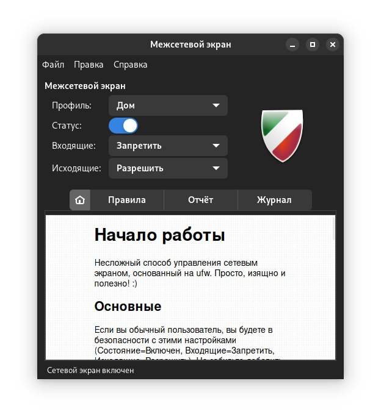

.. ARU (c) 2018 - 2022, Pavel Priluckiy, Vasiliy Stelmachenok and contributors

   ARU is licensed under a
   Creative Commons Attribution-ShareAlike 4.0 International License.

   You should have received a copy of the license along with this
   work. If not, see <https://creativecommons.org/licenses/by-sa/4.0/>.

.. _useful-programs:

************************
Полезные программы
************************

Программы разного назначения, однако могут быть полезными.

.. index:: useful-programs, stacer, garbage-removal
.. _stacer:

===========
Stacer
===========

Помощник в обслуживании и чистке системы.

.. image:: images/generic-system-acceleration-3.png

**Установка**::

  git clone https://aur.archlinux.org/stacer.git # Скачивание исходников. 
  cd stacer                                      # Переход в stacer. 
  makepkg -sric                                  # Сборка и установка.

.. index:: useful-programs, bleachbit, garbage-removal
.. _bleachbit:

===============
Bleachbit
===============

Аналог CCleaner для Linux, помогает выполнить очистку системы от накопившегося
в ней мусора.

Советуем выполнять чистку системы уже после проведения всех оптимизаций.

**Установка + дополнительные фильтры**::

  sudo pacman -S bleachbit

  # Дополнительные фильтры

  git clone https://aur.archlinux.org/cleanerml-git.git # Загрузка исходников.
  cd cleanerml-git                                      # Переход в cleanerm.
  makepkg -sric                                         # Сборка и установка.

.. index:: useful-programs, mouse, settings
.. _paper:

========
Piper
========

Позволяет выполнить более тонкую настройку вашей мышки, в том числе
переназначить DPI, настроить подсветку и собственные действия на дополнительные
кнопки.

.. image:: https://raw.githubusercontent.com/libratbag/piper/wiki/screenshots/piper-resolutionpage.png

**Установка** ::

  sudo pacman -S piper

.. attention:: Поддерживаются только некоторые из моделей мышек от Logitech/Razer/Steelseries.
   Полный список поддерживаемых устройств вы можете найти по ссылке:

   https://github.com/libratbag/libratbag/wiki/Devices

.. index:: useful-programs, usb, security
.. _pam-usb:

==========
pam_usb
==========

Позволяет сделать из вашей USB-флешки ключ для авторизации в вашу систему.
Совместим с экранными менеджерами входа GDM и KDM.

Существует несколько режимов работы:

1. Использовать флешку вместо пароля, при условии её подключения (если
   подключение отсутствует - нужно вводить пароль)

2. Требовать наличие подключенного USB-носителя вместе с вводом пароля.

**Установка** ::

  git clone https://github.com/mcdope/pam_usb.git
  cd pam_usb/arch_linux
  mv PKGBUILD_stable PKGBUILD
  makepkg -sric

.. index:: useful-programs, wine, prefixes, gaming
.. _bottles:

========
Bottles
========

Удобный менеджер по управлению бутылками (префиксами) в Wine. Альтернатива
Lutris, имеет приятный и понятный интерфейс, возможность графической установки
зависимостей (DLL библиотек) и поддерживает изоляцию из коробки.

**Демонстрация**

1. Окно выбора бутылки

.. image:: images/generic-system-acceleration-5.png

2. Создание новой бутылки

.. image:: images/generic-system-acceleration-6.png

3. Управление бутылкой

.. image:: images/generic-system-acceleration-7.png

4. Установка зависимостей (DLL библиотек)

.. image:: images/generic-system-acceleration-8.png

**Установка** ::

  git clone https://aur.archlinux.org/bottles.git # Скачиваем исходники
  cd bottles                                      # Переход в директорию
  makepkg -sric                                   # Сборка и установка

.. index:: firewall, gufw, ufw
.. _gufw:

=======
gUFW
=======

gUFW - это графическая оболочка для межсетевого экрана UFW, которая
позволит вам настроить ваш фаерволл в всего в два клика.

**Установка** ::

  sudo pacman -S gufw
  sudo systemctl enable --now ufw.service

.. vim:set textwidth=70:
